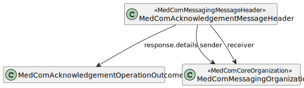

# MedComAcknowledgementMessageHeader - DK MedCom acknowledgement v2.0.3

* [**Table of Contents**](toc.md)
* [**Artifacts Summary**](artifacts.md)
* **MedComAcknowledgementMessageHeader**

## Resource Profile: MedComAcknowledgementMessageHeader 

| | |
| :--- | :--- |
| *Official URL*:http://medcomfhir.dk/ig/acknowledgement/StructureDefinition/medcom-messaging-acknowledgementHeader | *Version*:2.0.3 |
| Active as of 2026-02-05 | *Computable Name*:MedComAcknowledgementMessageHeader |

 
A resource that describes a reponse to a message that is exchanged as a MedCom messgage within Danish healthcare 

### Scope and usage

This profile is used as the MessageHeader resource for the MedCom Acknowledgement message. Constraint and rules from MedComMessagingMessageHeader is inherited to this profile. However, does MedComAcknowledgementMessageHeader not allow for a receiver of the type carbon-copy and the profile requires a response code. This code includes information about the delivery of a message e.g., if the message was delivered without error it would resolve in response code 'ok'.

Below can the structure of a MedCom AcknowledgementMessageHeader be seen.



Please refer to the tab "Snapshot Table(Must support)" below for the definition of the required content of a MedComAcknowledgementMessageHeader.

### Respons code

A MedComAcknowledgementMessageHeader is required in MedCom FHIR Messaging and follows the recommandations from HL7 FHIR ValueSet [response-code](http://hl7.org/fhir/R4/valueset-response-code.html)

The codes here are equivalent to HL7 v3.Acknowledgement as described in the table below.

| | | | | | |
| :--- | :--- | :--- | :--- | :--- | :--- |
| ok | OK | The message was accepted and processed without error. | AA | Application Acknowledgement Accept | Receiving application successfully processed message. |
| fatal-error | Fatal Error | The message was rejected because of a problem with the content. There is no point in re-sending without change. The response narrative SHALL describe the issue. | AE | Application Acknowledgement Error | Receiving application found error in processing message. Sending error response with additional error detail information. |
| transient-error | Transient Error | Some internal unexpected error occurred - wait and try again. Note - this is usually used for things like database unavailable, which may be expected to resolve, though human intervention may be required. | AR | Application Acknowledgement Reject | Receiving application failed to process message for reason unrelated to content or format. Original message sender must decide on whether to automatically send message again. |

Please go to this definition of [OperationOutcome](http://hl7.org/fhir/R4/operationoutcome.html#resource) to get informed how and when to use if the code response is different from "OK".

**Usages:**

* Examples for this Profile: [MessageHeader/aba2d9bf-2c6c-47e8-bce4-7928bcd51019](MessageHeader-aba2d9bf-2c6c-47e8-bce4-7928bcd51019.md), [MessageHeader/b879c81e-0607-4ccb-b358-24a72208e30d](MessageHeader-b879c81e-0607-4ccb-b358-24a72208e30d.md) and [MessageHeader/c9a0b728-0807-11ed-861d-0242ac120002](MessageHeader-c9a0b728-0807-11ed-861d-0242ac120002.md)

You can also check for [usages in the FHIR IG Statistics](https://packages2.fhir.org/xig/medcom.fhir.dk.acknowledgement|current/StructureDefinition/medcom-messaging-acknowledgementHeader)

### Formal Views of Profile Content

 [Description of Profiles, Differentials, Snapshots and how the different presentations work](http://build.fhir.org/ig/FHIR/ig-guidance/readingIgs.html#structure-definitions). 

 

Other representations of profile: [CSV](StructureDefinition-medcom-messaging-acknowledgementHeader.csv), [Excel](StructureDefinition-medcom-messaging-acknowledgementHeader.xlsx), [Schematron](StructureDefinition-medcom-messaging-acknowledgementHeader.sch) 


## Resource Content

```json
{
  "resourceType" : "StructureDefinition",
  "id" : "medcom-messaging-acknowledgementHeader",
  "url" : "http://medcomfhir.dk/ig/acknowledgement/StructureDefinition/medcom-messaging-acknowledgementHeader",
  "version" : "2.0.3",
  "name" : "MedComAcknowledgementMessageHeader",
  "status" : "active",
  "date" : "2026-02-05T13:47:18+00:00",
  "publisher" : "MedCom",
  "contact" : [
    {
      "name" : "MedCom",
      "telecom" : [
        {
          "system" : "url",
          "value" : "http://www.medcom.dk"
        }
      ]
    }
  ],
  "description" : "A resource that describes a reponse to a message that is exchanged as a MedCom messgage within Danish healthcare",
  "jurisdiction" : [
    {
      "coding" : [
        {
          "system" : "urn:iso:std:iso:3166",
          "code" : "DK",
          "display" : "Denmark"
        }
      ]
    }
  ],
  "fhirVersion" : "4.0.1",
  "mapping" : [
    {
      "identity" : "v2",
      "uri" : "http://hl7.org/v2",
      "name" : "HL7 v2 Mapping"
    },
    {
      "identity" : "rim",
      "uri" : "http://hl7.org/v3",
      "name" : "RIM Mapping"
    },
    {
      "identity" : "w5",
      "uri" : "http://hl7.org/fhir/fivews",
      "name" : "FiveWs Pattern Mapping"
    }
  ],
  "kind" : "resource",
  "abstract" : false,
  "type" : "MessageHeader",
  "baseDefinition" : "http://medcomfhir.dk/ig/messaging/StructureDefinition/medcom-messaging-messageHeader",
  "derivation" : "constraint",
  "differential" : {
    "element" : [
      {
        "id" : "MessageHeader",
        "path" : "MessageHeader"
      },
      {
        "id" : "MessageHeader.destination:cc",
        "path" : "MessageHeader.destination",
        "sliceName" : "cc",
        "max" : "0"
      },
      {
        "id" : "MessageHeader.source",
        "path" : "MessageHeader.source",
        "short" : "Contains information about the sender of the Acknowledgement message"
      },
      {
        "id" : "MessageHeader.response",
        "path" : "MessageHeader.response",
        "min" : 1,
        "mustSupport" : true
      },
      {
        "id" : "MessageHeader.response.identifier",
        "path" : "MessageHeader.response.identifier",
        "mustSupport" : true
      },
      {
        "id" : "MessageHeader.response.code",
        "path" : "MessageHeader.response.code",
        "mustSupport" : true
      },
      {
        "id" : "MessageHeader.response.details",
        "path" : "MessageHeader.response.details",
        "definition" : "Shall contain identified hints/warnings/error in case the code is transient-error or fatal-error",
        "type" : [
          {
            "code" : "Reference",
            "targetProfile" : [
              "http://medcomfhir.dk/ig/acknowledgement/StructureDefinition/medcom-acknowledgement-operationoutcome"
            ]
          }
        ],
        "mustSupport" : true
      }
    ]
  }
}

```
