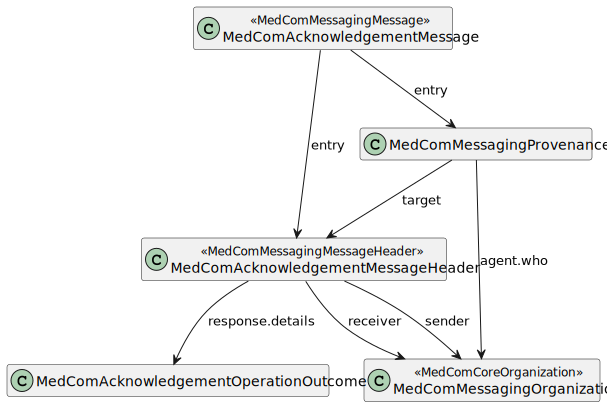

# Home - DK MedCom acknowledgement v2.0.3

* [**Table of Contents**](toc.md)
* **Home**

## Home

| | |
| :--- | :--- |
| *Official URL*:http://medcomfhir.dk/ig/acknowledgement/ImplementationGuide/medcom.fhir.dk.acknowledgement | *Version*:2.0.3 |
| Active as of 2026-02-05 | *Computable Name*:MedComAcknowledgement |

### Introduction

This implementation guide (IG) is provided by MedCom to describe the use of FHIR ®© Acknowledgement in message based exchange of data in Danish healthcare.

A MedCom Acknowledgement message (Danish: Kvittering) corresponds to a receipt of a delivered message. Every time a system receives a MedCom FHIR message, e.g. a [HospitalNotification](http://medcomfhir.dk/ig/hospitalnotification/) or a [CareCommunication](http://medcomfhir.dk/ig/carecommunication/), it shall be acknowledged with a MedCom Acknowledgement message, stating if the transfer was successful and the message validated correctly or not. In other word, does a MedCom Acknowledgement message hold information about how delivery of a message went. MedCom FHIR messaging complies with [reliable messaging and associated governance](https://medcomdk.github.io/MedCom-FHIR-Communication/#network-layer), which describes the value and needs of acknowledge all messages.

#### Acknowlegdement message

The following diagram depicts the structure of the Acknowledgement message.



The Acknowledgement message follows the general MedCom FHIR messaging structure, except that the carbon-copy destination is not allowed. The following sections describe the overall purpose of each profile.

#### MedComAcknowledgementMessage

A [MedComAcknowledgementMessage](https://medcomfhir.dk/ig/acknowledgement/StructureDefinition-medcom-messaging-acknowledgement.html) is inherited from [MedComMessagingMessage](http://medcomfhir.dk/ig/messaging/StructureDefinition-medcom-messaging-message.html), and constrains the profile since the MessageHeader shall be of the type MedComAcknowledgementMessageHeader.

#### MedComAcknowledgementMessageHeader

[MedComAcknowledgementMessageHeader](https://medcomfhir.dk/ig/acknowledgement/StructureDefinition-medcom-messaging-acknowledgementHeader.html) is inherited from [MedComMessagingMessageHeader](http://medcomfhir.dk/ig/messaging/StructureDefinition-medcom-messaging-messageHeader.html), and constrains the profile as carbon-copy is not allowed and it requires a respones code, which states if the delivery of the message went well or not.

An Acknowledgement message is required in MedCom FHIR Messaging and follows the recommandations from HL7 FHIR ValueSet [response-code](http://hl7.org/fhir/R4/valueset-response-code.html).

#### MedComAcknowledgementOperationOutcome

[MedComAcknowledgementOperationOutcome](https://medcomfhir.dk/ig/acknowledgement/StructureDefinition-medcom-acknowledgement-operationoutcome.html) shall be included in the bundle when the MessageHeader.response.code is different from 'ok'. Further, an OperationOutcome resource may be included when the MessageHeader.response.code is 'ok', e.g. in cases where the received message is valid, but it is a dublet. OperationOutcome contains a description of the error and the severity of the error.

The ValueSet [MedComAcknowledgementIssueDetailValues](http://medcomfhir.dk/ig/terminology/ValueSet-medcom-acknowledgement-issue-details.html) attached to the element OperationOutcome.response.detail.coding is used to describe the issue more detailed. Currently, the ValueSet is fairly empty, as MedCom wants input from IT-vendors on which codes give values in their systems. Across sectors there must be an agreed list of codes.

#### Timestamps

The Acknowledgement message contains three timestamps:

* Bundle.timestamp
* Provenance.occuredDateTime[x]
* Provenance.recorded.

The three timestamps are registered at different time during Acknowledgement message generation and sending. The Acknowledgement message is sent when a system receives a FHIR message e.g. when a municipality receives a HospitalNotification message from the hospital, the it-system will evaluate the message. Based on the result from the evaluation, the system will generate an acknowlegement message that represet the evaluation results. This means that if the HospitalNotification is evaluated positive the acknowlegdement is as well positive. Whereas if the HospitalNotification is evaluated negative then a negative Acknowledgement is generated and send. When the acknowledgement message is generated a Bundle.timestamp is registered. When the acknowledgement message is sent the Provenance.occuredDateTime[x] and Provenance.recorded time stamp is registered. Note that the Provenance.occuredDateTime[x] is a human redable, where Provenance.recorded is a system readable.

#### Simplified examples of the Acknowledgement messages

The simplified examples contain the required content of an Acknowledgement message. The messages illustrate an OK response and a fatal-error response based on a received message. The illustrations shows that two provenance resouces are included when sending an Acknowledgement message, one for the messages the is being acknowledged and one for the Acknowledgement message.

All profiles shall have a global unique id by using an UUID. [Read more about the use of ids here](https://medcomdk.github.io/MedCom-FHIR-Communication/assets/documents/052.2_MessageHeader_Identifiers_Timestamps.html).

[More examples of a Acknowledgement message can be found here](https://medcomfhir.dk/ig/acknowledgement/StructureDefinition-medcom-messaging-acknowledgement-examples.html). For examples of a profile, take a look under the tab 'Examples' on the site for the given profile.

> Please notice, that in the following examples is the Provenance resources listed as an array. This is just an example of an order, resources may be listed in any order.

* [Simplified example of a MedComAcknowledgementMessage responding with OK](./AcknowledgementOK.svg)
* [Simplified example of a MedComHospitalNotificationMessage responding with fatal-error.](./AcknowledgementError.svg)

#### Terminology

On [MedCom Terminology IG](http://medcomfhir.dk/ig/terminology/) all referenced CodeSystem and ValueSets developed by MedCom can be found.

#### Dependencies

This IG has a dependency to the [MedCom Core IG](http://medcomfhir.dk/ig/core/), [MedCom Messaging IG](http://medcomfhir.dk/ig/messaging/) and [DK-core v. 2.0.0](https://hl7.dk/fhir/core/), where the latter is defined by [HL7 Denmark](https://hl7.dk/). This is currently reflected in the profiles MedComAcknowledgementMessage, and MedComAcknowledgementMessageHeader which both inherits from profiles defined in MedCom Messaging IG.

### Documentation

On the [introduction page for Acknowledgement](https://medcomdk.github.io/dk-medcom-acknowledgement/) an introduction and use cases can be found.

### Governance

MedComs FHIR profiles and extension are managed in GitHub under MedCom: [Source code](https://github.com/medcomdk/dk-medcom-acknowledgement)

A description of [governance concerning change management and versioning](https://medcomdk.github.io/MedComLandingPage/#4-change-managment-and-versioning) of MedComs FHIR artefacts, can be found on the link.

#### Quality Assurance Report

In the Quality Assurance report (QA-report) for this IG, there is an error with the following description: **Reference is remote which isn’t supported by the specified aggregation mode(s) for the reference (bundled)**. The error occurs when creating instances of the profiles and is due to some elements having a Bundled flag {b}, however the referenced profile in the element is not included in the Bundle in an instance, since the instance only represents a part of the entire message. This will not influence the implementation by IT-vendors.

### Contact

[MedCom](https://www.medcom.dk/) is responsible for this IG.

If you have any questions, please contact [fhir@medcom.dk](mailto:fhir@medcom.dk) or write to MedCom's stream in [Zulip](https://chat.fhir.org/#narrow/stream/315677-denmark.2Fmedcom.2FFHIRimplementationErfaGroup).


## Resource Content

```json
{
  "resourceType" : "ImplementationGuide",
  "id" : "medcom.fhir.dk.acknowledgement",
  "url" : "http://medcomfhir.dk/ig/acknowledgement/ImplementationGuide/medcom.fhir.dk.acknowledgement",
  "version" : "2.0.3",
  "name" : "MedComAcknowledgement",
  "title" : "DK MedCom acknowledgement",
  "status" : "active",
  "date" : "2026-02-05T13:47:18+00:00",
  "publisher" : "MedCom",
  "contact" : [
    {
      "name" : "MedCom",
      "telecom" : [
        {
          "system" : "url",
          "value" : "http://www.medcom.dk"
        }
      ]
    }
  ],
  "description" : "The DK MedCom acknowledgement IG",
  "jurisdiction" : [
    {
      "coding" : [
        {
          "system" : "urn:iso:std:iso:3166",
          "code" : "DK",
          "display" : "Denmark"
        }
      ]
    }
  ],
  "packageId" : "medcom.fhir.dk.acknowledgement",
  "license" : "CC0-1.0",
  "fhirVersion" : ["4.0.1"],
  "dependsOn" : [
    {
      "id" : "hl7tx",
      "extension" : [
        {
          "url" : "http://hl7.org/fhir/tools/StructureDefinition/implementationguide-dependency-comment",
          "valueMarkdown" : "Automatically added as a dependency - all IGs depend on HL7 Terminology"
        }
      ],
      "uri" : "http://terminology.hl7.org/ImplementationGuide/hl7.terminology",
      "packageId" : "hl7.terminology.r4",
      "version" : "7.0.1"
    },
    {
      "id" : "hl7ext",
      "extension" : [
        {
          "url" : "http://hl7.org/fhir/tools/StructureDefinition/implementationguide-dependency-comment",
          "valueMarkdown" : "Automatically added as a dependency - all IGs depend on the HL7 Extension Pack"
        }
      ],
      "uri" : "http://hl7.org/fhir/extensions/ImplementationGuide/hl7.fhir.uv.extensions",
      "packageId" : "hl7.fhir.uv.extensions.r4",
      "version" : "5.2.0"
    },
    {
      "id" : "hl7_fhir_dk_core",
      "uri" : "http://hl7.dk/fhir/core/ImplementationGuide/hl7.fhir.dk.core",
      "packageId" : "hl7.fhir.dk.core",
      "version" : "2.0.0"
    },
    {
      "id" : "medcom_fhir_dk_core",
      "uri" : "http://medcomfhir.dk/ig/core/ImplementationGuide/medcom.fhir.dk.core",
      "packageId" : "medcom.fhir.dk.core",
      "version" : "2.0.1"
    },
    {
      "id" : "medcom_fhir_dk_messaging",
      "uri" : "http://medcomfhir.dk/ig/messaging/ImplementationGuide/medcom.fhir.dk.messaging",
      "packageId" : "medcom.fhir.dk.messaging",
      "version" : "2.1.0"
    },
    {
      "id" : "medcom_fhir_dk_terminology",
      "uri" : "http://medcomfhir.dk/ig/terminology/ImplementationGuide/medcom.fhir.dk.terminology",
      "packageId" : "medcom.fhir.dk.terminology",
      "version" : "1.4.0"
    }
  ],
  "definition" : {
    "extension" : [
      {
        "extension" : [
          {
            "url" : "code",
            "valueString" : "copyrightyear"
          },
          {
            "url" : "value",
            "valueString" : "2021+"
          }
        ],
        "url" : "http://hl7.org/fhir/tools/StructureDefinition/ig-parameter"
      },
      {
        "extension" : [
          {
            "url" : "code",
            "valueString" : "releaselabel"
          },
          {
            "url" : "value",
            "valueString" : "release"
          }
        ],
        "url" : "http://hl7.org/fhir/tools/StructureDefinition/ig-parameter"
      },
      {
        "extension" : [
          {
            "url" : "code",
            "valueString" : "apply-contact"
          },
          {
            "url" : "value",
            "valueString" : "true"
          }
        ],
        "url" : "http://hl7.org/fhir/tools/StructureDefinition/ig-parameter"
      },
      {
        "extension" : [
          {
            "url" : "code",
            "valueString" : "apply-jurisdiction"
          },
          {
            "url" : "value",
            "valueString" : "true"
          }
        ],
        "url" : "http://hl7.org/fhir/tools/StructureDefinition/ig-parameter"
      },
      {
        "extension" : [
          {
            "url" : "code",
            "valueString" : "apply-publisher"
          },
          {
            "url" : "value",
            "valueString" : "true"
          }
        ],
        "url" : "http://hl7.org/fhir/tools/StructureDefinition/ig-parameter"
      },
      {
        "extension" : [
          {
            "url" : "code",
            "valueString" : "autoload-resources"
          },
          {
            "url" : "value",
            "valueString" : "true"
          }
        ],
        "url" : "http://hl7.org/fhir/tools/StructureDefinition/ig-parameter"
      },
      {
        "extension" : [
          {
            "url" : "code",
            "valueString" : "path-liquid"
          },
          {
            "url" : "value",
            "valueString" : "template/liquid"
          }
        ],
        "url" : "http://hl7.org/fhir/tools/StructureDefinition/ig-parameter"
      },
      {
        "extension" : [
          {
            "url" : "code",
            "valueString" : "path-liquid"
          },
          {
            "url" : "value",
            "valueString" : "input/liquid"
          }
        ],
        "url" : "http://hl7.org/fhir/tools/StructureDefinition/ig-parameter"
      },
      {
        "extension" : [
          {
            "url" : "code",
            "valueString" : "path-qa"
          },
          {
            "url" : "value",
            "valueString" : "temp/qa"
          }
        ],
        "url" : "http://hl7.org/fhir/tools/StructureDefinition/ig-parameter"
      },
      {
        "extension" : [
          {
            "url" : "code",
            "valueString" : "path-temp"
          },
          {
            "url" : "value",
            "valueString" : "temp/pages"
          }
        ],
        "url" : "http://hl7.org/fhir/tools/StructureDefinition/ig-parameter"
      },
      {
        "extension" : [
          {
            "url" : "code",
            "valueString" : "path-output"
          },
          {
            "url" : "value",
            "valueString" : "output"
          }
        ],
        "url" : "http://hl7.org/fhir/tools/StructureDefinition/ig-parameter"
      },
      {
        "extension" : [
          {
            "url" : "code",
            "valueString" : "path-suppressed-warnings"
          },
          {
            "url" : "value",
            "valueString" : "input/ignoreWarnings.txt"
          }
        ],
        "url" : "http://hl7.org/fhir/tools/StructureDefinition/ig-parameter"
      },
      {
        "extension" : [
          {
            "url" : "code",
            "valueString" : "path-history"
          },
          {
            "url" : "value",
            "valueString" : "http://medcomfhir.dk/ig/acknowledgement/history.html"
          }
        ],
        "url" : "http://hl7.org/fhir/tools/StructureDefinition/ig-parameter"
      },
      {
        "extension" : [
          {
            "url" : "code",
            "valueString" : "template-html"
          },
          {
            "url" : "value",
            "valueString" : "template-page.html"
          }
        ],
        "url" : "http://hl7.org/fhir/tools/StructureDefinition/ig-parameter"
      },
      {
        "extension" : [
          {
            "url" : "code",
            "valueString" : "template-md"
          },
          {
            "url" : "value",
            "valueString" : "template-page-md.html"
          }
        ],
        "url" : "http://hl7.org/fhir/tools/StructureDefinition/ig-parameter"
      },
      {
        "extension" : [
          {
            "url" : "code",
            "valueString" : "apply-context"
          },
          {
            "url" : "value",
            "valueString" : "true"
          }
        ],
        "url" : "http://hl7.org/fhir/tools/StructureDefinition/ig-parameter"
      },
      {
        "extension" : [
          {
            "url" : "code",
            "valueString" : "apply-copyright"
          },
          {
            "url" : "value",
            "valueString" : "true"
          }
        ],
        "url" : "http://hl7.org/fhir/tools/StructureDefinition/ig-parameter"
      },
      {
        "extension" : [
          {
            "url" : "code",
            "valueString" : "apply-license"
          },
          {
            "url" : "value",
            "valueString" : "true"
          }
        ],
        "url" : "http://hl7.org/fhir/tools/StructureDefinition/ig-parameter"
      },
      {
        "extension" : [
          {
            "url" : "code",
            "valueString" : "apply-version"
          },
          {
            "url" : "value",
            "valueString" : "true"
          }
        ],
        "url" : "http://hl7.org/fhir/tools/StructureDefinition/ig-parameter"
      },
      {
        "extension" : [
          {
            "url" : "code",
            "valueString" : "apply-wg"
          },
          {
            "url" : "value",
            "valueString" : "true"
          }
        ],
        "url" : "http://hl7.org/fhir/tools/StructureDefinition/ig-parameter"
      },
      {
        "extension" : [
          {
            "url" : "code",
            "valueString" : "active-tables"
          },
          {
            "url" : "value",
            "valueString" : "true"
          }
        ],
        "url" : "http://hl7.org/fhir/tools/StructureDefinition/ig-parameter"
      },
      {
        "extension" : [
          {
            "url" : "code",
            "valueString" : "fmm-definition"
          },
          {
            "url" : "value",
            "valueString" : "http://hl7.org/fhir/versions.html#maturity"
          }
        ],
        "url" : "http://hl7.org/fhir/tools/StructureDefinition/ig-parameter"
      },
      {
        "extension" : [
          {
            "url" : "code",
            "valueString" : "propagate-status"
          },
          {
            "url" : "value",
            "valueString" : "true"
          }
        ],
        "url" : "http://hl7.org/fhir/tools/StructureDefinition/ig-parameter"
      },
      {
        "extension" : [
          {
            "url" : "code",
            "valueString" : "excludelogbinaryformat"
          },
          {
            "url" : "value",
            "valueString" : "true"
          }
        ],
        "url" : "http://hl7.org/fhir/tools/StructureDefinition/ig-parameter"
      },
      {
        "extension" : [
          {
            "url" : "code",
            "valueString" : "tabbed-snapshots"
          },
          {
            "url" : "value",
            "valueString" : "true"
          }
        ],
        "url" : "http://hl7.org/fhir/tools/StructureDefinition/ig-parameter"
      },
      {
        "url" : "http://hl7.org/fhir/tools/StructureDefinition/ig-internal-dependency",
        "valueCode" : "hl7.fhir.uv.tools.r4#0.9.0"
      },
      {
        "extension" : [
          {
            "url" : "code",
            "valueCode" : "copyrightyear"
          },
          {
            "url" : "value",
            "valueString" : "2021+"
          }
        ],
        "url" : "http://hl7.org/fhir/tools/StructureDefinition/ig-parameter"
      },
      {
        "extension" : [
          {
            "url" : "code",
            "valueCode" : "releaselabel"
          },
          {
            "url" : "value",
            "valueString" : "release"
          }
        ],
        "url" : "http://hl7.org/fhir/tools/StructureDefinition/ig-parameter"
      },
      {
        "extension" : [
          {
            "url" : "code",
            "valueCode" : "apply-contact"
          },
          {
            "url" : "value",
            "valueString" : "true"
          }
        ],
        "url" : "http://hl7.org/fhir/tools/StructureDefinition/ig-parameter"
      },
      {
        "extension" : [
          {
            "url" : "code",
            "valueCode" : "apply-jurisdiction"
          },
          {
            "url" : "value",
            "valueString" : "true"
          }
        ],
        "url" : "http://hl7.org/fhir/tools/StructureDefinition/ig-parameter"
      },
      {
        "extension" : [
          {
            "url" : "code",
            "valueCode" : "apply-publisher"
          },
          {
            "url" : "value",
            "valueString" : "true"
          }
        ],
        "url" : "http://hl7.org/fhir/tools/StructureDefinition/ig-parameter"
      },
      {
        "extension" : [
          {
            "url" : "code",
            "valueCode" : "autoload-resources"
          },
          {
            "url" : "value",
            "valueString" : "true"
          }
        ],
        "url" : "http://hl7.org/fhir/tools/StructureDefinition/ig-parameter"
      },
      {
        "extension" : [
          {
            "url" : "code",
            "valueCode" : "path-liquid"
          },
          {
            "url" : "value",
            "valueString" : "template/liquid"
          }
        ],
        "url" : "http://hl7.org/fhir/tools/StructureDefinition/ig-parameter"
      },
      {
        "extension" : [
          {
            "url" : "code",
            "valueCode" : "path-liquid"
          },
          {
            "url" : "value",
            "valueString" : "input/liquid"
          }
        ],
        "url" : "http://hl7.org/fhir/tools/StructureDefinition/ig-parameter"
      },
      {
        "extension" : [
          {
            "url" : "code",
            "valueCode" : "path-qa"
          },
          {
            "url" : "value",
            "valueString" : "temp/qa"
          }
        ],
        "url" : "http://hl7.org/fhir/tools/StructureDefinition/ig-parameter"
      },
      {
        "extension" : [
          {
            "url" : "code",
            "valueCode" : "path-temp"
          },
          {
            "url" : "value",
            "valueString" : "temp/pages"
          }
        ],
        "url" : "http://hl7.org/fhir/tools/StructureDefinition/ig-parameter"
      },
      {
        "extension" : [
          {
            "url" : "code",
            "valueCode" : "path-output"
          },
          {
            "url" : "value",
            "valueString" : "output"
          }
        ],
        "url" : "http://hl7.org/fhir/tools/StructureDefinition/ig-parameter"
      },
      {
        "extension" : [
          {
            "url" : "code",
            "valueCode" : "path-suppressed-warnings"
          },
          {
            "url" : "value",
            "valueString" : "input/ignoreWarnings.txt"
          }
        ],
        "url" : "http://hl7.org/fhir/tools/StructureDefinition/ig-parameter"
      },
      {
        "extension" : [
          {
            "url" : "code",
            "valueCode" : "path-history"
          },
          {
            "url" : "value",
            "valueString" : "http://medcomfhir.dk/ig/acknowledgement/history.html"
          }
        ],
        "url" : "http://hl7.org/fhir/tools/StructureDefinition/ig-parameter"
      },
      {
        "extension" : [
          {
            "url" : "code",
            "valueCode" : "template-html"
          },
          {
            "url" : "value",
            "valueString" : "template-page.html"
          }
        ],
        "url" : "http://hl7.org/fhir/tools/StructureDefinition/ig-parameter"
      },
      {
        "extension" : [
          {
            "url" : "code",
            "valueCode" : "template-md"
          },
          {
            "url" : "value",
            "valueString" : "template-page-md.html"
          }
        ],
        "url" : "http://hl7.org/fhir/tools/StructureDefinition/ig-parameter"
      },
      {
        "extension" : [
          {
            "url" : "code",
            "valueCode" : "apply-context"
          },
          {
            "url" : "value",
            "valueString" : "true"
          }
        ],
        "url" : "http://hl7.org/fhir/tools/StructureDefinition/ig-parameter"
      },
      {
        "extension" : [
          {
            "url" : "code",
            "valueCode" : "apply-copyright"
          },
          {
            "url" : "value",
            "valueString" : "true"
          }
        ],
        "url" : "http://hl7.org/fhir/tools/StructureDefinition/ig-parameter"
      },
      {
        "extension" : [
          {
            "url" : "code",
            "valueCode" : "apply-license"
          },
          {
            "url" : "value",
            "valueString" : "true"
          }
        ],
        "url" : "http://hl7.org/fhir/tools/StructureDefinition/ig-parameter"
      },
      {
        "extension" : [
          {
            "url" : "code",
            "valueCode" : "apply-version"
          },
          {
            "url" : "value",
            "valueString" : "true"
          }
        ],
        "url" : "http://hl7.org/fhir/tools/StructureDefinition/ig-parameter"
      },
      {
        "extension" : [
          {
            "url" : "code",
            "valueCode" : "apply-wg"
          },
          {
            "url" : "value",
            "valueString" : "true"
          }
        ],
        "url" : "http://hl7.org/fhir/tools/StructureDefinition/ig-parameter"
      },
      {
        "extension" : [
          {
            "url" : "code",
            "valueCode" : "active-tables"
          },
          {
            "url" : "value",
            "valueString" : "true"
          }
        ],
        "url" : "http://hl7.org/fhir/tools/StructureDefinition/ig-parameter"
      },
      {
        "extension" : [
          {
            "url" : "code",
            "valueCode" : "fmm-definition"
          },
          {
            "url" : "value",
            "valueString" : "http://hl7.org/fhir/versions.html#maturity"
          }
        ],
        "url" : "http://hl7.org/fhir/tools/StructureDefinition/ig-parameter"
      },
      {
        "extension" : [
          {
            "url" : "code",
            "valueCode" : "propagate-status"
          },
          {
            "url" : "value",
            "valueString" : "true"
          }
        ],
        "url" : "http://hl7.org/fhir/tools/StructureDefinition/ig-parameter"
      },
      {
        "extension" : [
          {
            "url" : "code",
            "valueCode" : "excludelogbinaryformat"
          },
          {
            "url" : "value",
            "valueString" : "true"
          }
        ],
        "url" : "http://hl7.org/fhir/tools/StructureDefinition/ig-parameter"
      },
      {
        "extension" : [
          {
            "url" : "code",
            "valueCode" : "tabbed-snapshots"
          },
          {
            "url" : "value",
            "valueString" : "true"
          }
        ],
        "url" : "http://hl7.org/fhir/tools/StructureDefinition/ig-parameter"
      }
    ],
    "resource" : [
      {
        "extension" : [
          {
            "url" : "http://hl7.org/fhir/tools/StructureDefinition/resource-information",
            "valueString" : "MessageHeader"
          }
        ],
        "reference" : {
          "reference" : "MessageHeader/aba2d9bf-2c6c-47e8-bce4-7928bcd51019"
        },
        "name" : "Acknowledgement MessageHeader -  ok message",
        "description" : "Acknowledgement MessageHeader - ok message. Valid only if used in a Bundle (message).",
        "exampleCanonical" : "http://medcomfhir.dk/ig/acknowledgement/StructureDefinition/medcom-messaging-acknowledgementHeader"
      },
      {
        "extension" : [
          {
            "url" : "http://hl7.org/fhir/tools/StructureDefinition/resource-information",
            "valueString" : "MessageHeader"
          }
        ],
        "reference" : {
          "reference" : "MessageHeader/b879c81e-0607-4ccb-b358-24a72208e30d"
        },
        "name" : "Acknowledgement MessageHeader - fatal-error message",
        "description" : "Acknowledgement MessageHeader - fatal-error message. Valid only if used in a Bundle (message).",
        "exampleCanonical" : "http://medcomfhir.dk/ig/acknowledgement/StructureDefinition/medcom-messaging-acknowledgementHeader"
      },
      {
        "extension" : [
          {
            "url" : "http://hl7.org/fhir/tools/StructureDefinition/resource-information",
            "valueString" : "MessageHeader"
          }
        ],
        "reference" : {
          "reference" : "MessageHeader/c9a0b728-0807-11ed-861d-0242ac120002"
        },
        "name" : "Acknowledgement MessageHeader - transient-error message",
        "description" : "Acknowledgement MessageHeader - transient-error message. Valid only if used in a Bundle (message).",
        "exampleCanonical" : "http://medcomfhir.dk/ig/acknowledgement/StructureDefinition/medcom-messaging-acknowledgementHeader"
      },
      {
        "extension" : [
          {
            "url" : "http://hl7.org/fhir/tools/StructureDefinition/resource-information",
            "valueString" : "Patient"
          }
        ],
        "reference" : {
          "reference" : "Patient/382fb8a3-6725-41e2-a615-2b1cfcfe9931"
        },
        "name" : "Bruno Test Elmer",
        "description" : "Patient described with minimal information. Valid only if used in a Bundle.",
        "exampleBoolean" : true
      },
      {
        "extension" : [
          {
            "url" : "http://hl7.org/fhir/tools/StructureDefinition/resource-information",
            "valueString" : "Provenance"
          }
        ],
        "reference" : {
          "reference" : "Provenance/4c284936-5454-4116-95fc-3c8eeeed2400"
        },
        "name" : "CareCommunication example. The Provenance instance is only valid if used in a bundle (message) - new message",
        "description" : "CareCommunication example. The Provenance instance is only valid if used in a bundle (message) - new message",
        "exampleBoolean" : true
      },
      {
        "extension" : [
          {
            "url" : "http://hl7.org/fhir/tools/StructureDefinition/resource-information",
            "valueString" : "Bundle"
          }
        ],
        "reference" : {
          "reference" : "Bundle/eb26be85-fdb7-454d-a980-95cba6d1745b"
        },
        "name" : "eb26be85-fdb7-454d-a980-95cba6d1745b",
        "description" : "Example of an emty message.",
        "exampleBoolean" : true
      },
      {
        "extension" : [
          {
            "url" : "http://hl7.org/fhir/tools/StructureDefinition/resource-information",
            "valueString" : "Bundle"
          }
        ],
        "reference" : {
          "reference" : "Bundle/bc9535ef-ed94-4060-a928-7baddec7ee71"
        },
        "name" : "Example Acknowledgement message - Fatal error",
        "description" : "Example Acknowledgement message - Fatal error",
        "exampleCanonical" : "http://medcomfhir.dk/ig/acknowledgement/StructureDefinition/medcom-messaging-acknowledgement"
      },
      {
        "extension" : [
          {
            "url" : "http://hl7.org/fhir/tools/StructureDefinition/resource-information",
            "valueString" : "Bundle"
          }
        ],
        "reference" : {
          "reference" : "Bundle/a8c041b8-c65a-4fde-a90f-962076918834"
        },
        "name" : "Example Acknowledgement message - Ok",
        "description" : "Example Acknowledgement message - Ok",
        "exampleCanonical" : "http://medcomfhir.dk/ig/acknowledgement/StructureDefinition/medcom-messaging-acknowledgement"
      },
      {
        "extension" : [
          {
            "url" : "http://hl7.org/fhir/tools/StructureDefinition/resource-information",
            "valueString" : "Bundle"
          }
        ],
        "reference" : {
          "reference" : "Bundle/c9c2b2f6-0807-11ed-861d-0242ac120002"
        },
        "name" : "Example Acknowledgement message - Transient error",
        "description" : "Example Acknowledgement message - Transient error",
        "exampleCanonical" : "http://medcomfhir.dk/ig/acknowledgement/StructureDefinition/medcom-messaging-acknowledgement"
      },
      {
        "extension" : [
          {
            "url" : "http://hl7.org/fhir/tools/StructureDefinition/resource-information",
            "valueString" : "Organization"
          }
        ],
        "reference" : {
          "reference" : "Organization/74cdf292-abf3-4f5f-80ea-60a48013ff6d"
        },
        "name" : "Example of a reciever organization with a SOR and an EAN identifier.",
        "description" : "Example of an organization with a SOR and an EAN identifier.",
        "exampleBoolean" : true
      },
      {
        "extension" : [
          {
            "url" : "http://hl7.org/fhir/tools/StructureDefinition/resource-information",
            "valueString" : "Organization"
          }
        ],
        "reference" : {
          "reference" : "Organization/d7056980-a8b2-42aa-8a0e-c1fc85d1f40d"
        },
        "name" : "Example of a sender organization with a SOR and an EAN identifier.",
        "description" : "Example of an organization with a SOR and an EAN identifier.",
        "exampleBoolean" : true
      },
      {
        "extension" : [
          {
            "url" : "http://hl7.org/fhir/tools/StructureDefinition/resource-information",
            "valueString" : "StructureDefinition:resource"
          }
        ],
        "reference" : {
          "reference" : "StructureDefinition/medcom-messaging-acknowledgement"
        },
        "name" : "MedComAcknowledgementMessage",
        "description" : "Base resource for all MedCom Acknowledgement messages.",
        "exampleBoolean" : false
      },
      {
        "extension" : [
          {
            "url" : "http://hl7.org/fhir/tools/StructureDefinition/resource-information",
            "valueString" : "StructureDefinition:resource"
          }
        ],
        "reference" : {
          "reference" : "StructureDefinition/medcom-messaging-acknowledgementHeader"
        },
        "name" : "MedComAcknowledgementMessageHeader",
        "description" : "A resource that describes a reponse to a message that is exchanged as a MedCom messgage within Danish healthcare",
        "exampleBoolean" : false
      },
      {
        "extension" : [
          {
            "url" : "http://hl7.org/fhir/tools/StructureDefinition/resource-information",
            "valueString" : "StructureDefinition:resource"
          }
        ],
        "reference" : {
          "reference" : "StructureDefinition/medcom-acknowledgement-operationoutcome"
        },
        "name" : "MedComAcknowledgementOperationOutcome",
        "description" : "This profile provides detailed information about the outcome of an attempted system operation, such as delivering a message. It shall only be used when the attempt fails.",
        "exampleBoolean" : false
      },
      {
        "extension" : [
          {
            "url" : "http://hl7.org/fhir/tools/StructureDefinition/resource-information",
            "valueString" : "OperationOutcome"
          }
        ],
        "reference" : {
          "reference" : "OperationOutcome/becb2a8e-3a68-4083-910e-811296affd43"
        },
        "name" : "MedComAcknowledgementOperationOutcome - Severity is 'error'",
        "description" : "Example of an error operationOutcome. Valid only if used in a Bundle (message).",
        "exampleCanonical" : "http://medcomfhir.dk/ig/acknowledgement/StructureDefinition/medcom-acknowledgement-operationoutcome"
      },
      {
        "extension" : [
          {
            "url" : "http://hl7.org/fhir/tools/StructureDefinition/resource-information",
            "valueString" : "OperationOutcome"
          }
        ],
        "reference" : {
          "reference" : "OperationOutcome/c0055484-2a56-4da2-81b8-a9d5087d865c"
        },
        "name" : "MedComAcknowledgementOperationOutcome - Severity is 'error'",
        "description" : "Example of an error operationOutcome. Valid only if used in a Bundle (message).",
        "exampleCanonical" : "http://medcomfhir.dk/ig/acknowledgement/StructureDefinition/medcom-acknowledgement-operationoutcome"
      },
      {
        "extension" : [
          {
            "url" : "http://hl7.org/fhir/tools/StructureDefinition/resource-information",
            "valueString" : "OperationOutcome"
          }
        ],
        "reference" : {
          "reference" : "OperationOutcome/a87bc9d4-f876-4b6f-8585-40b26dc1e369"
        },
        "name" : "MedComAcknowledgementOperationOutcome - Severity is 'information'",
        "description" : "Example of an error operationOutcome. Valid only if used in a Bundle (message).",
        "exampleCanonical" : "http://medcomfhir.dk/ig/acknowledgement/StructureDefinition/medcom-acknowledgement-operationoutcome"
      },
      {
        "extension" : [
          {
            "url" : "http://hl7.org/fhir/tools/StructureDefinition/resource-information",
            "valueString" : "MessageHeader"
          }
        ],
        "reference" : {
          "reference" : "MessageHeader/3881874e-2042-4a00-aee8-23512799f512"
        },
        "name" : "Message Header for an empty message. Valid only if used in a bundle (message)",
        "description" : "Message Header for an empty message. Valid only if used in a bundle (message).",
        "exampleBoolean" : true
      },
      {
        "extension" : [
          {
            "url" : "http://hl7.org/fhir/tools/StructureDefinition/resource-information",
            "valueString" : "MessageHeader"
          }
        ],
        "reference" : {
          "reference" : "MessageHeader/42cb9200-f421-4d08-8391-7d51a2503cb4"
        },
        "name" : "Message header for care communication message. Valid only if used in a bundle (message).",
        "description" : "Message header for care communication message. Valid only if used in a bundle (message).",
        "exampleBoolean" : true
      },
      {
        "extension" : [
          {
            "url" : "http://hl7.org/fhir/tools/StructureDefinition/resource-information",
            "valueString" : "Provenance"
          }
        ],
        "reference" : {
          "reference" : "Provenance/69dab277-dd4b-4055-9fda-a10a65cb4412"
        },
        "name" : "Provenance information for an Acknowledgement message - CareCommunication. Valid only if used in a bundle (message)",
        "description" : "Provenance information for an Acknowledgementmessage - CareCommunication. Valid only if used in a bundle (message).",
        "exampleBoolean" : true
      },
      {
        "extension" : [
          {
            "url" : "http://hl7.org/fhir/tools/StructureDefinition/resource-information",
            "valueString" : "Provenance"
          }
        ],
        "reference" : {
          "reference" : "Provenance/9c56ba88-9645-11ec-b909-0242ac120002"
        },
        "name" : "Provenance information for an Acknowledgement message - CareCommunication. Valid only if used in a bundle (message)",
        "description" : "Provenance information for an Acknowledgementmessage - CareCommunication. Valid only if used in a bundle (message).",
        "exampleBoolean" : true
      },
      {
        "extension" : [
          {
            "url" : "http://hl7.org/fhir/tools/StructureDefinition/resource-information",
            "valueString" : "Provenance"
          }
        ],
        "reference" : {
          "reference" : "Provenance/9b56aa88-9745-12ec-b919-0242ac122002"
        },
        "name" : "Provenance information for an Acknowledgement message - CareCommunication. Valid only if used in a bundle (message)",
        "description" : "Provenance information for an Acknowledgementmessage - CareCommunication. Valid only if used in a bundle (message).",
        "exampleBoolean" : true
      }
    ],
    "page" : {
      "extension" : [
        {
          "url" : "http://hl7.org/fhir/tools/StructureDefinition/ig-page-name",
          "valueUrl" : "toc.html"
        }
      ],
      "nameUrl" : "toc.html",
      "title" : "Table of Contents",
      "generation" : "html",
      "page" : [
        {
          "extension" : [
            {
              "url" : "http://hl7.org/fhir/tools/StructureDefinition/ig-page-name",
              "valueUrl" : "index.html"
            }
          ],
          "nameUrl" : "index.html",
          "title" : "Home",
          "generation" : "markdown"
        },
        {
          "extension" : [
            {
              "url" : "http://hl7.org/fhir/tools/StructureDefinition/ig-page-name",
              "valueUrl" : "downloads.html"
            }
          ],
          "nameUrl" : "downloads.html",
          "title" : "Downloads",
          "generation" : "markdown"
        },
        {
          "extension" : [
            {
              "url" : "http://hl7.org/fhir/tools/StructureDefinition/ig-page-name",
              "valueUrl" : "Enclosing_envelope_for_FHIR-messages.html"
            }
          ],
          "nameUrl" : "Enclosing_envelope_for_FHIR-messages.html",
          "title" : "Enclosing Envelope for FHIR Messages",
          "generation" : "markdown"
        },
        {
          "extension" : [
            {
              "url" : "http://hl7.org/fhir/tools/StructureDefinition/ig-page-name",
              "valueUrl" : "examples.html"
            }
          ],
          "nameUrl" : "examples.html",
          "title" : "Examples",
          "generation" : "markdown"
        },
        {
          "extension" : [
            {
              "url" : "http://hl7.org/fhir/tools/StructureDefinition/ig-page-name",
              "valueUrl" : "extensions.html"
            }
          ],
          "nameUrl" : "extensions.html",
          "title" : "Extensions",
          "generation" : "html"
        },
        {
          "extension" : [
            {
              "url" : "http://hl7.org/fhir/tools/StructureDefinition/ig-page-name",
              "valueUrl" : "Forsendelseskuvert_for_FHIR-meddelelser.html"
            }
          ],
          "nameUrl" : "Forsendelseskuvert_for_FHIR-meddelelser.html",
          "title" : "Forsendelseskuvert for FHIR Meddelelser",
          "generation" : "markdown"
        },
        {
          "extension" : [
            {
              "url" : "http://hl7.org/fhir/tools/StructureDefinition/ig-page-name",
              "valueUrl" : "profiles.html"
            }
          ],
          "nameUrl" : "profiles.html",
          "title" : "Profiles",
          "generation" : "html"
        }
      ]
    },
    "parameter" : [
      {
        "code" : "path-resource",
        "value" : "input/capabilities"
      },
      {
        "code" : "path-resource",
        "value" : "input/examples"
      },
      {
        "code" : "path-resource",
        "value" : "input/extensions"
      },
      {
        "code" : "path-resource",
        "value" : "input/models"
      },
      {
        "code" : "path-resource",
        "value" : "input/operations"
      },
      {
        "code" : "path-resource",
        "value" : "input/profiles"
      },
      {
        "code" : "path-resource",
        "value" : "input/resources"
      },
      {
        "code" : "path-resource",
        "value" : "input/vocabulary"
      },
      {
        "code" : "path-resource",
        "value" : "input/maps"
      },
      {
        "code" : "path-resource",
        "value" : "input/testing"
      },
      {
        "code" : "path-resource",
        "value" : "input/history"
      },
      {
        "code" : "path-resource",
        "value" : "fsh-generated/resources"
      },
      {
        "code" : "path-pages",
        "value" : "template/config"
      },
      {
        "code" : "path-pages",
        "value" : "input/images"
      },
      {
        "code" : "path-tx-cache",
        "value" : "input-cache/txcache"
      }
    ]
  }
}

```
