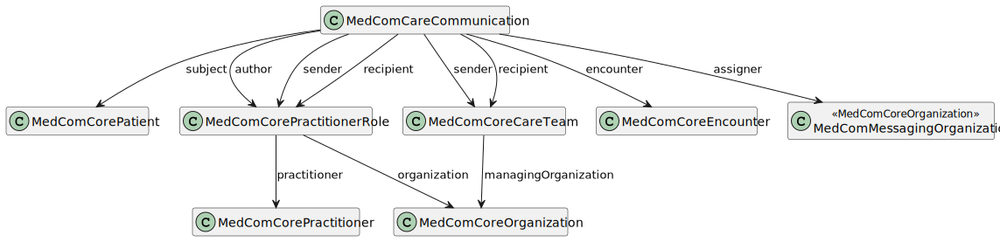

# MedComCareCommunication - DK MedCom Carecommunication v5.0.2

* [**Table of Contents**](toc.md)
* [**Artifacts Summary**](artifacts.md)
* **MedComCareCommunication**

## Resource Profile: MedComCareCommunication 

| | |
| :--- | :--- |
| *Official URL*:http://medcomfhir.dk/ig/carecommunication/StructureDefinition/medcom-careCommunication-communication | *Version*:5.0.2 |
| Active as of 2026-02-13 | *Computable Name*:MedComCareCommunication |

 
Care related communication between two or more parties in Danish healthcare 

### Scope and usage

This profile is used as the Communication resource for the MedCom CareCommunication message. The [MedComCareCommunication](https://medcomfhir.dk/ig/carecommunication/StructureDefinition-medcom-careCommunication-communication.html) profile contains the main content of a message, which includes a communication identifier, at least one message segment with a message text (Danish: Meddelelsestekst) and a signature. The message may include zero or more message segments with an attachment and a signature. All message segments are found under the element Communication.payload. A more detailed description of the content of the MedComCareCommunication profile can be seen below.

The figure below shows the possible references from MedComCareCommunication profile, and thereby which resources that may be included in a CareCommunication message. A subject, in terms of a [MedComCorePatient](https://medcomfhir.dk/ig/core/StructureDefinition-medcom-core-patient.html), shall always be included since a CareCommunication message always concerns a patient or citizen's matter. A [MedComCorePractitionerRole](https://medcomfhir.dk/ig/core/StructureDefinition-medcom-core-practitionerrole.html) and [MedComCorePractitioner](https://medcomfhir.dk/ig/core/StructureDefinition-medcom-core-practitioner.html) shall be included since these reference includes information about the author of the message text. A [MedComCoreEncounter](https://medcomfhir.dk/ig/core/StructureDefinition-medcom-core-encounter.html) may be referenced if an episodeOfCare-identifier (Danish: forløbs-id) is relevant to include. Further, the [MedComCorePractitionerRole](https://medcomfhir.dk/ig/core/StructureDefinition-medcom-core-practitionerrole.html) or [MedComCoreCareTeam](https://medcomfhir.dk/ig/core/StructureDefinition-medcom-core-careteam.html) may be included if a recipient or sender is added. Both profiles includes a reference to the [MedComCoreOrganization](https://medcomfhir.dk/ig/core/StructureDefinition-medcom-core-organization.html) the CareTeam or Practitioner is a part of.



Please refer to the tab "Snapshot Table(Must support)" below for the definition of the required content of a MedCom CareCommunication.

#### Communication identifier

The purpose of the communication identifier, in the element Communication.identifier.value, is to ensure a common identifier for a communication. This will help systems to connect incoming and outgoing CareCommuncations. This identifier must be a UUID v4 and it must remain the same when replying to a CareCommunication. The identifier must be updated when a CareCommunication is forwarded. This is elaborated in the [Governance for CareCommunication](https://medcomdk.github.io/MedCom-FHIR-Communication/assets/documents/governance-for-careCommunication.html).

#### Categories and topic

A CareCommunication shall have a category (Danish: Kategori), in the element Communication.category. The category describes the overall content of the communication and shall be selected from a nationally agreed list of categories defined in the [ValueSet of category codes](https://medcomfhir.dk/ig/terminology/ValueSet-medcom-careCommunication-categories.html). Exactly one category code must be included in a CareCommunication. In time, new category codes may be relevant to include or existing codes may be irrelevant, why it should be expected that the ValueSet will change. Changes will be made in agreement with the business and will be warned.

In addition to the category, it is allowed to add a topic (Danish: Emne) in the element Communication.topic, to support and elaborate the category. This can either be inserted as free text or as regionally agreed codes, which is describes further in the [clinical guidelines for application](https://medcomdk.github.io/dk-medcom-carecommunication/#11-clinical-guidelines-for-application).

When sending a CareCommunication message with the category **other**, a topic shall be included. To ensure this, the invariant medcom-careCommunication-6 is created.

#### Priority

Priority, found in the element Communication.priority, is used to support the referral flow. It is only allowed to add a priority to a CareCommunication when the category of the message is **regarding referral**. In this case, priority can either be **routine** or **asap**. To ensure this, the invariant medcom-careCommunication-5 is created, which states that in no other case than when the category is **regarding referral**, a priority must be added. As described on [clinical guidelines for application](https://medcomdk.github.io/dk-medcom-carecommunication/#11-clinical-guidelines-for-application), the use of priority must follow the development in collective agreements and on basis of national requirements.

#### Message segments

A message segment consists of a message text including a signature or an attachment. The message text and attachment will both be included in the element Communication.payload. There are different requirements for the two types of message segments, which is documented in the following. At least one payload which includes the message text shall be included when sending a new CareCommunication message, but zero or more attachments may be included.

> Note: Snippets from a patient's journal may be included in the message text or as an attachment, for instance, as a pdf-document. In both cases, it is recommended that the sender clearly describes in the message text or attachment, who the original author of the journal is and when it was written in the message test or attachment. If the snippet is included as an attachment, the author information may both be included as written/copied text or structured information.

When a CareCommunication message is forwarded, more than two organizations will be involved in the communication. It is a requirement that all organizations participating in the communication are made visible to the user. This must be clearly indicated for each message segment, ensuring full transparency and traceability of the message flow across healthcare actors. This information may, for example, be included alongside the signature. Furthermore, it must be clearly indicated which attachments were sent by which organization, and which message text they were sent with. This is necessary to ensure a clear and coherent overview.

##### Signature and relevant information

**Payload:string:** The written content of the message is of the datatype [string](http://hl7.org/fhir/R4/datatypes.html#string) defined by HL7. Line breaks must be represented as \n in FHIR JSON and as in FHIR XML. The signature for the message text consists of author name, author role, relevant phone number, and sent timestamp as structured data elements. The identifier is included for technical purposes. See the table below for an overview of the requirements.
 **Payload:attachment:** The allowed types of attachments can be found in the [ValueSet of allowed mimetypes](https://medcomfhir.dk/ig/terminology/ValueSet-medcom-core-attachmentMimeTypes.html). Further, it is allowed to include a link to a website. In a message segment with an attachment, the title, identifier and timestamp must be included, whereas it is optional to include information about the author, relevant phone number and creation date as structured data. Supporting all attachment types is optional when sending; however, systems must be able to receive all attachment types. If forwarding is supported, the ability to send all attachment types is also required.

| | | | | | | | |
| :--- | :--- | :--- | :--- | :--- | :--- | :--- | :--- |
| Message text | R | R | R | R | R | - | - |
| Attachment | O | O | O | R | R | R | O |

R = required and O = optional.

A description of the above mentioned information can be found here: 
 **Author name:** The name of the person responsible for writing the message text. The author shall be described using a [MedComCorePractitioner](https://medcomfhir.dk/ig/core/StructureDefinition-medcom-core-practitioner.html) profile. 
 **Author role:** The role (Danish: stillingsbetegnelse) of the person responsible for writing the message text. The author role shall be described using a [MedComCorePractitionerRole](https://medcomfhir.dk/ig/core/StructureDefinition-medcom-core-practitionerrole.html) profile. It is recommended to use a role from the defined list of roles in the element PractitionerRole.code.coding.code. Alternatively, a it is allowed to add a role in the element PractitionerRole.code.text.
 **Relevant phone number:** A relevant phone number e.g. to the department from which the CareCommunication is sent. The phone number should be applied automatically. In case it is not possible to apply the phone number automatically, it shall be applied by the author. 
 **Timestamp:** Represents the real world event, where the user presses "send" to send the CareCommunication.
 **Identifier:** An UUID version 4 with a reference to the organisation who assigned the identifier, which will be the same as the sender organisation of the message segment. 
 **Title:** The title of the attached file. This should be applied by the system. Note: it is not allowed for the system to automatically include the '.filetype' in the title. 
 **Creation:** The date and time for when the attachment is created.

##### Content of the message segments

Message text must always be included in a CareCommunication, which applies to creating a new message, replying, and forwarding. All previous message segments with message text must be included in a message when replying and all relevant message segments must be included in a message when forwarding a message.

Attachments must always be included the first time they are sent. When replying to a CareCommunication, the base64-encoded content in the element Communication.payload:attachment.content.data or the link in the element Communication.payload:attachment.content.url must not be included, to avoid sending the same content back and forth. Instead the identifier must always be included in a reply and it should be used to identify which attachment(s) or link(s) that must be displayed to the receiver. When forwarding a message, the base64-encoded content of the attachments must be included.

#### Episode of care identifier

In the element Communication.encounter it is possible to reference a [MedComCoreEncounter](https://medcomfhir.dk/ig/core/StructureDefinition-medcom-core-encounter.html). An encounter describes the meeting between a patient and one or more healthcare providers or actors involved in the patient care. The Encounter resource contains an episodeOfCare-identifier. When receiving a message, either CareCommunication or EDIFACT/OIOXML message, there will in many cases be an episodeOfCare-identifier, as it described the id of the contact. If this is the case, the episodeOfCare-identifier shall always be included in the response. Altenatively, when a user at a hospital is in the context of e.g. an admission, the episodeOfCare-identifier should be coupled to a CareCommunication. [Click here to get more information about the episodeOfCare-identifier](https://medcomdk.github.io/MedCom-FHIR-Communication/)

#### Recipient and sender

In the [MedComCareCommunicationMessageHeader](https://medcomfhir.dk/ig/carecommunication/StructureDefinition-medcom-careCommunication-messageHeader.html) profile it is required to include information about a sender and receiver in terms of a reference to a [MedComMessagingOrganization](https://medcomfhir.dk/ig/messaging/StructureDefinition-medcom-messaging-organization.html). This information is primarily used for transportation matters and will always include an EAN-number and SOR-identifier for each organization.

When sending a CareCommunication message it is possible to add a more specific receiver of the message, called a recipient, and a more specific sender, which can be found in the elements Communication.recipient and Communication.extension.sender, respectively. It is allowed to reference a [MedComCoreCareTeam](https://medcomfhir.dk/ig/core/StructureDefinition-medcom-core-careteam.html), which is people or an organization participating a coordination or delivery of patientcare, or [MedComCorePractitionerRole](https://medcomfhir.dk/ig/core/StructureDefinition-medcom-core-practitionerrole.html), which references a MedComCorePractitioner to address a healthcare professional involved in patient care. Common for both MedComCoreCareTeam and MedComCorePractitionerRole/MedComCorePractitioner is that a name of the careteam or practitioner should be included as well as a reference to a MedComCoreOrganization which represents the sender or receiver defined in [MedComCareCommunicationMessageHeader](https://medcomfhir.dk/ig/carecommunication/StructureDefinition-medcom-careCommunication-messageHeader.html).

When receiving a CareCommunication that includes a specific sender (Communication.extension.sender), it is required that this specific sender is transferred to the reply as the specific recipient (Communication.recipient). This ensures continuity and clarity in the communication flow between involved parties.

**Usages:**

* Refer to this Profile: [MedComCareCommunicationMessageHeader](StructureDefinition-medcom-careCommunication-messageHeader.md)
* Examples for this Profile: [Communication/4c712bdc-1558-4125-a854-fa8b3a11f6ed](Communication-4c712bdc-1558-4125-a854-fa8b3a11f6ed.md), [Communication/5485bde0-8246-4f46-b1a1-1f14e0a7a856](Communication-5485bde0-8246-4f46-b1a1-1f14e0a7a856.md), [Communication/94e65db8-2f0c-4a2c-a7c9-06a160d59a12](Communication-94e65db8-2f0c-4a2c-a7c9-06a160d59a12.md), [Communication/c34e8284-b353-468f-a2ea-f6ef6330292c](Communication-c34e8284-b353-468f-a2ea-f6ef6330292c.md)... Show 4 more, [Communication/d148fa55-3201-4a18-a7b0-bce67bf597a6](Communication-d148fa55-3201-4a18-a7b0-bce67bf597a6.md), [Communication/d2b79da8-acda-4985-a8ad-5ed7ec9a2800](Communication-d2b79da8-acda-4985-a8ad-5ed7ec9a2800.md), [Communication/d8434eb5-8286-48f8-a590-4a27175ed82f](Communication-d8434eb5-8286-48f8-a590-4a27175ed82f.md) and [Communication/f54efd18-5520-11ed-bdc3-0242ac120002](Communication-f54efd18-5520-11ed-bdc3-0242ac120002.md)

You can also check for [usages in the FHIR IG Statistics](https://packages2.fhir.org/xig/medcom.fhir.dk.carecommunication|current/StructureDefinition/medcom-careCommunication-communication)

### Formal Views of Profile Content

 [Description of Profiles, Differentials, Snapshots and how the different presentations work](http://build.fhir.org/ig/FHIR/ig-guidance/readingIgs.html#structure-definitions). 

 

Other representations of profile: [CSV](StructureDefinition-medcom-careCommunication-communication.csv), [Excel](StructureDefinition-medcom-careCommunication-communication.xlsx), [Schematron](StructureDefinition-medcom-careCommunication-communication.sch) 


## Resource Content

```json
{
  "resourceType" : "StructureDefinition",
  "id" : "medcom-careCommunication-communication",
  "url" : "http://medcomfhir.dk/ig/carecommunication/StructureDefinition/medcom-careCommunication-communication",
  "version" : "5.0.2",
  "name" : "MedComCareCommunication",
  "status" : "active",
  "date" : "2026-02-13T11:52:39+00:00",
  "publisher" : "MedCom",
  "contact" : [
    {
      "name" : "MedCom",
      "telecom" : [
        {
          "system" : "url",
          "value" : "http://www.medcom.dk"
        }
      ]
    }
  ],
  "description" : "Care related communication between two or more parties in Danish healthcare",
  "jurisdiction" : [
    {
      "coding" : [
        {
          "system" : "urn:iso:std:iso:3166",
          "code" : "DK",
          "display" : "Denmark"
        }
      ]
    }
  ],
  "fhirVersion" : "4.0.1",
  "mapping" : [
    {
      "identity" : "workflow",
      "uri" : "http://hl7.org/fhir/workflow",
      "name" : "Workflow Pattern"
    },
    {
      "identity" : "w5",
      "uri" : "http://hl7.org/fhir/fivews",
      "name" : "FiveWs Pattern Mapping"
    },
    {
      "identity" : "rim",
      "uri" : "http://hl7.org/v3",
      "name" : "RIM Mapping"
    }
  ],
  "kind" : "resource",
  "abstract" : false,
  "type" : "Communication",
  "baseDefinition" : "http://hl7.org/fhir/StructureDefinition/Communication",
  "derivation" : "constraint",
  "differential" : {
    "element" : [
      {
        "id" : "Communication",
        "path" : "Communication",
        "constraint" : [
          {
            "key" : "medcom-careCommunication-5",
            "severity" : "error",
            "human" : "Priority must not be present when Communication.category is other than 'regarding-referral'",
            "expression" : "where(category.coding.code != 'regarding-referral').priority.empty()",
            "source" : "http://medcomfhir.dk/ig/carecommunication/StructureDefinition/medcom-careCommunication-communication"
          },
          {
            "key" : "medcom-careCommunication-6",
            "severity" : "error",
            "human" : "There shall exist a Communication.topic when Communication.category = 'other'",
            "expression" : "iif(category.coding.code != 'other', true, category.coding.code = 'other' and topic.exists())",
            "source" : "http://medcomfhir.dk/ig/carecommunication/StructureDefinition/medcom-careCommunication-communication"
          },
          {
            "key" : "medcom-careCommunication-7",
            "severity" : "error",
            "human" : "There shall exist a practitioner role when using a PractitionerRole as author in a message segment.",
            "expression" : "payload.extension('http://medcomfhir.dk/ig/core/StructureDefinition/medcom-core-practitioner-extension').value.resolve().all(code.coding.code.exists() xor code.text.exists())",
            "source" : "http://medcomfhir.dk/ig/carecommunication/StructureDefinition/medcom-careCommunication-communication"
          },
          {
            "key" : "medcom-careCommunication-8",
            "severity" : "error",
            "human" : "There shall exist a practitioner name when using a Practitioner as author in a message segment.",
            "expression" : "payload.where(extension('http://medcomfhir.dk/ig/core/StructureDefinition/medcom-core-practitioner-extension').exists()).extension.value.reference.resolve().practitioner.resolve().name.exists()",
            "source" : "http://medcomfhir.dk/ig/carecommunication/StructureDefinition/medcom-careCommunication-communication"
          },
          {
            "key" : "medcom-careCommunication-9",
            "severity" : "error",
            "human" : "An episodeOfCare-identifier must be included when an Encounter instance is included.",
            "expression" : "iif(encounter.exists().not(), true, encounter.reference.resolve().episodeOfCare.identifier.exists())",
            "source" : "http://medcomfhir.dk/ig/carecommunication/StructureDefinition/medcom-careCommunication-communication"
          },
          {
            "key" : "medcom-careCommunication-15",
            "severity" : "error",
            "human" : "If an Encounter resource is present in the bundle, there must be a reference to it in Communication.encounter. If no Encounter is present, Communication.encounter must not be populated.",
            "expression" : "iif(encounter.exists(), Communication.encounter.reference.exists(), Communication.encounter.exists().not())",
            "source" : "http://medcomfhir.dk/ig/carecommunication/StructureDefinition/medcom-careCommunication-communication"
          }
        ]
      },
      {
        "id" : "Communication.id",
        "extension" : [
          {
            "extension" : [
              {
                "url" : "code",
                "valueCode" : "SHALL:in-narrative"
              },
              {
                "url" : "actor",
                "valueCanonical" : "http://medcomfhir.dk/ig/carecommunication/ActorDefinition/ProducerActor"
              }
            ],
            "url" : "http://hl7.org/fhir/StructureDefinition/obligation"
          }
        ],
        "path" : "Communication.id",
        "mustSupport" : true
      },
      {
        "id" : "Communication.text",
        "path" : "Communication.text",
        "short" : "The narrative text SHALL always be included when exchanging a MedCom FHIR Bundle.",
        "mustSupport" : true
      },
      {
        "id" : "Communication.text.status",
        "path" : "Communication.text.status",
        "mustSupport" : true
      },
      {
        "id" : "Communication.text.div",
        "path" : "Communication.text.div",
        "mustSupport" : true
      },
      {
        "id" : "Communication.extension",
        "path" : "Communication.extension",
        "slicing" : {
          "discriminator" : [
            {
              "type" : "value",
              "path" : "url"
            }
          ],
          "ordered" : false,
          "rules" : "open"
        }
      },
      {
        "id" : "Communication.extension:sender",
        "extension" : [
          {
            "extension" : [
              {
                "url" : "code",
                "valueCode" : "SHALL:in-narrative"
              },
              {
                "url" : "actor",
                "valueCanonical" : "http://medcomfhir.dk/ig/carecommunication/ActorDefinition/ProducerActor"
              }
            ],
            "url" : "http://hl7.org/fhir/StructureDefinition/obligation"
          }
        ],
        "path" : "Communication.extension",
        "sliceName" : "sender",
        "min" : 0,
        "max" : "1",
        "type" : [
          {
            "code" : "Extension",
            "profile" : [
              "http://medcomfhir.dk/ig/core/StructureDefinition/medcom-core-sender-extension|3.0.1"
            ]
          }
        ],
        "mustSupport" : true
      },
      {
        "id" : "Communication.identifier",
        "path" : "Communication.identifier",
        "short" : "The communication identifier",
        "min" : 1,
        "max" : "1",
        "constraint" : [
          {
            "key" : "medcom-uuidv4",
            "severity" : "error",
            "human" : "The value shall correspond to the structure of an UUID version 4",
            "expression" : "value.matches('urn:uuid:[0-9a-f]{8}-[0-9a-f]{4}-[0-9a-f]{4}-[0-9a-f]{4}-[0-9a-f]{12}')",
            "source" : "http://medcomfhir.dk/ig/carecommunication/StructureDefinition/medcom-careCommunication-communication"
          }
        ],
        "mustSupport" : true
      },
      {
        "id" : "Communication.identifier.value",
        "path" : "Communication.identifier.value",
        "min" : 1,
        "mustSupport" : true
      },
      {
        "id" : "Communication.status",
        "extension" : [
          {
            "extension" : [
              {
                "url" : "code",
                "valueCode" : "SHALL:in-narrative"
              },
              {
                "url" : "actor",
                "valueCanonical" : "http://medcomfhir.dk/ig/carecommunication/ActorDefinition/ProducerActor"
              }
            ],
            "url" : "http://hl7.org/fhir/StructureDefinition/obligation"
          }
        ],
        "path" : "Communication.status",
        "patternCode" : "unknown",
        "mustSupport" : true
      },
      {
        "id" : "Communication.category",
        "path" : "Communication.category",
        "short" : "The category (Danish: kategori) describes the overall content of the message.",
        "min" : 1,
        "max" : "1",
        "mustSupport" : true,
        "binding" : {
          "strength" : "required",
          "valueSet" : "http://medcomfhir.dk/ig/terminology/ValueSet/medcom-careCommunication-categories|1.9.0"
        }
      },
      {
        "id" : "Communication.category.coding",
        "path" : "Communication.category.coding",
        "min" : 1,
        "max" : "1",
        "mustSupport" : true
      },
      {
        "id" : "Communication.category.coding.system",
        "path" : "Communication.category.coding.system",
        "min" : 1,
        "mustSupport" : true
      },
      {
        "id" : "Communication.category.coding.code",
        "extension" : [
          {
            "extension" : [
              {
                "url" : "code",
                "valueCode" : "SHALL:in-narrative"
              },
              {
                "url" : "actor",
                "valueCanonical" : "http://medcomfhir.dk/ig/carecommunication/ActorDefinition/ProducerActor"
              }
            ],
            "url" : "http://hl7.org/fhir/StructureDefinition/obligation"
          }
        ],
        "path" : "Communication.category.coding.code",
        "min" : 1,
        "mustSupport" : true
      },
      {
        "id" : "Communication.priority",
        "extension" : [
          {
            "extension" : [
              {
                "url" : "code",
                "valueCode" : "SHALL:in-narrative"
              },
              {
                "url" : "actor",
                "valueCanonical" : "http://medcomfhir.dk/ig/carecommunication/ActorDefinition/ProducerActor"
              }
            ],
            "url" : "http://hl7.org/fhir/StructureDefinition/obligation"
          }
        ],
        "path" : "Communication.priority",
        "short" : "Shall be present if the message priority is known to be ASAP, but is only allowed when the category is 'regarding referral', see medcom-careCommunication-5",
        "mustSupport" : true,
        "binding" : {
          "strength" : "required",
          "valueSet" : "http://medcomfhir.dk/ig/terminology/ValueSet/medcom-careCommunication-requestPriority|1.8.1"
        }
      },
      {
        "id" : "Communication.subject",
        "extension" : [
          {
            "extension" : [
              {
                "url" : "code",
                "valueCode" : "SHALL:in-narrative"
              },
              {
                "url" : "actor",
                "valueCanonical" : "http://medcomfhir.dk/ig/carecommunication/ActorDefinition/ProducerActor"
              }
            ],
            "url" : "http://hl7.org/fhir/StructureDefinition/obligation"
          }
        ],
        "path" : "Communication.subject",
        "min" : 1,
        "type" : [
          {
            "code" : "Reference",
            "targetProfile" : [
              "http://medcomfhir.dk/ig/core/StructureDefinition/medcom-core-patient|3.0.1"
            ],
            "aggregation" : ["bundled"]
          }
        ],
        "mustSupport" : true
      },
      {
        "id" : "Communication.topic",
        "path" : "Communication.topic",
        "short" : "The topic (Danish: emne) may be added as a supplement to the category. Topic must be added in the text-element.",
        "mustSupport" : true
      },
      {
        "id" : "Communication.topic.text",
        "extension" : [
          {
            "url" : "http://hl7.org/fhir/StructureDefinition/elementdefinition-translatable",
            "valueBoolean" : true
          },
          {
            "extension" : [
              {
                "url" : "code",
                "valueCode" : "SHALL:in-narrative"
              },
              {
                "url" : "actor",
                "valueCanonical" : "http://medcomfhir.dk/ig/carecommunication/ActorDefinition/ProducerActor"
              }
            ],
            "url" : "http://hl7.org/fhir/StructureDefinition/obligation"
          }
        ],
        "path" : "Communication.topic.text",
        "min" : 1,
        "mustSupport" : true
      },
      {
        "id" : "Communication.encounter",
        "extension" : [
          {
            "extension" : [
              {
                "url" : "code",
                "valueCode" : "SHALL:in-narrative"
              },
              {
                "url" : "actor",
                "valueCanonical" : "http://medcomfhir.dk/ig/carecommunication/ActorDefinition/ProducerActor"
              }
            ],
            "url" : "http://hl7.org/fhir/StructureDefinition/obligation"
          }
        ],
        "path" : "Communication.encounter",
        "short" : "Shall contain a reference to an Encounter resource with a episodeOfCare-identifier, if the identifier is included in a previous message.",
        "type" : [
          {
            "code" : "Reference",
            "targetProfile" : [
              "http://medcomfhir.dk/ig/core/StructureDefinition/medcom-core-encounter|3.0.1"
            ],
            "aggregation" : ["bundled"]
          }
        ],
        "mustSupport" : true
      },
      {
        "id" : "Communication.recipient",
        "extension" : [
          {
            "extension" : [
              {
                "url" : "code",
                "valueCode" : "SHALL:in-narrative"
              },
              {
                "url" : "actor",
                "valueCanonical" : "http://medcomfhir.dk/ig/carecommunication/ActorDefinition/ProducerActor"
              }
            ],
            "url" : "http://hl7.org/fhir/StructureDefinition/obligation"
          }
        ],
        "path" : "Communication.recipient",
        "short" : "Describes a more specific receiver than the MessageHeader.destination.reciever, called a recipient. It may be a careteam a homecare group in the municipality or a named general practitioner.",
        "max" : "1",
        "type" : [
          {
            "code" : "Reference",
            "targetProfile" : [
              "http://medcomfhir.dk/ig/core/StructureDefinition/medcom-core-practitionerrole|3.0.1",
              "http://medcomfhir.dk/ig/core/StructureDefinition/medcom-core-careteam|3.0.1"
            ],
            "aggregation" : ["bundled"]
          }
        ],
        "mustSupport" : true
      },
      {
        "id" : "Communication.payload",
        "path" : "Communication.payload",
        "slicing" : {
          "discriminator" : [
            {
              "type" : "type",
              "path" : "$this.content"
            }
          ],
          "rules" : "open"
        },
        "short" : "Each payload corresponds to a message segment with a message text or an attachment. At least one payload with a message text shall be included.",
        "min" : 1
      },
      {
        "id" : "Communication.payload.extension",
        "path" : "Communication.payload.extension",
        "slicing" : {
          "discriminator" : [
            {
              "type" : "value",
              "path" : "url"
            }
          ],
          "ordered" : false,
          "rules" : "open"
        }
      },
      {
        "id" : "Communication.payload.extension:date",
        "path" : "Communication.payload.extension",
        "sliceName" : "date",
        "min" : 0,
        "max" : "1",
        "type" : [
          {
            "code" : "Extension",
            "profile" : [
              "http://medcomfhir.dk/ig/core/StructureDefinition/medcom-core-datetime-extension|3.0.1"
            ]
          }
        ]
      },
      {
        "id" : "Communication.payload.extension:author",
        "path" : "Communication.payload.extension",
        "sliceName" : "author",
        "min" : 0,
        "max" : "1",
        "type" : [
          {
            "code" : "Extension",
            "profile" : [
              "http://medcomfhir.dk/ig/core/StructureDefinition/medcom-core-practitioner-extension|3.0.1"
            ]
          }
        ]
      },
      {
        "id" : "Communication.payload.extension:authorContact",
        "path" : "Communication.payload.extension",
        "sliceName" : "authorContact",
        "min" : 0,
        "max" : "1",
        "type" : [
          {
            "code" : "Extension",
            "profile" : [
              "http://medcomfhir.dk/ig/core/StructureDefinition/medcom-core-contact-extension|3.0.1"
            ]
          }
        ]
      },
      {
        "id" : "Communication.payload.extension:identifier",
        "path" : "Communication.payload.extension",
        "sliceName" : "identifier",
        "min" : 0,
        "max" : "1",
        "type" : [
          {
            "code" : "Extension",
            "profile" : [
              "http://medcomfhir.dk/ig/core/StructureDefinition/medcom-core-identifier-extension|3.0.1"
            ]
          }
        ]
      },
      {
        "id" : "Communication.payload:string",
        "path" : "Communication.payload",
        "sliceName" : "string",
        "min" : 1,
        "max" : "*",
        "mustSupport" : true
      },
      {
        "id" : "Communication.payload:string.extension",
        "path" : "Communication.payload.extension",
        "min" : 4
      },
      {
        "id" : "Communication.payload:string.extension:date",
        "extension" : [
          {
            "extension" : [
              {
                "url" : "code",
                "valueCode" : "SHALL:in-narrative"
              },
              {
                "url" : "actor",
                "valueCanonical" : "http://medcomfhir.dk/ig/carecommunication/ActorDefinition/ProducerActor"
              }
            ],
            "url" : "http://hl7.org/fhir/StructureDefinition/obligation"
          }
        ],
        "path" : "Communication.payload.extension",
        "sliceName" : "date",
        "min" : 1,
        "max" : "1",
        "type" : [
          {
            "code" : "Extension",
            "profile" : [
              "http://medcomfhir.dk/ig/core/StructureDefinition/medcom-core-datetime-extension|3.0.1"
            ]
          }
        ],
        "mustSupport" : true
      },
      {
        "id" : "Communication.payload:string.extension:author",
        "extension" : [
          {
            "extension" : [
              {
                "url" : "code",
                "valueCode" : "SHALL:in-narrative"
              },
              {
                "url" : "actor",
                "valueCanonical" : "http://medcomfhir.dk/ig/carecommunication/ActorDefinition/ProducerActor"
              }
            ],
            "url" : "http://hl7.org/fhir/StructureDefinition/obligation"
          }
        ],
        "path" : "Communication.payload.extension",
        "sliceName" : "author",
        "min" : 1,
        "max" : "1",
        "type" : [
          {
            "code" : "Extension",
            "profile" : [
              "http://medcomfhir.dk/ig/core/StructureDefinition/medcom-core-practitioner-extension|3.0.1"
            ]
          }
        ],
        "mustSupport" : true
      },
      {
        "id" : "Communication.payload:string.extension:authorContact",
        "extension" : [
          {
            "extension" : [
              {
                "url" : "code",
                "valueCode" : "SHALL:in-narrative"
              },
              {
                "url" : "actor",
                "valueCanonical" : "http://medcomfhir.dk/ig/carecommunication/ActorDefinition/ProducerActor"
              }
            ],
            "url" : "http://hl7.org/fhir/StructureDefinition/obligation"
          }
        ],
        "path" : "Communication.payload.extension",
        "sliceName" : "authorContact",
        "min" : 1,
        "max" : "1",
        "type" : [
          {
            "code" : "Extension",
            "profile" : [
              "http://medcomfhir.dk/ig/core/StructureDefinition/medcom-core-contact-extension|3.0.1"
            ]
          }
        ],
        "mustSupport" : true
      },
      {
        "id" : "Communication.payload:string.extension:identifier",
        "path" : "Communication.payload.extension",
        "sliceName" : "identifier",
        "min" : 1,
        "max" : "1",
        "type" : [
          {
            "code" : "Extension",
            "profile" : [
              "http://medcomfhir.dk/ig/core/StructureDefinition/medcom-core-identifier-extension|3.0.1"
            ]
          }
        ],
        "mustSupport" : true
      },
      {
        "id" : "Communication.payload:string.content[x]",
        "extension" : [
          {
            "extension" : [
              {
                "url" : "code",
                "valueCode" : "SHALL:in-narrative"
              },
              {
                "url" : "actor",
                "valueCanonical" : "http://medcomfhir.dk/ig/carecommunication/ActorDefinition/ProducerActor"
              }
            ],
            "url" : "http://hl7.org/fhir/StructureDefinition/obligation"
          }
        ],
        "path" : "Communication.payload.content[x]",
        "short" : "Line breaks must be represented as '\n' in FHIR JSON and as '&#xA;' in FHIR XML.",
        "type" : [
          {
            "code" : "string"
          }
        ],
        "mustSupport" : true
      },
      {
        "id" : "Communication.payload:attachment",
        "path" : "Communication.payload",
        "sliceName" : "attachment",
        "short" : "The payload with an attachment shall contain a link or content attached to the message.",
        "min" : 0,
        "max" : "*",
        "mustSupport" : true
      },
      {
        "id" : "Communication.payload:attachment.extension",
        "path" : "Communication.payload.extension",
        "min" : 2
      },
      {
        "id" : "Communication.payload:attachment.extension:date",
        "extension" : [
          {
            "extension" : [
              {
                "url" : "code",
                "valueCode" : "SHALL:in-narrative"
              },
              {
                "url" : "actor",
                "valueCanonical" : "http://medcomfhir.dk/ig/carecommunication/ActorDefinition/ProducerActor"
              }
            ],
            "url" : "http://hl7.org/fhir/StructureDefinition/obligation"
          }
        ],
        "path" : "Communication.payload.extension",
        "sliceName" : "date",
        "min" : 1,
        "max" : "1",
        "type" : [
          {
            "code" : "Extension",
            "profile" : [
              "http://medcomfhir.dk/ig/core/StructureDefinition/medcom-core-datetime-extension|3.0.1"
            ]
          }
        ],
        "mustSupport" : true
      },
      {
        "id" : "Communication.payload:attachment.extension:author",
        "extension" : [
          {
            "extension" : [
              {
                "url" : "code",
                "valueCode" : "SHALL:in-narrative"
              },
              {
                "url" : "actor",
                "valueCanonical" : "http://medcomfhir.dk/ig/carecommunication/ActorDefinition/ProducerActor"
              }
            ],
            "url" : "http://hl7.org/fhir/StructureDefinition/obligation"
          }
        ],
        "path" : "Communication.payload.extension",
        "sliceName" : "author",
        "min" : 0,
        "max" : "1",
        "type" : [
          {
            "code" : "Extension",
            "profile" : [
              "http://medcomfhir.dk/ig/core/StructureDefinition/medcom-core-practitioner-extension|3.0.1"
            ]
          }
        ],
        "mustSupport" : true
      },
      {
        "id" : "Communication.payload:attachment.extension:authorContact",
        "extension" : [
          {
            "extension" : [
              {
                "url" : "code",
                "valueCode" : "SHALL:in-narrative"
              },
              {
                "url" : "actor",
                "valueCanonical" : "http://medcomfhir.dk/ig/carecommunication/ActorDefinition/ProducerActor"
              }
            ],
            "url" : "http://hl7.org/fhir/StructureDefinition/obligation"
          }
        ],
        "path" : "Communication.payload.extension",
        "sliceName" : "authorContact",
        "min" : 0,
        "max" : "1",
        "type" : [
          {
            "code" : "Extension",
            "profile" : [
              "http://medcomfhir.dk/ig/core/StructureDefinition/medcom-core-contact-extension|3.0.1"
            ]
          }
        ],
        "mustSupport" : true
      },
      {
        "id" : "Communication.payload:attachment.extension:identifier",
        "path" : "Communication.payload.extension",
        "sliceName" : "identifier",
        "min" : 1,
        "max" : "1",
        "type" : [
          {
            "code" : "Extension",
            "profile" : [
              "http://medcomfhir.dk/ig/core/StructureDefinition/medcom-core-identifier-extension|3.0.1"
            ]
          }
        ],
        "mustSupport" : true
      },
      {
        "id" : "Communication.payload:attachment.content[x]",
        "path" : "Communication.payload.content[x]",
        "type" : [
          {
            "code" : "Attachment"
          }
        ],
        "mustSupport" : true
      },
      {
        "id" : "Communication.payload:attachment.content[x].contentType",
        "extension" : [
          {
            "extension" : [
              {
                "url" : "code",
                "valueCode" : "SHALL:in-narrative"
              },
              {
                "url" : "actor",
                "valueCanonical" : "http://medcomfhir.dk/ig/carecommunication/ActorDefinition/ProducerActor"
              }
            ],
            "url" : "http://hl7.org/fhir/StructureDefinition/obligation"
          }
        ],
        "path" : "Communication.payload.content[x].contentType",
        "short" : "The content type shall be present when the content is an attachment included in the data element.",
        "mustSupport" : true,
        "binding" : {
          "strength" : "required",
          "valueSet" : "http://medcomfhir.dk/ig/terminology/ValueSet/medcom-core-attachmentMimeTypes|1.8.1"
        }
      },
      {
        "id" : "Communication.payload:attachment.content[x].data",
        "path" : "Communication.payload.content[x].data",
        "short" : "Shall be present and contain the base64 encoded content of the attachment.",
        "mustSupport" : true
      },
      {
        "id" : "Communication.payload:attachment.content[x].url",
        "extension" : [
          {
            "extension" : [
              {
                "url" : "code",
                "valueCode" : "SHALL:in-narrative"
              },
              {
                "url" : "actor",
                "valueCanonical" : "http://medcomfhir.dk/ig/carecommunication/ActorDefinition/ProducerActor"
              }
            ],
            "url" : "http://hl7.org/fhir/StructureDefinition/obligation"
          }
        ],
        "path" : "Communication.payload.content[x].url",
        "short" : "Shall be present if the attachment is a link to a web page.",
        "mustSupport" : true
      },
      {
        "id" : "Communication.payload:attachment.content[x].title",
        "extension" : [
          {
            "url" : "http://hl7.org/fhir/StructureDefinition/elementdefinition-translatable",
            "valueBoolean" : true
          },
          {
            "extension" : [
              {
                "url" : "code",
                "valueCode" : "SHALL:in-narrative"
              },
              {
                "url" : "actor",
                "valueCanonical" : "http://medcomfhir.dk/ig/carecommunication/ActorDefinition/ProducerActor"
              }
            ],
            "url" : "http://hl7.org/fhir/StructureDefinition/obligation"
          }
        ],
        "path" : "Communication.payload.content[x].title",
        "short" : "Note: it is not allowed for the system to automatically include '.filetype' in the title.",
        "min" : 1,
        "mustSupport" : true
      },
      {
        "id" : "Communication.payload:attachment.content[x].creation",
        "extension" : [
          {
            "extension" : [
              {
                "url" : "code",
                "valueCode" : "SHALL:in-narrative"
              },
              {
                "url" : "actor",
                "valueCanonical" : "http://medcomfhir.dk/ig/carecommunication/ActorDefinition/ProducerActor"
              }
            ],
            "url" : "http://hl7.org/fhir/StructureDefinition/obligation"
          }
        ],
        "path" : "Communication.payload.content[x].creation",
        "short" : "The time the attachment was created",
        "mustSupport" : true
      }
    ]
  }
}

```
