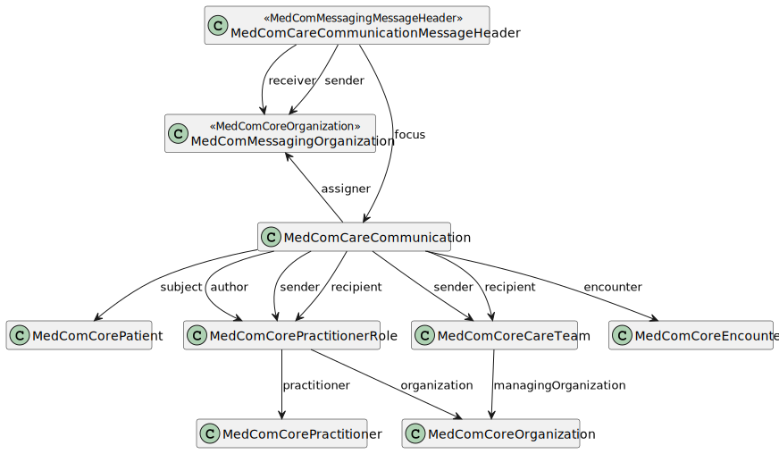

# MedComCareCommunicationMessageHeader - DK MedCom Carecommunication v5.0.2

* [**Table of Contents**](toc.md)
* [**Artifacts Summary**](artifacts.md)
* **MedComCareCommunicationMessageHeader**

## Resource Profile: MedComCareCommunicationMessageHeader 

| | |
| :--- | :--- |
| *Official URL*:http://medcomfhir.dk/ig/carecommunication/StructureDefinition/medcom-careCommunication-messageHeader | *Version*:5.0.2 |
| Active as of 2026-02-13 | *Computable Name*:MedComCareCommunicationMessageHeader |

 
Message header for CareCommunication message 

### Scope and usage

This profile is used as the MessageHeader resource for the MedCom CareCommunication message. Constraint and rules from MedComMessagingMessageHeader are inherited to this profile, but MedComCareCommunicatonMessageHeader is further restricted as it shall contain an focus in terms of the MedComCareCommunication and the event code which shall be **care-communication-message**. MedComCareCommunicatonMessageHeader shall have a globally unique id. CareCommunication follows the general MedCom FHIR messaging model, except that retract-message, modified-message and the carbon-copy destination is not allowed to be used.



Please refer to the tab "Snapshot Table(Must support)" below for the definition of the required content of a MedComCareCommunicationMessageHeader.

**Usages:**

* Refer to this Profile: [MedComCareCommunicationProvenance](StructureDefinition-medcom-careCommunication-provenance.md)
* Examples for this Profile: [MessageHeader/025bdfdd-397b-43e2-9e8c-272664a6e471](MessageHeader-025bdfdd-397b-43e2-9e8c-272664a6e471.md), [MessageHeader/2654e182-cfee-4537-b744-e36231ebe2f3](MessageHeader-2654e182-cfee-4537-b744-e36231ebe2f3.md), [MessageHeader/3076d9b0-5521-11ed-bdc3-0242ac120002](MessageHeader-3076d9b0-5521-11ed-bdc3-0242ac120002.md), [MessageHeader/375293b8-2f91-4d08-b13a-83ea76b6d001](MessageHeader-375293b8-2f91-4d08-b13a-83ea76b6d001.md)... Show 4 more, [MessageHeader/42cb9200-f421-4d08-8391-7d51a2503cb4](MessageHeader-42cb9200-f421-4d08-8391-7d51a2503cb4.md), [MessageHeader/4dff3695-218d-4878-838a-5f23cbba6f82](MessageHeader-4dff3695-218d-4878-838a-5f23cbba6f82.md), [MessageHeader/aac67161-d0de-4933-a78c-060beafb4814](MessageHeader-aac67161-d0de-4933-a78c-060beafb4814.md) and [MessageHeader/d5bd2111-2576-48d3-84d4-8be0297a038d](MessageHeader-d5bd2111-2576-48d3-84d4-8be0297a038d.md)

You can also check for [usages in the FHIR IG Statistics](https://packages2.fhir.org/xig/medcom.fhir.dk.carecommunication|current/StructureDefinition/medcom-careCommunication-messageHeader)

### Formal Views of Profile Content

 [Description of Profiles, Differentials, Snapshots and how the different presentations work](http://build.fhir.org/ig/FHIR/ig-guidance/readingIgs.html#structure-definitions). 

 

Other representations of profile: [CSV](StructureDefinition-medcom-careCommunication-messageHeader.csv), [Excel](StructureDefinition-medcom-careCommunication-messageHeader.xlsx), [Schematron](StructureDefinition-medcom-careCommunication-messageHeader.sch) 


## Resource Content

```json
{
  "resourceType" : "StructureDefinition",
  "id" : "medcom-careCommunication-messageHeader",
  "url" : "http://medcomfhir.dk/ig/carecommunication/StructureDefinition/medcom-careCommunication-messageHeader",
  "version" : "5.0.2",
  "name" : "MedComCareCommunicationMessageHeader",
  "status" : "active",
  "date" : "2026-02-13T11:52:39+00:00",
  "publisher" : "MedCom",
  "contact" : [
    {
      "name" : "MedCom",
      "telecom" : [
        {
          "system" : "url",
          "value" : "http://www.medcom.dk"
        }
      ]
    }
  ],
  "description" : "Message header for CareCommunication message",
  "jurisdiction" : [
    {
      "coding" : [
        {
          "system" : "urn:iso:std:iso:3166",
          "code" : "DK",
          "display" : "Denmark"
        }
      ]
    }
  ],
  "fhirVersion" : "4.0.1",
  "mapping" : [
    {
      "identity" : "v2",
      "uri" : "http://hl7.org/v2",
      "name" : "HL7 v2 Mapping"
    },
    {
      "identity" : "rim",
      "uri" : "http://hl7.org/v3",
      "name" : "RIM Mapping"
    },
    {
      "identity" : "w5",
      "uri" : "http://hl7.org/fhir/fivews",
      "name" : "FiveWs Pattern Mapping"
    }
  ],
  "kind" : "resource",
  "abstract" : false,
  "type" : "MessageHeader",
  "baseDefinition" : "http://medcomfhir.dk/ig/messaging/StructureDefinition/medcom-messaging-messageHeader",
  "derivation" : "constraint",
  "differential" : {
    "element" : [
      {
        "id" : "MessageHeader",
        "path" : "MessageHeader"
      },
      {
        "id" : "MessageHeader.event[x].system",
        "path" : "MessageHeader.event[x].system",
        "patternUri" : "http://medcomfhir.dk/ig/terminology/CodeSystem/medcom-messaging-eventCodes"
      },
      {
        "id" : "MessageHeader.event[x].code",
        "path" : "MessageHeader.event[x].code",
        "patternCode" : "care-communication-message"
      },
      {
        "id" : "MessageHeader.destination:cc",
        "path" : "MessageHeader.destination",
        "sliceName" : "cc",
        "max" : "0"
      },
      {
        "id" : "MessageHeader.focus",
        "extension" : [
          {
            "extension" : [
              {
                "url" : "code",
                "valueCode" : "SHALL:in-narrative"
              },
              {
                "url" : "actor",
                "valueCanonical" : "http://medcomfhir.dk/ig/carecommunication/ActorDefinition/ProducerActor"
              }
            ],
            "url" : "http://hl7.org/fhir/StructureDefinition/obligation"
          }
        ],
        "path" : "MessageHeader.focus",
        "min" : 1,
        "max" : "1",
        "type" : [
          {
            "code" : "Reference",
            "targetProfile" : [
              "http://medcomfhir.dk/ig/carecommunication/StructureDefinition/medcom-careCommunication-communication"
            ],
            "aggregation" : ["bundled"]
          }
        ],
        "mustSupport" : true
      },
      {
        "id" : "MessageHeader.definition",
        "path" : "MessageHeader.definition",
        "min" : 1,
        "constraint" : [
          {
            "key" : "medcom-carecommunication-definition-url",
            "severity" : "error",
            "human" : "SHALL reference a MedCom CareCommunication MessageDefinition whose canonical URL starts with\nhttp://medcomfhir.dk/ig/messagedefinitions/MessageDefinition/MedComCareCommunicationMessageDefinition|5. — that is, any version 5.x of the message definition. The current minor version the sender uses must be added in the end of the definition.",
            "expression" : "matches('^http://medcomfhir.dk/ig/messagedefinitions/MessageDefinition/MedComCareCommunicationMessageDefinition|5[.][0-9]{1,2}$')",
            "source" : "http://medcomfhir.dk/ig/carecommunication/StructureDefinition/medcom-careCommunication-messageHeader"
          }
        ]
      }
    ]
  }
}

```
