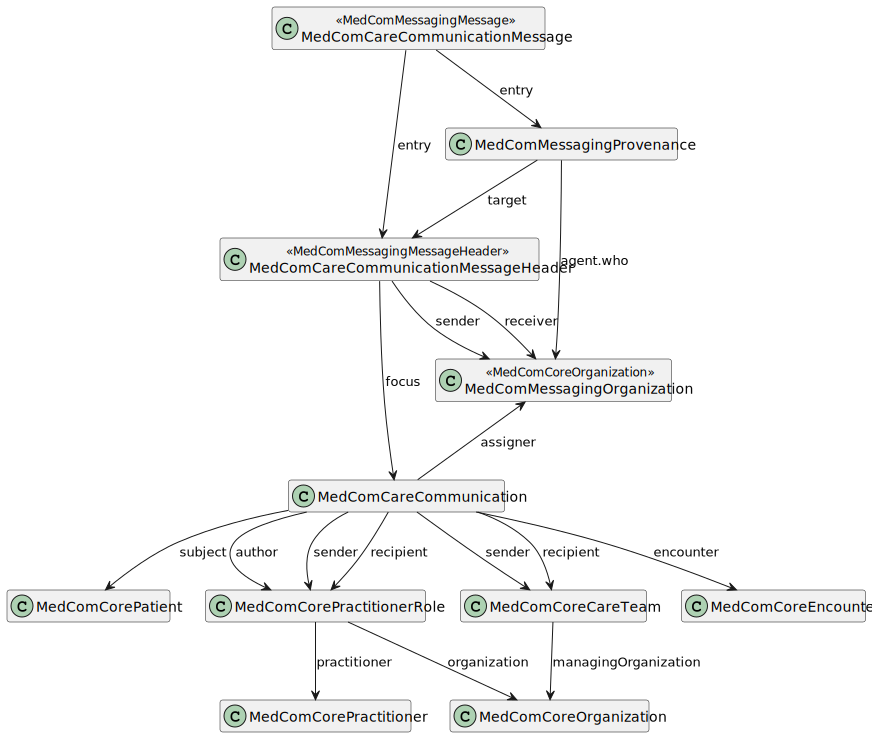

# MedComCareCommunicationMessage - DK MedCom Carecommunication v5.0.2

* [**Table of Contents**](toc.md)
* [**Artifacts Summary**](artifacts.md)
* **MedComCareCommunicationMessage**

## Resource Profile: MedComCareCommunicationMessage 

| | |
| :--- | :--- |
| *Official URL*:http://medcomfhir.dk/ig/carecommunication/StructureDefinition/medcom-careCommunication-message | *Version*:5.0.2 |
| Active as of 2026-02-13 | *Computable Name*:MedComCareCommunicationMessage |

 
The CareCommunication is used to ensure secure electronic communication of personally identifiable information and is most often used for ad hoc communication between parties in Danish Healthcare. However, the CareCommunication shall only be used in areas where no other MedCom standard is available, and it must not be used for cases with an acute nature. 

### Scope and usage

This profile is the root profile of MedCom FHIR CareCommunication message. This profile is inherited from the MedComMessagingMessage. The following figure represent the profiles that should be included in a MedCom FHIR CareCommunication message.

The Bundle containing the CareCommunication message is selfcontained, why it shall contain one instance of the MedComCareCommunicationMessageHeader. By convention the cardinality is shown as 0..*.



Please refer to the tab "Snapshot Table(Must support)" below for the definition of the required content of a MedComCareCommunicationMessage.

**Usages:**

* Examples for this Profile: [Bundle/0d5b3c18-fab6-4d93-9d88-c9c8abf1f18c](Bundle-0d5b3c18-fab6-4d93-9d88-c9c8abf1f18c.md), [Bundle/3dcb5618-3055-406a-9034-1b8fc8de0fea](Bundle-3dcb5618-3055-406a-9034-1b8fc8de0fea.md), [Bundle/add5e7e2-0c0f-4a4a-bfff-f6f984fa7e3c](Bundle-add5e7e2-0c0f-4a4a-bfff-f6f984fa7e3c.md), [Bundle/b56549f7-ed10-422d-8088-f7222b686e46](Bundle-b56549f7-ed10-422d-8088-f7222b686e46.md)... Show 4 more, [Bundle/c0426e3e-978f-46e8-a366-a30f27854b0a](Bundle-c0426e3e-978f-46e8-a366-a30f27854b0a.md), [Bundle/d11968f5-4bdf-4b50-b146-a8e1cc890fc3](Bundle-d11968f5-4bdf-4b50-b146-a8e1cc890fc3.md), [Bundle/gfd00bc2-9c26-4174-934e-f6e4360845de](Bundle-gfd00bc2-9c26-4174-934e-f6e4360845de.md) and [Bundle/k7bfbc0c-553d-11ed-bdc3-0242ac120002](Bundle-k7bfbc0c-553d-11ed-bdc3-0242ac120002.md)

You can also check for [usages in the FHIR IG Statistics](https://packages2.fhir.org/xig/medcom.fhir.dk.carecommunication|current/StructureDefinition/medcom-careCommunication-message)

### Formal Views of Profile Content

 [Description of Profiles, Differentials, Snapshots and how the different presentations work](http://build.fhir.org/ig/FHIR/ig-guidance/readingIgs.html#structure-definitions). 

 

Other representations of profile: [CSV](StructureDefinition-medcom-careCommunication-message.csv), [Excel](StructureDefinition-medcom-careCommunication-message.xlsx), [Schematron](StructureDefinition-medcom-careCommunication-message.sch) 


## Resource Content

```json
{
  "resourceType" : "StructureDefinition",
  "id" : "medcom-careCommunication-message",
  "url" : "http://medcomfhir.dk/ig/carecommunication/StructureDefinition/medcom-careCommunication-message",
  "version" : "5.0.2",
  "name" : "MedComCareCommunicationMessage",
  "status" : "active",
  "date" : "2026-02-13T11:55:29+00:00",
  "publisher" : "MedCom",
  "contact" : [
    {
      "name" : "MedCom",
      "telecom" : [
        {
          "system" : "url",
          "value" : "http://www.medcom.dk"
        }
      ]
    }
  ],
  "description" : "The CareCommunication is used to ensure secure electronic communication of personally identifiable information and is most often used for ad hoc communication between parties in Danish Healthcare. However, the CareCommunication shall only be used in areas where no other MedCom standard is available, and it must not be used for cases with an acute nature.",
  "jurisdiction" : [
    {
      "coding" : [
        {
          "system" : "urn:iso:std:iso:3166",
          "code" : "DK",
          "display" : "Denmark"
        }
      ]
    }
  ],
  "fhirVersion" : "4.0.1",
  "mapping" : [
    {
      "identity" : "v2",
      "uri" : "http://hl7.org/v2",
      "name" : "HL7 v2 Mapping"
    },
    {
      "identity" : "rim",
      "uri" : "http://hl7.org/v3",
      "name" : "RIM Mapping"
    },
    {
      "identity" : "cda",
      "uri" : "http://hl7.org/v3/cda",
      "name" : "CDA (R2)"
    },
    {
      "identity" : "w5",
      "uri" : "http://hl7.org/fhir/fivews",
      "name" : "FiveWs Pattern Mapping"
    }
  ],
  "kind" : "resource",
  "abstract" : false,
  "type" : "Bundle",
  "baseDefinition" : "http://medcomfhir.dk/ig/messaging/StructureDefinition/medcom-messaging-message",
  "derivation" : "constraint",
  "differential" : {
    "element" : [
      {
        "id" : "Bundle",
        "path" : "Bundle",
        "constraint" : [
          {
            "key" : "medcom-careCommunication-1",
            "severity" : "error",
            "human" : "The MessageHeader shall be the medcom-careCommunication-messageHeader",
            "expression" : "entry[0].resource.ofType(MessageHeader).meta.profile.startsWith('http://medcomfhir.dk/ig/carecommunication/StructureDefinition/medcom-careCommunication-messageHeader')",
            "source" : "http://medcomfhir.dk/ig/carecommunication/StructureDefinition/medcom-careCommunication-message"
          },
          {
            "key" : "medcom-careCommunication-2",
            "severity" : "error",
            "human" : "Entry shall contain exactly one Patient resource",
            "expression" : "entry.where(resource.is(Patient)).count() = 1",
            "source" : "http://medcomfhir.dk/ig/carecommunication/StructureDefinition/medcom-careCommunication-message"
          },
          {
            "key" : "medcom-careCommunication-4",
            "severity" : "error",
            "human" : "There shall exist a practitioner given and family name when using a PractitionerRole.",
            "expression" : "entry.resource.ofType(Practitioner).name.exists()",
            "source" : "http://medcomfhir.dk/ig/carecommunication/StructureDefinition/medcom-careCommunication-message"
          },
          {
            "key" : "medcom-careCommunication-3",
            "severity" : "error",
            "human" : "All Provenance resources shall be of the type medcom-careCommunication-provenance profile",
            "expression" : "entry.resource.ofType(Provenance).all(meta.profile.startsWith('http://medcomfhir.dk/ig/carecommunication/StructureDefinition/medcom-careCommunication-provenance'))",
            "source" : "http://medcomfhir.dk/ig/carecommunication/StructureDefinition/medcom-careCommunication-message"
          },
          {
            "key" : "medcom-careCommunication-12",
            "severity" : "error",
            "human" : "If a specific recipient is present, at least one of the organisations that the referenced CareTeam or Practitioner/PractitionerRole belongs to MUST equal the organisation referenced in MessageHeader.receiver.\nIf no specific recipient is present, this rule is not evaluated.",
            "expression" : "Bundle.entry.resource.ofType(Communication).recipient.reference.resolve().managingOrganization.reference.resolve() = %resource.entry.resource.ofType(MessageHeader).destination.receiver.reference.resolve() or Bundle.entry.resource.ofType(Communication).recipient.reference.resolve().organization.reference.resolve() = %resource.entry.resource.ofType(MessageHeader).destination.receiver.reference.resolve() or Bundle.entry.resource.ofType(Communication).recipient.exists().not()",
            "source" : "http://medcomfhir.dk/ig/carecommunication/StructureDefinition/medcom-careCommunication-message"
          },
          {
            "key" : "medcom-careCommunication-11",
            "severity" : "error",
            "human" : "If a specific sender is present, at least one of the organisations that the\n referenced CareTeam or Practitioner/PractitionerRole belongs to MUST equal the organisation referenced in MessageHeader.sender.\nIf no specific sender extension is present, this rule is not evaluated.",
            "expression" : "Bundle.entry.resource.ofType(Communication).extension.value.reference.resolve().managingOrganization.reference.resolve()\n        = %resource.entry.resource.ofType(MessageHeader).sender.reference.resolve()\n    or Bundle.entry.resource.ofType(Communication).extension.value.reference.resolve().organization.reference.resolve()\n        = %resource.entry.resource.ofType(MessageHeader).sender.reference.resolve()\n    or Bundle.entry.resource.ofType(Communication).extension.exists().not()",
            "source" : "http://medcomfhir.dk/ig/carecommunication/StructureDefinition/medcom-careCommunication-message"
          },
          {
            "key" : "medcom-careCommunication-13",
            "severity" : "error",
            "human" : "All PractitionerRole resources shall have a reference to an instance of a Practitioner resource.",
            "expression" : "Bundle.entry.resource.ofType(PractitionerRole).practitioner.reference.exists()",
            "source" : "http://medcomfhir.dk/ig/carecommunication/StructureDefinition/medcom-careCommunication-message"
          }
        ]
      },
      {
        "id" : "Bundle.entry",
        "path" : "Bundle.entry",
        "short" : "Message content (MedComCareCommunicationMessageHeader, MedComMessagingOrganization, MedComMessagingProvenance, MedComCareCommunication, MedComCorePatient, MedComCoreEncounter, MedComCorePractitioner, MedComCorePractitionerRole, MedComCoreCareTeam) - Open"
      },
      {
        "id" : "Bundle.entry.resource",
        "path" : "Bundle.entry.resource",
        "min" : 1
      }
    ]
  }
}

```
