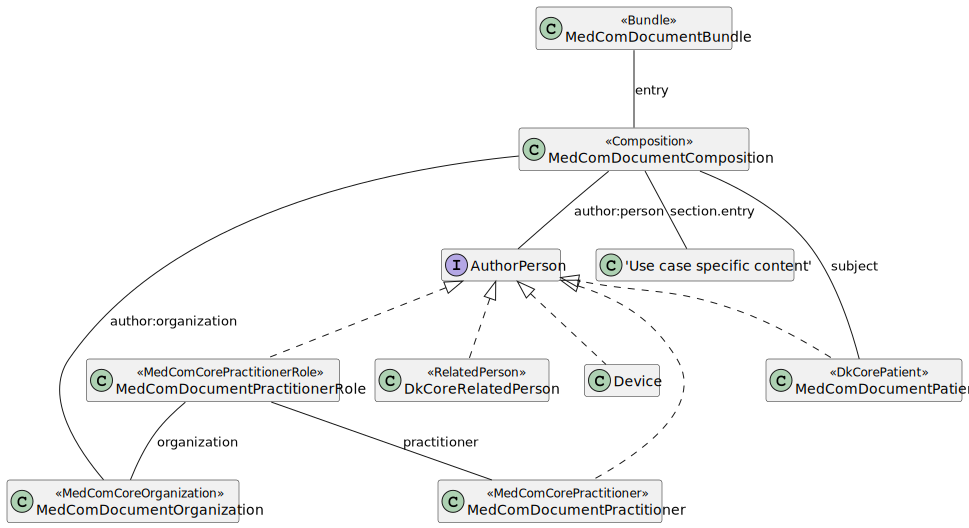

# Home - DK MedCom Document v2.0.2

* [**Table of Contents**](toc.md)
* **Home**

## Home

| | |
| :--- | :--- |
| *Official URL*:http://medcomfhir.dk/ig/document/ImplementationGuide/medcom.fhir.dk.document | *Version*:2.0.2 |
| Active as of 2026-04-29 | *Computable Name*:MedComDocument |

# DK MedCom Document

This Implementation Guide (IG) is provided by MedCom to describe the use of FHIR ®© in document-based exchange of data in Danish healthcare.

The IG contains profiles that are used to define a general model for MedCom FHIR documents. The use case-specific profiles are maintained in individual IGs.

The profiles build upon the knowledge obtained through the use of CDA in Denmark and the work around [FHIR documents from HL7 International](https://hl7.org/fhir/R4/documents.html).

#### General Document Model

The figure below illustrates a general document model, which all MedCom documents will comply to. Document profiles in this IG are all prefixed with "MedComDocument". Besides the profiles shown in the figure, a MedCom document can also include some MedCom Core profiles and profiles made to support a specific use case. Altogether they constitute the actual content of a MedCom FHIR document. The following sections describe the overall purpose of each document profile.



The figure shows the general MedCom document model. It is a structural overview of a MedCom Document Bundle, illustrating the relationships between Bundle, Composition, authorPerson, subject (patient), and referenced resources such as Practitioner, PractitionerRole, Organization, RelatedPerson, Device, and use-case–specific content.

##### MedComDocument Profiles

You will find a list of all MedCom Document profiles in the "Profiles" tab in the menu.

##### Resource Identifiers in MedCom FHIR Documents

In FHIR, `Resource.identifier` is intended to capture business identifiers that remain constant across system boundaries, which differs from `Resource.id`, the internal technical identifier used within a single FHIR Bundle. All resources included in a MedCom FHIR document **MUST** carry an `identifier` element consisting of both a `system` and a `value`. The identifier SHALL be globally unique, persistent, and stable over time. This means that the identifier **MUST NOT** change as long as the resource represents the same underlying real-world entity or dataset. For example, a Patient resource will always carry the same civil registration number (CPR) as its identifier.

**Global uniqueness:** To ensure global uniqueness, implementations may for example use UUIDv4 or UUIDv5. Use authoritative identifiers when available, such as CPR numbers or SOR codes.

**Persistence across snapshots:** Even if a document is re-created or updated, resources representing the same entity (e.g., Patient, Practitioner, Organization, Encounter) **MUST** retain their identifier.

**Bundle.identifier:** Once a document is assembled into a Bundle, the document is immutable, meaning its content cannot be changed, and the document id (Bundle.identifier) can never be reused.

##### XML and JSON

**XML and JSON:** Note that the document may be represented in either XML or JSON and interconverted between these or have its character encoding changed, all the while remaining the same document.

#### Terminology IG and metadata IG

In the [MedCom Terminology IG](http://medcomfhir.dk/ig/terminology/) all referenced MedCom Terminology CodeSystems and Value sets developed by MedCom can be found.

In the [MedCom Terminology for XDS Metadata](https://medcomfhir.dk/ig/xdsmetadata/) all MedCom CodeSystems and Value sets related to metadata can be found.

**Note** that the IG versions linked may be newer than the versions used as dependencies in this implementation guide. For the exact dependency versions applied, see the **Dependencies** tab in the top menu under **More**.

#### Dependencies

Besides Terminology and metadata IGs, this IG has a dependency to the [MedComCore IG](http://medcomfhir.dk/ig/core/), [DK-core](https://hl7.dk/fhir/core/), defined by [HL7 Denmark](https://hl7.dk/) and [IHE MHD](https://profiles.ihe.net/ITI/MHD/). **Note** that the IG versions linked may be newer than the versions used as dependencies in this implementation guide. For the exact dependency versions applied, see the **Dependencies** tab in the top menu under **More**.

### Documentation

[More information about MedCom Document](https://medcomdk.github.io/dk-medcom-document/) can be found here. MedCom document profiles does not alone constitute a standard.

### Governance and guidance

FHIR profiles are managed under MedCom: [Source code](https://github.com/medcomdk/dk-medcom-document).

A description of governance and guidance for MedCom's FHIR standards, can be found on the [MedCom Landing Page](https://medcomdk.github.io/MedComLandingPage).

The MedCom FHIR landing page provides an overview of governance requirements that apply to MedCom’s FHIR standards. This includes e.g. the mandatory rules for interpreting MustSupport, the formal validation requirements that implementers must follow, the expectations for producing narrative texts and governance for how MedCom Terminology is versioned. In addition, the governance section outlines the rules for MedCom FHIR Messaging and Document Sharing, including requirements for e.g. message flow and envelope usage.

The landing page also offers help to developers to understand how to work with MedCom’s FHIR standards. This includes a guide on how to read an Implementation Guide. Users will also find instructions on how to use some of the required tools, such as validation setup and how to use Touchstone.

### Temporary representations of code systems and valuesets from the MedCom XDS Metadata IG

Due to inconsistencies between MedCom’s XDS Metadata Standard and FHIR representations of code systems and value sets, selected code systems and value sets from the MedCom XDS Metadata Standard IG are temporarily included in this Implementation Guide with necessary adaptations. They will be removed from this IG once these issues are resolved in version 2.0 of the MedCom XDS Metadata Standard.

The affected code systems are listed below (value sets using these code systems are included as well):

| | | | | |
| :--- | :--- | :--- | :--- | :--- |
| 2.16.840.1.113883.6.96 | SCT | Systematized Nomenclature Of MEDicine (SNOMED) Clinical Terms (CT) | IHTSDO | http://snomed.info/sct|http://snomed.info/sct/554471000005108 |
| 2.16.840.1.113883.6.1 | LOINC | Logical Observation Identifier Names and Codes (LOINC) | Regenstrief Institute | http://loinc.org |
| 2.16.840.1.113883.5.79 | mediaType | mediaType | HL7 | urn:ietf:bcp:13 |
| 2.16.840.1.113883.6.121 | ieft3066 | Tags for the Identification of Languages | HL7 | urn:ietf:bcp:47 |
| 2.16.840.1.113883.5.25 | Confidentiality | Confidentiality | HL7 | http://terminology.hl7.org/CodeSystem/v3-Confidentiality |
| 1.2.208.184.100.9 | classcode | Danish Integrating the Healthcare Enterprise (IHE) metadata class codes | MedCom |  |
| 1.2.208.184.100.1 | message-codes | Message codes administered by MedCom | MedCom |  |
| 1.2.208.184.100.10 | formatcode | Danish Integrating the Healthcare Enterprise (IHE) metadata format codes | MedCom |  |
| - | homeCommunityId | - | MedCom |  |

### Contact

[MedCom](https://www.medcom.dk/) is responsible for this IG.

If you have any questions, please contact [fhir@medcom.dk](mailto:fhir@medcom.dk) or write to MedCom's stream in [Zulip](https://chat.fhir.org/#narrow/stream/315677-denmark.2Fmedcom.2FFHIRimplementationErfaGroup).


## Resource Content

```json
{
  "resourceType" : "ImplementationGuide",
  "id" : "medcom.fhir.dk.document",
  "url" : "http://medcomfhir.dk/ig/document/ImplementationGuide/medcom.fhir.dk.document",
  "version" : "2.0.2",
  "name" : "MedComDocument",
  "title" : "DK MedCom Document",
  "status" : "active",
  "date" : "2026-04-29T08:04:26+00:00",
  "publisher" : "MedCom",
  "contact" : [
    {
      "name" : "MedCom",
      "telecom" : [
        {
          "system" : "url",
          "value" : "http://www.medcom.dk"
        },
        {
          "system" : "email",
          "value" : "fhir@medcom.dk"
        }
      ]
    }
  ],
  "description" : "The DK MedCom Document IG",
  "jurisdiction" : [
    {
      "coding" : [
        {
          "system" : "urn:iso:std:iso:3166",
          "code" : "DK",
          "display" : "Denmark"
        }
      ]
    }
  ],
  "packageId" : "medcom.fhir.dk.document",
  "license" : "CC0-1.0",
  "fhirVersion" : ["4.0.1"],
  "dependsOn" : [
    {
      "id" : "hl7tx",
      "extension" : [
        {
          "url" : "http://hl7.org/fhir/tools/StructureDefinition/implementationguide-dependency-comment",
          "valueMarkdown" : "Automatically added as a dependency - all IGs depend on HL7 Terminology"
        }
      ],
      "uri" : "http://terminology.hl7.org/ImplementationGuide/hl7.terminology",
      "packageId" : "hl7.terminology.r4",
      "version" : "7.1.0"
    },
    {
      "id" : "hl7ext",
      "extension" : [
        {
          "url" : "http://hl7.org/fhir/tools/StructureDefinition/implementationguide-dependency-comment",
          "valueMarkdown" : "Automatically added as a dependency - all IGs depend on the HL7 Extension Pack"
        }
      ],
      "uri" : "http://hl7.org/fhir/extensions/ImplementationGuide/hl7.fhir.uv.extensions",
      "packageId" : "hl7.fhir.uv.extensions.r4",
      "version" : "5.2.0"
    },
    {
      "id" : "medcom_fhir_dk_xdsmetadata",
      "uri" : "http://medcomfhir.dk/ig/xdsmetadata/ImplementationGuide/medcom.fhir.dk.xdsmetadata",
      "packageId" : "medcom.fhir.dk.xdsmetadata",
      "version" : "1.0.1"
    },
    {
      "id" : "medcom_fhir_dk_terminology",
      "uri" : "http://medcomfhir.dk/ig/terminology/ImplementationGuide/medcom.fhir.dk.terminology",
      "packageId" : "medcom.fhir.dk.terminology",
      "version" : "2.0.2"
    },
    {
      "id" : "medcom_fhir_dk_core",
      "uri" : "http://medcomfhir.dk/ig/core/ImplementationGuide/medcom.fhir.dk.core",
      "packageId" : "medcom.fhir.dk.core",
      "version" : "4.0.0"
    },
    {
      "id" : "hl7_fhir_dk_core",
      "uri" : "http://hl7.dk/fhir/core/ImplementationGuide/hl7.fhir.dk.core",
      "packageId" : "hl7.fhir.dk.core",
      "version" : "3.5.0"
    },
    {
      "id" : "hl7_fhir_uv_xver_r5_r4",
      "uri" : "http://hl7.org/fhir/uv/xver/ImplementationGuide/hl7.fhir.uv.xver-r5.r4",
      "packageId" : "hl7.fhir.uv.xver-r5.r4",
      "version" : "0.1.0"
    },
    {
      "id" : "ihe_iti_mhd",
      "uri" : "https://profiles.ihe.net/ITI/MHD/ImplementationGuide/ihe.iti.mhd",
      "packageId" : "ihe.iti.mhd",
      "version" : "4.2.3"
    }
  ],
  "definition" : {
    "extension" : [
      {
        "extension" : [
          {
            "url" : "code",
            "valueString" : "copyrightyear"
          },
          {
            "url" : "value",
            "valueString" : "2024+"
          }
        ],
        "url" : "http://hl7.org/fhir/tools/StructureDefinition/ig-parameter"
      },
      {
        "extension" : [
          {
            "url" : "code",
            "valueString" : "releaselabel"
          },
          {
            "url" : "value",
            "valueString" : "release"
          }
        ],
        "url" : "http://hl7.org/fhir/tools/StructureDefinition/ig-parameter"
      },
      {
        "extension" : [
          {
            "url" : "code",
            "valueString" : "apply-contact"
          },
          {
            "url" : "value",
            "valueString" : "true"
          }
        ],
        "url" : "http://hl7.org/fhir/tools/StructureDefinition/ig-parameter"
      },
      {
        "extension" : [
          {
            "url" : "code",
            "valueString" : "apply-jurisdiction"
          },
          {
            "url" : "value",
            "valueString" : "true"
          }
        ],
        "url" : "http://hl7.org/fhir/tools/StructureDefinition/ig-parameter"
      },
      {
        "extension" : [
          {
            "url" : "code",
            "valueString" : "apply-publisher"
          },
          {
            "url" : "value",
            "valueString" : "true"
          }
        ],
        "url" : "http://hl7.org/fhir/tools/StructureDefinition/ig-parameter"
      },
      {
        "extension" : [
          {
            "url" : "code",
            "valueString" : "pin-canonicals"
          },
          {
            "url" : "value",
            "valueString" : "pin-multiples"
          }
        ],
        "url" : "http://hl7.org/fhir/tools/StructureDefinition/ig-parameter"
      },
      {
        "extension" : [
          {
            "url" : "code",
            "valueString" : "excludettl"
          },
          {
            "url" : "value",
            "valueString" : "true"
          }
        ],
        "url" : "http://hl7.org/fhir/tools/StructureDefinition/ig-parameter"
      },
      {
        "extension" : [
          {
            "url" : "code",
            "valueString" : "show-inherited-invariants"
          },
          {
            "url" : "value",
            "valueString" : "false"
          }
        ],
        "url" : "http://hl7.org/fhir/tools/StructureDefinition/ig-parameter"
      },
      {
        "extension" : [
          {
            "url" : "code",
            "valueString" : "special-url"
          },
          {
            "url" : "value",
            "valueString" : "urn:oid:1.2.208.184.100.9"
          }
        ],
        "url" : "http://hl7.org/fhir/tools/StructureDefinition/ig-parameter"
      },
      {
        "extension" : [
          {
            "url" : "code",
            "valueString" : "special-url"
          },
          {
            "url" : "value",
            "valueString" : "urn:oid:2.16.840.1.113883.6.96"
          }
        ],
        "url" : "http://hl7.org/fhir/tools/StructureDefinition/ig-parameter"
      },
      {
        "extension" : [
          {
            "url" : "code",
            "valueString" : "special-url"
          },
          {
            "url" : "value",
            "valueString" : "urn:oid:2.16.840.1.113883.6.1"
          }
        ],
        "url" : "http://hl7.org/fhir/tools/StructureDefinition/ig-parameter"
      },
      {
        "extension" : [
          {
            "url" : "code",
            "valueString" : "special-url"
          },
          {
            "url" : "value",
            "valueString" : "urn:oid:1.2.208.184.100.1"
          }
        ],
        "url" : "http://hl7.org/fhir/tools/StructureDefinition/ig-parameter"
      },
      {
        "extension" : [
          {
            "url" : "code",
            "valueString" : "special-url"
          },
          {
            "url" : "value",
            "valueString" : "urn:oid:1.2.208.176.2.4"
          }
        ],
        "url" : "http://hl7.org/fhir/tools/StructureDefinition/ig-parameter"
      },
      {
        "extension" : [
          {
            "url" : "code",
            "valueString" : "special-url"
          },
          {
            "url" : "value",
            "valueString" : "urn:oid:1.2.208.176.2.1"
          }
        ],
        "url" : "http://hl7.org/fhir/tools/StructureDefinition/ig-parameter"
      },
      {
        "extension" : [
          {
            "url" : "code",
            "valueString" : "special-url"
          },
          {
            "url" : "value",
            "valueString" : "urn:oid:1.2.208.176.7.3.1"
          }
        ],
        "url" : "http://hl7.org/fhir/tools/StructureDefinition/ig-parameter"
      },
      {
        "extension" : [
          {
            "url" : "code",
            "valueString" : "special-url"
          },
          {
            "url" : "value",
            "valueString" : "urn:oid:1.2.208.184.100.10"
          }
        ],
        "url" : "http://hl7.org/fhir/tools/StructureDefinition/ig-parameter"
      },
      {
        "extension" : [
          {
            "url" : "code",
            "valueString" : "special-url"
          },
          {
            "url" : "value",
            "valueString" : "urn:oid:1.2.208.176.8.1"
          }
        ],
        "url" : "http://hl7.org/fhir/tools/StructureDefinition/ig-parameter"
      },
      {
        "extension" : [
          {
            "url" : "code",
            "valueString" : "special-url"
          },
          {
            "url" : "value",
            "valueString" : "urn:oid:2.16.840.1.113883.6.121"
          }
        ],
        "url" : "http://hl7.org/fhir/tools/StructureDefinition/ig-parameter"
      },
      {
        "extension" : [
          {
            "url" : "code",
            "valueString" : "special-url"
          },
          {
            "url" : "value",
            "valueString" : "urn:oid:2.16.840.1.113883.5.79"
          }
        ],
        "url" : "http://hl7.org/fhir/tools/StructureDefinition/ig-parameter"
      },
      {
        "extension" : [
          {
            "url" : "code",
            "valueString" : "autoload-resources"
          },
          {
            "url" : "value",
            "valueString" : "true"
          }
        ],
        "url" : "http://hl7.org/fhir/tools/StructureDefinition/ig-parameter"
      },
      {
        "extension" : [
          {
            "url" : "code",
            "valueString" : "path-liquid"
          },
          {
            "url" : "value",
            "valueString" : "template/liquid"
          }
        ],
        "url" : "http://hl7.org/fhir/tools/StructureDefinition/ig-parameter"
      },
      {
        "extension" : [
          {
            "url" : "code",
            "valueString" : "path-liquid"
          },
          {
            "url" : "value",
            "valueString" : "input/liquid"
          }
        ],
        "url" : "http://hl7.org/fhir/tools/StructureDefinition/ig-parameter"
      },
      {
        "extension" : [
          {
            "url" : "code",
            "valueString" : "path-qa"
          },
          {
            "url" : "value",
            "valueString" : "temp/qa"
          }
        ],
        "url" : "http://hl7.org/fhir/tools/StructureDefinition/ig-parameter"
      },
      {
        "extension" : [
          {
            "url" : "code",
            "valueString" : "path-temp"
          },
          {
            "url" : "value",
            "valueString" : "temp/pages"
          }
        ],
        "url" : "http://hl7.org/fhir/tools/StructureDefinition/ig-parameter"
      },
      {
        "extension" : [
          {
            "url" : "code",
            "valueString" : "path-output"
          },
          {
            "url" : "value",
            "valueString" : "output"
          }
        ],
        "url" : "http://hl7.org/fhir/tools/StructureDefinition/ig-parameter"
      },
      {
        "extension" : [
          {
            "url" : "code",
            "valueString" : "path-suppressed-warnings"
          },
          {
            "url" : "value",
            "valueString" : "input/ignoreWarnings.txt"
          }
        ],
        "url" : "http://hl7.org/fhir/tools/StructureDefinition/ig-parameter"
      },
      {
        "extension" : [
          {
            "url" : "code",
            "valueString" : "path-history"
          },
          {
            "url" : "value",
            "valueString" : "http://medcomfhir.dk/ig/document/history.html"
          }
        ],
        "url" : "http://hl7.org/fhir/tools/StructureDefinition/ig-parameter"
      },
      {
        "extension" : [
          {
            "url" : "code",
            "valueString" : "template-html"
          },
          {
            "url" : "value",
            "valueString" : "template-page.html"
          }
        ],
        "url" : "http://hl7.org/fhir/tools/StructureDefinition/ig-parameter"
      },
      {
        "extension" : [
          {
            "url" : "code",
            "valueString" : "template-md"
          },
          {
            "url" : "value",
            "valueString" : "template-page-md.html"
          }
        ],
        "url" : "http://hl7.org/fhir/tools/StructureDefinition/ig-parameter"
      },
      {
        "extension" : [
          {
            "url" : "code",
            "valueString" : "apply-context"
          },
          {
            "url" : "value",
            "valueString" : "true"
          }
        ],
        "url" : "http://hl7.org/fhir/tools/StructureDefinition/ig-parameter"
      },
      {
        "extension" : [
          {
            "url" : "code",
            "valueString" : "apply-copyright"
          },
          {
            "url" : "value",
            "valueString" : "true"
          }
        ],
        "url" : "http://hl7.org/fhir/tools/StructureDefinition/ig-parameter"
      },
      {
        "extension" : [
          {
            "url" : "code",
            "valueString" : "apply-license"
          },
          {
            "url" : "value",
            "valueString" : "true"
          }
        ],
        "url" : "http://hl7.org/fhir/tools/StructureDefinition/ig-parameter"
      },
      {
        "extension" : [
          {
            "url" : "code",
            "valueString" : "apply-version"
          },
          {
            "url" : "value",
            "valueString" : "true"
          }
        ],
        "url" : "http://hl7.org/fhir/tools/StructureDefinition/ig-parameter"
      },
      {
        "extension" : [
          {
            "url" : "code",
            "valueString" : "apply-wg"
          },
          {
            "url" : "value",
            "valueString" : "true"
          }
        ],
        "url" : "http://hl7.org/fhir/tools/StructureDefinition/ig-parameter"
      },
      {
        "extension" : [
          {
            "url" : "code",
            "valueString" : "active-tables"
          },
          {
            "url" : "value",
            "valueString" : "true"
          }
        ],
        "url" : "http://hl7.org/fhir/tools/StructureDefinition/ig-parameter"
      },
      {
        "extension" : [
          {
            "url" : "code",
            "valueString" : "fmm-definition"
          },
          {
            "url" : "value",
            "valueString" : "http://hl7.org/fhir/versions.html#maturity"
          }
        ],
        "url" : "http://hl7.org/fhir/tools/StructureDefinition/ig-parameter"
      },
      {
        "extension" : [
          {
            "url" : "code",
            "valueString" : "propagate-status"
          },
          {
            "url" : "value",
            "valueString" : "true"
          }
        ],
        "url" : "http://hl7.org/fhir/tools/StructureDefinition/ig-parameter"
      },
      {
        "extension" : [
          {
            "url" : "code",
            "valueString" : "excludelogbinaryformat"
          },
          {
            "url" : "value",
            "valueString" : "true"
          }
        ],
        "url" : "http://hl7.org/fhir/tools/StructureDefinition/ig-parameter"
      },
      {
        "extension" : [
          {
            "url" : "code",
            "valueString" : "tabbed-snapshots"
          },
          {
            "url" : "value",
            "valueString" : "true"
          }
        ],
        "url" : "http://hl7.org/fhir/tools/StructureDefinition/ig-parameter"
      },
      {
        "url" : "http://hl7.org/fhir/tools/StructureDefinition/ig-internal-dependency",
        "valueCode" : "hl7.fhir.uv.tools.r4#0.9.0"
      },
      {
        "extension" : [
          {
            "url" : "code",
            "valueCode" : "copyrightyear"
          },
          {
            "url" : "value",
            "valueString" : "2024+"
          }
        ],
        "url" : "http://hl7.org/fhir/tools/StructureDefinition/ig-parameter"
      },
      {
        "extension" : [
          {
            "url" : "code",
            "valueCode" : "releaselabel"
          },
          {
            "url" : "value",
            "valueString" : "release"
          }
        ],
        "url" : "http://hl7.org/fhir/tools/StructureDefinition/ig-parameter"
      },
      {
        "extension" : [
          {
            "url" : "code",
            "valueCode" : "apply-contact"
          },
          {
            "url" : "value",
            "valueString" : "true"
          }
        ],
        "url" : "http://hl7.org/fhir/tools/StructureDefinition/ig-parameter"
      },
      {
        "extension" : [
          {
            "url" : "code",
            "valueCode" : "apply-jurisdiction"
          },
          {
            "url" : "value",
            "valueString" : "true"
          }
        ],
        "url" : "http://hl7.org/fhir/tools/StructureDefinition/ig-parameter"
      },
      {
        "extension" : [
          {
            "url" : "code",
            "valueCode" : "apply-publisher"
          },
          {
            "url" : "value",
            "valueString" : "true"
          }
        ],
        "url" : "http://hl7.org/fhir/tools/StructureDefinition/ig-parameter"
      },
      {
        "extension" : [
          {
            "url" : "code",
            "valueCode" : "pin-canonicals"
          },
          {
            "url" : "value",
            "valueString" : "pin-multiples"
          }
        ],
        "url" : "http://hl7.org/fhir/tools/StructureDefinition/ig-parameter"
      },
      {
        "extension" : [
          {
            "url" : "code",
            "valueCode" : "excludettl"
          },
          {
            "url" : "value",
            "valueString" : "true"
          }
        ],
        "url" : "http://hl7.org/fhir/tools/StructureDefinition/ig-parameter"
      },
      {
        "extension" : [
          {
            "url" : "code",
            "valueCode" : "show-inherited-invariants"
          },
          {
            "url" : "value",
            "valueString" : "false"
          }
        ],
        "url" : "http://hl7.org/fhir/tools/StructureDefinition/ig-parameter"
      },
      {
        "extension" : [
          {
            "url" : "code",
            "valueCode" : "special-url"
          },
          {
            "url" : "value",
            "valueString" : "urn:oid:1.2.208.184.100.9"
          }
        ],
        "url" : "http://hl7.org/fhir/tools/StructureDefinition/ig-parameter"
      },
      {
        "extension" : [
          {
            "url" : "code",
            "valueCode" : "special-url"
          },
          {
            "url" : "value",
            "valueString" : "urn:oid:2.16.840.1.113883.6.96"
          }
        ],
        "url" : "http://hl7.org/fhir/tools/StructureDefinition/ig-parameter"
      },
      {
        "extension" : [
          {
            "url" : "code",
            "valueCode" : "special-url"
          },
          {
            "url" : "value",
            "valueString" : "urn:oid:2.16.840.1.113883.6.1"
          }
        ],
        "url" : "http://hl7.org/fhir/tools/StructureDefinition/ig-parameter"
      },
      {
        "extension" : [
          {
            "url" : "code",
            "valueCode" : "special-url"
          },
          {
            "url" : "value",
            "valueString" : "urn:oid:1.2.208.184.100.1"
          }
        ],
        "url" : "http://hl7.org/fhir/tools/StructureDefinition/ig-parameter"
      },
      {
        "extension" : [
          {
            "url" : "code",
            "valueCode" : "special-url"
          },
          {
            "url" : "value",
            "valueString" : "urn:oid:1.2.208.176.2.4"
          }
        ],
        "url" : "http://hl7.org/fhir/tools/StructureDefinition/ig-parameter"
      },
      {
        "extension" : [
          {
            "url" : "code",
            "valueCode" : "special-url"
          },
          {
            "url" : "value",
            "valueString" : "urn:oid:1.2.208.176.2.1"
          }
        ],
        "url" : "http://hl7.org/fhir/tools/StructureDefinition/ig-parameter"
      },
      {
        "extension" : [
          {
            "url" : "code",
            "valueCode" : "special-url"
          },
          {
            "url" : "value",
            "valueString" : "urn:oid:1.2.208.176.7.3.1"
          }
        ],
        "url" : "http://hl7.org/fhir/tools/StructureDefinition/ig-parameter"
      },
      {
        "extension" : [
          {
            "url" : "code",
            "valueCode" : "special-url"
          },
          {
            "url" : "value",
            "valueString" : "urn:oid:1.2.208.184.100.10"
          }
        ],
        "url" : "http://hl7.org/fhir/tools/StructureDefinition/ig-parameter"
      },
      {
        "extension" : [
          {
            "url" : "code",
            "valueCode" : "special-url"
          },
          {
            "url" : "value",
            "valueString" : "urn:oid:1.2.208.176.8.1"
          }
        ],
        "url" : "http://hl7.org/fhir/tools/StructureDefinition/ig-parameter"
      },
      {
        "extension" : [
          {
            "url" : "code",
            "valueCode" : "special-url"
          },
          {
            "url" : "value",
            "valueString" : "urn:oid:2.16.840.1.113883.6.121"
          }
        ],
        "url" : "http://hl7.org/fhir/tools/StructureDefinition/ig-parameter"
      },
      {
        "extension" : [
          {
            "url" : "code",
            "valueCode" : "special-url"
          },
          {
            "url" : "value",
            "valueString" : "urn:oid:2.16.840.1.113883.5.79"
          }
        ],
        "url" : "http://hl7.org/fhir/tools/StructureDefinition/ig-parameter"
      },
      {
        "extension" : [
          {
            "url" : "code",
            "valueCode" : "autoload-resources"
          },
          {
            "url" : "value",
            "valueString" : "true"
          }
        ],
        "url" : "http://hl7.org/fhir/tools/StructureDefinition/ig-parameter"
      },
      {
        "extension" : [
          {
            "url" : "code",
            "valueCode" : "path-liquid"
          },
          {
            "url" : "value",
            "valueString" : "template/liquid"
          }
        ],
        "url" : "http://hl7.org/fhir/tools/StructureDefinition/ig-parameter"
      },
      {
        "extension" : [
          {
            "url" : "code",
            "valueCode" : "path-liquid"
          },
          {
            "url" : "value",
            "valueString" : "input/liquid"
          }
        ],
        "url" : "http://hl7.org/fhir/tools/StructureDefinition/ig-parameter"
      },
      {
        "extension" : [
          {
            "url" : "code",
            "valueCode" : "path-qa"
          },
          {
            "url" : "value",
            "valueString" : "temp/qa"
          }
        ],
        "url" : "http://hl7.org/fhir/tools/StructureDefinition/ig-parameter"
      },
      {
        "extension" : [
          {
            "url" : "code",
            "valueCode" : "path-temp"
          },
          {
            "url" : "value",
            "valueString" : "temp/pages"
          }
        ],
        "url" : "http://hl7.org/fhir/tools/StructureDefinition/ig-parameter"
      },
      {
        "extension" : [
          {
            "url" : "code",
            "valueCode" : "path-output"
          },
          {
            "url" : "value",
            "valueString" : "output"
          }
        ],
        "url" : "http://hl7.org/fhir/tools/StructureDefinition/ig-parameter"
      },
      {
        "extension" : [
          {
            "url" : "code",
            "valueCode" : "path-suppressed-warnings"
          },
          {
            "url" : "value",
            "valueString" : "input/ignoreWarnings.txt"
          }
        ],
        "url" : "http://hl7.org/fhir/tools/StructureDefinition/ig-parameter"
      },
      {
        "extension" : [
          {
            "url" : "code",
            "valueCode" : "path-history"
          },
          {
            "url" : "value",
            "valueString" : "http://medcomfhir.dk/ig/document/history.html"
          }
        ],
        "url" : "http://hl7.org/fhir/tools/StructureDefinition/ig-parameter"
      },
      {
        "extension" : [
          {
            "url" : "code",
            "valueCode" : "template-html"
          },
          {
            "url" : "value",
            "valueString" : "template-page.html"
          }
        ],
        "url" : "http://hl7.org/fhir/tools/StructureDefinition/ig-parameter"
      },
      {
        "extension" : [
          {
            "url" : "code",
            "valueCode" : "template-md"
          },
          {
            "url" : "value",
            "valueString" : "template-page-md.html"
          }
        ],
        "url" : "http://hl7.org/fhir/tools/StructureDefinition/ig-parameter"
      },
      {
        "extension" : [
          {
            "url" : "code",
            "valueCode" : "apply-context"
          },
          {
            "url" : "value",
            "valueString" : "true"
          }
        ],
        "url" : "http://hl7.org/fhir/tools/StructureDefinition/ig-parameter"
      },
      {
        "extension" : [
          {
            "url" : "code",
            "valueCode" : "apply-copyright"
          },
          {
            "url" : "value",
            "valueString" : "true"
          }
        ],
        "url" : "http://hl7.org/fhir/tools/StructureDefinition/ig-parameter"
      },
      {
        "extension" : [
          {
            "url" : "code",
            "valueCode" : "apply-license"
          },
          {
            "url" : "value",
            "valueString" : "true"
          }
        ],
        "url" : "http://hl7.org/fhir/tools/StructureDefinition/ig-parameter"
      },
      {
        "extension" : [
          {
            "url" : "code",
            "valueCode" : "apply-version"
          },
          {
            "url" : "value",
            "valueString" : "true"
          }
        ],
        "url" : "http://hl7.org/fhir/tools/StructureDefinition/ig-parameter"
      },
      {
        "extension" : [
          {
            "url" : "code",
            "valueCode" : "apply-wg"
          },
          {
            "url" : "value",
            "valueString" : "true"
          }
        ],
        "url" : "http://hl7.org/fhir/tools/StructureDefinition/ig-parameter"
      },
      {
        "extension" : [
          {
            "url" : "code",
            "valueCode" : "active-tables"
          },
          {
            "url" : "value",
            "valueString" : "true"
          }
        ],
        "url" : "http://hl7.org/fhir/tools/StructureDefinition/ig-parameter"
      },
      {
        "extension" : [
          {
            "url" : "code",
            "valueCode" : "fmm-definition"
          },
          {
            "url" : "value",
            "valueString" : "http://hl7.org/fhir/versions.html#maturity"
          }
        ],
        "url" : "http://hl7.org/fhir/tools/StructureDefinition/ig-parameter"
      },
      {
        "extension" : [
          {
            "url" : "code",
            "valueCode" : "propagate-status"
          },
          {
            "url" : "value",
            "valueString" : "true"
          }
        ],
        "url" : "http://hl7.org/fhir/tools/StructureDefinition/ig-parameter"
      },
      {
        "extension" : [
          {
            "url" : "code",
            "valueCode" : "excludelogbinaryformat"
          },
          {
            "url" : "value",
            "valueString" : "true"
          }
        ],
        "url" : "http://hl7.org/fhir/tools/StructureDefinition/ig-parameter"
      },
      {
        "extension" : [
          {
            "url" : "code",
            "valueCode" : "tabbed-snapshots"
          },
          {
            "url" : "value",
            "valueString" : "true"
          }
        ],
        "url" : "http://hl7.org/fhir/tools/StructureDefinition/ig-parameter"
      }
    ],
    "resource" : [
      {
        "extension" : [
          {
            "url" : "http://hl7.org/fhir/tools/StructureDefinition/resource-information",
            "valueString" : "Organization"
          }
        ],
        "reference" : {
          "reference" : "Organization/8fa7df76-bec2-4fe2-9a44-750030a0eda0"
        },
        "name" : "Author Organization",
        "description" : "Instance of an author organization",
        "exampleBoolean" : true
      },
      {
        "extension" : [
          {
            "url" : "http://hl7.org/fhir/tools/StructureDefinition/resource-information",
            "valueString" : "Practitioner"
          }
        ],
        "reference" : {
          "reference" : "Practitioner/42cb9200-f421-4d08-8391-7d51a2503cb4"
        },
        "name" : "Author Person",
        "description" : "Instance of an author person",
        "exampleCanonical" : "http://medcomfhir.dk/ig/document/StructureDefinition/medcom-document-practitioner"
      },
      {
        "extension" : [
          {
            "url" : "http://hl7.org/fhir/tools/StructureDefinition/resource-information",
            "valueString" : "Bundle"
          }
        ],
        "reference" : {
          "reference" : "Bundle/0a74554f-ded3-4bc7-bef1-535699565c5b"
        },
        "name" : "Bundle instance",
        "description" : "Bundle instance",
        "exampleCanonical" : "http://medcomfhir.dk/ig/document/StructureDefinition/medcom-document-bundle"
      },
      {
        "extension" : [
          {
            "url" : "http://hl7.org/fhir/tools/StructureDefinition/resource-information",
            "valueString" : "CodeSystem"
          }
        ],
        "reference" : {
          "reference" : "CodeSystem/MedCom-ihe-classcode-CS-TEMP"
        },
        "name" : "DK IHE ClassCode_TEMP",
        "description" : "_TEMP Danish Integrating the Healthcare Enterprise (IHE) metadata class codes",
        "exampleBoolean" : false
      },
      {
        "extension" : [
          {
            "url" : "http://hl7.org/fhir/tools/StructureDefinition/resource-information",
            "valueString" : "CodeSystem"
          }
        ],
        "reference" : {
          "reference" : "CodeSystem/MedCom-ihe-formatcode-CS-TEMP"
        },
        "name" : "DK IHE FormatCode_TEMP",
        "description" : "_TEMP Danish Integrating the Healthcare Enterprise (IHE) metadata format codes",
        "exampleBoolean" : false
      },
      {
        "extension" : [
          {
            "url" : "http://hl7.org/fhir/tools/StructureDefinition/resource-information",
            "valueString" : "Composition"
          }
        ],
        "reference" : {
          "reference" : "Composition/384ca229-c562-4a26-a035-c0c38108e037"
        },
        "name" : "Elektrokardiogram-12-aflednings",
        "description" : "Composition example",
        "exampleCanonical" : "http://medcomfhir.dk/ig/document/StructureDefinition/medcom-document-composition"
      },
      {
        "extension" : [
          {
            "url" : "http://hl7.org/fhir/tools/StructureDefinition/resource-information",
            "valueString" : "ValueSet"
          }
        ],
        "reference" : {
          "reference" : "ValueSet/MedCom-ihe-core-classcode-VS-TEMP"
        },
        "name" : "IHE ClassCode_TEMP",
        "description" : "_TEMP Value set for the classCode attribute. classCode used in DK IHE Document sharing",
        "exampleBoolean" : false
      },
      {
        "extension" : [
          {
            "url" : "http://hl7.org/fhir/tools/StructureDefinition/resource-information",
            "valueString" : "ValueSet"
          }
        ],
        "reference" : {
          "reference" : "ValueSet/MedCom-ihe-core-confidentialitycode-VS-TEMP"
        },
        "name" : "IHE ConfidentialityCode_TEMP",
        "description" : "_TEMP Confidentiality code used in Danish Document sharing.",
        "exampleBoolean" : false
      },
      {
        "extension" : [
          {
            "url" : "http://hl7.org/fhir/tools/StructureDefinition/resource-information",
            "valueString" : "ValueSet"
          }
        ],
        "reference" : {
          "reference" : "ValueSet/MedCom-ihe-core-formatcode-VS-TEMP"
        },
        "name" : "IHE FormatCode_TEMP",
        "description" : "_TEMP ValueSet containing FormatCodes defines by MedCom.",
        "exampleBoolean" : false
      },
      {
        "extension" : [
          {
            "url" : "http://hl7.org/fhir/tools/StructureDefinition/resource-information",
            "valueString" : "ValueSet"
          }
        ],
        "reference" : {
          "reference" : "ValueSet/MedCom-ihe-core-HealthcareFacilityTypeCode-VS-TEMP"
        },
        "name" : "IHE HealthcareFacilityTypeCode_TEMP",
        "description" : "_TEMP Value set for healthcare facility type code represents the type of organizational setting of the clinical encounter during which the documented act occurred.",
        "exampleBoolean" : false
      },
      {
        "extension" : [
          {
            "url" : "http://hl7.org/fhir/tools/StructureDefinition/resource-information",
            "valueString" : "ValueSet"
          }
        ],
        "reference" : {
          "reference" : "ValueSet/MedCom-ihe-core-languagecode-VS-TEMP"
        },
        "name" : "IHE LanguageCode_TEMP",
        "description" : "_TEMP Tags for the Identification of Languages (RFC 3066)",
        "exampleBoolean" : false
      },
      {
        "extension" : [
          {
            "url" : "http://hl7.org/fhir/tools/StructureDefinition/resource-information",
            "valueString" : "ValueSet"
          }
        ],
        "reference" : {
          "reference" : "ValueSet/MedCom-ihe-core-mimetype-VS-TEMP"
        },
        "name" : "IHE MimeType_TEMP",
        "description" : "_TEMP Values for the document metadata attribute mimeType",
        "exampleBoolean" : false
      },
      {
        "extension" : [
          {
            "url" : "http://hl7.org/fhir/tools/StructureDefinition/resource-information",
            "valueString" : "ValueSet"
          }
        ],
        "reference" : {
          "reference" : "ValueSet/MedCom-ihe-core-PracticeSettingCode-VS-TEMP"
        },
        "name" : "IHE PracticeSettingCode_TEMP",
        "description" : "_TEMP Values used for the document metadata attribute practiceSettingCode, which is an attribute specifying the clinical specialty where the act that resulted in the document was performed (e.g., Family Practice, Laboratory, Radiology). The value set is based on a subset of the code list from the SOR lookup table 'SOR-Kliniske specialer' (https://sor.sum.dsdn.dk/lookupdata/#clinical_speciality, accessable on Sundhedsdatanettet (SDN)), which is based on SNOMED codes.",
        "exampleBoolean" : false
      },
      {
        "extension" : [
          {
            "url" : "http://hl7.org/fhir/tools/StructureDefinition/resource-information",
            "valueString" : "ValueSet"
          }
        ],
        "reference" : {
          "reference" : "ValueSet/MedCom-ihe-core-typecode-VS-TEMP"
        },
        "name" : "IHE TypeCode_TEMP",
        "description" : "_TEMP ValueSet containing TypeCode.",
        "exampleBoolean" : false
      },
      {
        "extension" : [
          {
            "url" : "http://hl7.org/fhir/tools/StructureDefinition/resource-information",
            "valueString" : "StructureDefinition:extension"
          }
        ],
        "reference" : {
          "reference" : "StructureDefinition/medcom-document-homecommunityid-extension"
        },
        "name" : "MedCom Document HomeCommunityID",
        "description" : "Extension containing information about operational and in production home communities (XCA) in Danish Document Sharing",
        "exampleBoolean" : false
      },
      {
        "extension" : [
          {
            "url" : "http://hl7.org/fhir/tools/StructureDefinition/resource-information",
            "valueString" : "CodeSystem"
          }
        ],
        "reference" : {
          "reference" : "CodeSystem/MedCom-message-codes-CS-TEMP"
        },
        "name" : "MedCom Message Codes_TEMP",
        "description" : "_TEMP MedCom Message Codes, which includes document type codes (Danish).",
        "exampleBoolean" : false
      },
      {
        "extension" : [
          {
            "url" : "http://hl7.org/fhir/tools/StructureDefinition/resource-information",
            "valueString" : "StructureDefinition:extension"
          }
        ],
        "reference" : {
          "reference" : "StructureDefinition/medcom-document-version-id-extension"
        },
        "name" : "MedCom XDS Version ID extension",
        "description" : "Extension containing information about the version of the DocumentReference for a specific standard. The version is included in the R5 version of the resource.",
        "exampleBoolean" : false
      },
      {
        "extension" : [
          {
            "url" : "http://hl7.org/fhir/tools/StructureDefinition/resource-information",
            "valueString" : "StructureDefinition:resource"
          }
        ],
        "reference" : {
          "reference" : "StructureDefinition/medcom-contained-documentreference"
        },
        "name" : "MedComContainedDocumentReference",
        "description" : "A profile stating the rules, when exchanging a FHIR document in the Danish Healthcare sector using  IHE MHD and IHE XDS based document sharing.",
        "exampleBoolean" : false
      },
      {
        "extension" : [
          {
            "url" : "http://hl7.org/fhir/tools/StructureDefinition/resource-information",
            "valueString" : "StructureDefinition:resource"
          }
        ],
        "reference" : {
          "reference" : "StructureDefinition/medcom-document-bundle"
        },
        "name" : "MedComDocumentBundle",
        "description" : "The Bundle profile for a document",
        "exampleBoolean" : false
      },
      {
        "extension" : [
          {
            "url" : "http://hl7.org/fhir/tools/StructureDefinition/resource-information",
            "valueString" : "StructureDefinition:resource"
          }
        ],
        "reference" : {
          "reference" : "StructureDefinition/medcom-document-careteam"
        },
        "name" : "MedComDocumentCareTeam",
        "description" : "Careteam participating in the care of a patient.",
        "exampleBoolean" : false
      },
      {
        "extension" : [
          {
            "url" : "http://hl7.org/fhir/tools/StructureDefinition/resource-information",
            "valueString" : "StructureDefinition:resource"
          }
        ],
        "reference" : {
          "reference" : "StructureDefinition/medcom-document-composition"
        },
        "name" : "MedComDocumentComposition",
        "description" : "The profile of the MedCom Document Composition containing the minimum allowed content.",
        "exampleBoolean" : false
      },
      {
        "extension" : [
          {
            "url" : "http://hl7.org/fhir/tools/StructureDefinition/resource-information",
            "valueString" : "StructureDefinition:resource"
          }
        ],
        "reference" : {
          "reference" : "StructureDefinition/medcom-document-observation"
        },
        "name" : "MedComDocumentObservation",
        "description" : "Observation profile to be used in MedCom FHIR Documents.",
        "exampleBoolean" : false
      },
      {
        "extension" : [
          {
            "url" : "http://hl7.org/fhir/tools/StructureDefinition/resource-information",
            "valueString" : "StructureDefinition:resource"
          }
        ],
        "reference" : {
          "reference" : "StructureDefinition/medcom-document-organization"
        },
        "name" : "MedComDocumentOrganization",
        "description" : "A profile including requirements for a MedCom Document Organization resource",
        "exampleBoolean" : false
      },
      {
        "extension" : [
          {
            "url" : "http://hl7.org/fhir/tools/StructureDefinition/resource-information",
            "valueString" : "StructureDefinition:resource"
          }
        ],
        "reference" : {
          "reference" : "StructureDefinition/medcom-document-patient"
        },
        "name" : "MedComDocumentPatient",
        "description" : "A profile including requirements for a MedCom Document Patient.",
        "exampleBoolean" : false
      },
      {
        "extension" : [
          {
            "url" : "http://hl7.org/fhir/tools/StructureDefinition/resource-information",
            "valueString" : "StructureDefinition:resource"
          }
        ],
        "reference" : {
          "reference" : "StructureDefinition/medcom-document-practitioner"
        },
        "name" : "MedComDocumentPractitioner",
        "description" : "A profile including requirements for a MedCom Document Practitioner",
        "exampleBoolean" : false
      },
      {
        "extension" : [
          {
            "url" : "http://hl7.org/fhir/tools/StructureDefinition/resource-information",
            "valueString" : "StructureDefinition:resource"
          }
        ],
        "reference" : {
          "reference" : "StructureDefinition/medcom-document-practitionerrole"
        },
        "name" : "MedComDocumentPractitionerRole",
        "description" : "Document PractitionerRole resource used to describe the role of a healthcare professional or another actor involved in citizen or patient care.",
        "exampleBoolean" : false
      },
      {
        "extension" : [
          {
            "url" : "http://hl7.org/fhir/tools/StructureDefinition/resource-information",
            "valueString" : "Observation"
          }
        ],
        "reference" : {
          "reference" : "Observation/ef810168-ee8c-4f14-9012-6aff6c1d86e7"
        },
        "name" : "Observation",
        "description" : "Observation EKG PDF",
        "exampleCanonical" : "http://medcomfhir.dk/ig/document/StructureDefinition/medcom-document-observation"
      },
      {
        "extension" : [
          {
            "url" : "http://hl7.org/fhir/tools/StructureDefinition/resource-information",
            "valueString" : "Organization"
          }
        ],
        "reference" : {
          "reference" : "Organization/f8d0eb07-5336-4005-9081-b065f9a82663"
        },
        "name" : "Organization",
        "description" : "Instance of an author organization",
        "exampleCanonical" : "http://medcomfhir.dk/ig/document/StructureDefinition/medcom-document-organization"
      },
      {
        "extension" : [
          {
            "url" : "http://hl7.org/fhir/tools/StructureDefinition/resource-information",
            "valueString" : "Patient"
          }
        ],
        "reference" : {
          "reference" : "Patient/379ebb53-11e3-42ac-b9db-0bad0ece46d1"
        },
        "name" : "Patient",
        "description" : "Instance of a patient",
        "exampleCanonical" : "http://medcomfhir.dk/ig/document/StructureDefinition/medcom-document-patient"
      },
      {
        "extension" : [
          {
            "url" : "http://hl7.org/fhir/tools/StructureDefinition/resource-information",
            "valueString" : "Patient"
          }
        ],
        "reference" : {
          "reference" : "Patient/37628912-7816-47a3-acd8-396b610be142"
        },
        "name" : "Patient",
        "description" : "Instance of a patient",
        "exampleCanonical" : "http://medcomfhir.dk/ig/document/StructureDefinition/medcom-document-patient"
      },
      {
        "extension" : [
          {
            "url" : "http://hl7.org/fhir/tools/StructureDefinition/resource-information",
            "valueString" : "Practitioner"
          }
        ],
        "reference" : {
          "reference" : "Practitioner/48ed6310-3095-44da-9e34-d1cd6bd830c9"
        },
        "name" : "Practitioner",
        "description" : "Instance of a practitioner",
        "exampleCanonical" : "http://medcomfhir.dk/ig/document/StructureDefinition/medcom-document-practitioner"
      },
      {
        "extension" : [
          {
            "url" : "http://hl7.org/fhir/tools/StructureDefinition/resource-information",
            "valueString" : "PractitionerRole"
          }
        ],
        "reference" : {
          "reference" : "PractitionerRole/bb6fa4e1-f8b1-4bf4-b77e-bb03b2cc9820"
        },
        "name" : "PractitionerRole",
        "description" : "PractitionerRole with a role and reference to a practitioner and an organization",
        "exampleCanonical" : "http://medcomfhir.dk/ig/document/StructureDefinition/medcom-document-practitionerrole"
      },
      {
        "extension" : [
          {
            "url" : "http://hl7.org/fhir/tools/StructureDefinition/resource-information",
            "valueString" : "ActorDefinition"
          }
        ],
        "reference" : {
          "reference" : "ActorDefinition/ProducerActor"
        },
        "name" : "Producer of FHIR resources",
        "description" : "The system that creates the FHIR resources",
        "exampleBoolean" : true
      },
      {
        "extension" : [
          {
            "url" : "http://hl7.org/fhir/tools/StructureDefinition/resource-information",
            "valueString" : "ValueSet"
          }
        ],
        "reference" : {
          "reference" : "ValueSet/MedCom-ihe-core-homeCommunityId-VS-TEMP"
        },
        "name" : "_TEMP IHE HomeCommunityId",
        "description" : "_TEMP List of operational and in production home communities (XCA) in Danish Document Sharing",
        "exampleBoolean" : false
      },
      {
        "extension" : [
          {
            "url" : "http://hl7.org/fhir/tools/StructureDefinition/resource-information",
            "valueString" : "CodeSystem"
          }
        ],
        "reference" : {
          "reference" : "CodeSystem/MedCom-ihe-homeCommunityId-CS-TEMP"
        },
        "name" : "_TEMP IHE XDS Affinity Domain",
        "description" : "_TEMPIHE XDS Affinity Domains who has agreed to share healthcare related documents in Denmark",
        "exampleBoolean" : false
      }
    ],
    "page" : {
      "extension" : [
        {
          "url" : "http://hl7.org/fhir/tools/StructureDefinition/ig-page-name",
          "valueUrl" : "toc.html"
        }
      ],
      "nameUrl" : "toc.html",
      "title" : "Table of Contents",
      "generation" : "html",
      "page" : [
        {
          "extension" : [
            {
              "url" : "http://hl7.org/fhir/tools/StructureDefinition/ig-page-name",
              "valueUrl" : "index.html"
            }
          ],
          "nameUrl" : "index.html",
          "title" : "Home",
          "generation" : "markdown"
        },
        {
          "extension" : [
            {
              "url" : "http://hl7.org/fhir/tools/StructureDefinition/ig-page-name",
              "valueUrl" : "dependencies.html"
            }
          ],
          "nameUrl" : "dependencies.html",
          "title" : "Dependencies",
          "generation" : "html"
        },
        {
          "extension" : [
            {
              "url" : "http://hl7.org/fhir/tools/StructureDefinition/ig-page-name",
              "valueUrl" : "downloads.html"
            }
          ],
          "nameUrl" : "downloads.html",
          "title" : "Downloads",
          "generation" : "markdown"
        },
        {
          "extension" : [
            {
              "url" : "http://hl7.org/fhir/tools/StructureDefinition/ig-page-name",
              "valueUrl" : "extensions.html"
            }
          ],
          "nameUrl" : "extensions.html",
          "title" : "Extensions",
          "generation" : "html"
        },
        {
          "extension" : [
            {
              "url" : "http://hl7.org/fhir/tools/StructureDefinition/ig-page-name",
              "valueUrl" : "profiles.html"
            }
          ],
          "nameUrl" : "profiles.html",
          "title" : "Profiles",
          "generation" : "html"
        },
        {
          "extension" : [
            {
              "url" : "http://hl7.org/fhir/tools/StructureDefinition/ig-page-name",
              "valueUrl" : "unstructuredclinicalcontent.html"
            }
          ],
          "nameUrl" : "unstructuredclinicalcontent.html",
          "title" : "Unstructuredclinicalcontent",
          "generation" : "markdown"
        }
      ]
    },
    "parameter" : [
      {
        "code" : "path-resource",
        "value" : "input/capabilities"
      },
      {
        "code" : "path-resource",
        "value" : "input/examples"
      },
      {
        "code" : "path-resource",
        "value" : "input/extensions"
      },
      {
        "code" : "path-resource",
        "value" : "input/models"
      },
      {
        "code" : "path-resource",
        "value" : "input/operations"
      },
      {
        "code" : "path-resource",
        "value" : "input/profiles"
      },
      {
        "code" : "path-resource",
        "value" : "input/resources"
      },
      {
        "code" : "path-resource",
        "value" : "input/vocabulary"
      },
      {
        "code" : "path-resource",
        "value" : "input/maps"
      },
      {
        "code" : "path-resource",
        "value" : "input/testing"
      },
      {
        "code" : "path-resource",
        "value" : "input/history"
      },
      {
        "code" : "path-resource",
        "value" : "fsh-generated/resources"
      },
      {
        "code" : "path-pages",
        "value" : "template/config"
      },
      {
        "code" : "path-pages",
        "value" : "input/images"
      },
      {
        "code" : "path-tx-cache",
        "value" : "input-cache/txcache"
      }
    ]
  }
}

```
