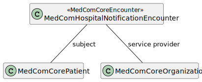

# MedComHospitalNotificationEncounter - DK MedCom HospitalNotification v3.0.2

* [**Table of Contents**](toc.md)
* [**Artifacts Summary**](artifacts.md)
* **MedComHospitalNotificationEncounter**

## Resource Profile: MedComHospitalNotificationEncounter 

| | |
| :--- | :--- |
| *Official URL*:http://medcomfhir.dk/ig/hospitalnotification/StructureDefinition/medcom-hospitalNotification-encounter | *Version*:3.0.2 |
| Active as of 2026-02-10 | *Computable Name*:MedComHospitalNotificationEncounter |

 
Encounter derivation that handles hospital notification when a patient is admitted to a hospital. The hospital notification is always send from a hospital. The receiver of the message is the patients home municipalicy. The hospital notification is send for example when patient is admitted, on leave, returned from leave, finished hospital stay. 

### Scope and usage

This profile is used as the Encounter resource for the HospitalNotification message. The HospitalNotificationEncounter inherits from the MedComCoreEncounter. Besides the references shown on the figure below, the MedComHospitalNotificationEncounter contains an episode of care identifier (Danish: forløbsid), a status describing the status of the encounter e.g., if the patient is **onleave** and the class of the admission, which can be either **inpatient** or **emergency**. Both status and class shall be included in all messages and depending on the status of the encounter, the status and class shall be assigned to different codes. [Here you the find the combination of codes](https://medcomdk.github.io/dk-medcom-hospitalnotification/#hospitalnotification-codes-in-fhir).

The HospitalNotification message is sent without patient consent, why only a limited data set is allowed to transmit due to Danish legislation. For this reason, is the HospitalNotificationEncounter profile quite narrow. [More information about the legal aspects can be found here](https://medcomdk.github.io/dk-medcom-hospitalnotification/#clinical-guidelines).

The figure below shows the references from a MedComHospitalNotificationEncounter.



Please refer to the tab "Snapshot Table(Must support)" below for the definition of the required content of a MedComHospitalNotificationEncounter.

### Service Provider

The element Encounter.serviceProvider describes the organization or hospital department in charge of the patient's admission. The element references a MedComMessagingOrganization or MedComCoreOrganization, since MedComMessaigingOrganization inherits properties from MedComCoreOrganization.

The sender of a HospitalNotification (MessageHeader.sender) and the serviceProvider (Encounter.serviceProvider) may be the same hospital department, hence be represented referencing the same instance of a Organization resource, which shall be a MedComMessagingOrganization. However, the sender organisation may be a higher-level department (in the SOR register) than the serviceProvider organisation, and in this case they shall be represented referencing two different instances of a Organization resource.

[An example of different serviceProvider and sender organisation can be found here](https://medcomfhir.dk/ig/hospitalnotification/Bundle-m908i967-9ie3-9023-b9ec-98108695f01d.html). Other examples will have the same organisation as serviceProvider and sender.

### Episode of care identifier

The MedComHospitalNotificationEncounter profile requires at least one episode of care identifiers to be included, but allows more than one to be included. The episode of care identifier can be a locally defined UUID for the specific admission/contact or it can be an LPR3 identifier. The identifier is used for linking messages exchanged during a specific message flow. Hence, the episode of care identifier send and received in the initial HospitalNotification message must also be returned in e.g ReportOfAdmission (Danish: Indlæggelsesrapport), ProgressOfCarePlan (Danish: Plejeforløbsplan), CareCommunication (Danish: Korrespondancemeddelelse) etc.

**In case only one episode of care identifier is included in the initial HospitalNotification message, either a locally defined UUID for the specific admission/contact or an LPR3 identifier:** The following messages exchanged must apply/return this episode of care identifier, regardless of whether it is a locally defined UUID or an LPR3 identifier. If more identifiers are subsequently added, these can be ignored (or returned if possible).

**In case more episode of care identifiers are included in the initial HospitalNotification message:** The following messages exchanged must return the locally defined UUID for the specific admission/contact. The other identifiers can be ignored (or returned if possible).

#### System for locally defined episode of care identifiers

When a locally defined identifier for the specific admission/contact is included in a HospitalNotification message, a system for the identifier shall also be included. The system is used to destinguish between the LPR3 identifier and the locally defined identifier. The system is found at Encounter.episodeOfCare.identifier.system in the profile. The datatype of the system is Unique Resource Identifier Reference (uri), meaning that the system must be absolut or relative unique. It is recommended to use SOR-endpoint, which is also definied in the MessageHeader.source.endpoint. This is shown in the XML-snippet and examples below.

```
 <episodeOfCare>
    <identifier>
      <system value="https://sor2.sum.dsdn.dk/#id=265161000016000"/>
      <value value="bd481c38-a921-11ed-afa1-0242ac120002"/>
    </identifier>
  </episodeOfCare>

```

[A simplified example with two episode of care identifieres can be found here](./hospitalnotification/HNAdmitInPatEoC.svg) and [a FHIR example with two episode of care identifieres can be found here](https://medcomfhir.dk/ig/hospitalnotification/Bundle-n73ccf30-80b9-4bd2-bf50-1ac1914498f0.html) Other examples will have just one episode of care identifier.

### Timestamps

The Encounter profile contains four timestamps each representing a different time during a hospitalisation. Common for the four timestamps is that they represent the time of the event, e.g. the patient's physical attendance at the hospital (Encounter.period.start) or a patient going on leave from the hospital (Encounter.extension:leavePeriod.start).

| | | | |
| :--- | :--- | :--- | :--- |
| Encounter.period.start | Start hospital stay, i.e. the actual beginning of the meeting between the health care professional and patient | Patient's physical attendance at the hospital | [HospitalNotification Encounter - STIN](https://medcomfhir.dk/ig/hospitalnotification/Encounter-a790f964-88d3-4652-bbc8-81d2f3d035f8.html)and[HospitalNotification Encounter - STAA](https://medcomfhir.dk/ig/hospitalnotification/Encounter-h2cb16ce-af8c-46f3-be9e-89406ef3e7b5.html) |
| Encounter.period.end | End hospital stay, i.e. the actual end of the meeting between the health care professional and patient | Patient leaves the hospital after discharge or when a patient dies (on arrival or during hospital stay) | [HospitalNotification Encounter - SLHJ (inpatient)](https://medcomfhir.dk/ig/hospitalnotification/Encounter-f405ba2d-467a-4e92-9acc-9dc2a629760f.html)and[HospitalNotification Encounter - MORS (inpatient)](https://medcomfhir.dk/ig/hospitalnotification/Encounter-gcab7218-9584-11ec-b909-0242ac120002.html) |
| Encounter.extension:leavePeriod.start | Patient starts leave, i.e. the actual beginning of a leave-period | Patient leaves the hospital to go on leave. | [HospitalNotification Encounter - STOR](https://medcomfhir.dk/ig/hospitalnotification/Encounter-d56e9c54-23d2-43a4-816e-951d2a6e3281.html) |
| Encounter.extension:leavePeriod.end | Patient ends leave, i.e. the actual end of a leave-period | Patient's physical attendance at the hospital after a period of leave | [HospitalNotification Encounter - SLOR](https://medcomfhir.dk/ig/hospitalnotification/Encounter-e07c4bd4-cfad-4c4d-9c4b-e4ba3424a65b.html) |

#### Start and end of hospital stay

As described above, the timestamp of start and end of hospital stay are included in the elements Encounter.period.start and Encounter.period.end, respectively. Encounter.period.start shall always be present, also when sending a HospitalNotification describing a period of leave or end or hospital stay.

In cases where a patient is transferred to a hospital in the same region or in another region, or a hospitalisation changes from 'acute ambulant' to 'inpatient', a new start hospital stay HospitalNotification shall be sent. These three cases shall result in a new instance of the Encounter profile which has a new Encounter.period.start representing the time of the change in the hospitalisation. All cases are described in the [Clinical guidelines for application](https://medcomdk.github.io/dk-medcom-hospitalnotification/#11-clinical-guidelines-for-application).

#### Leave

To express the timestamps for a period of leave, the MedComHospitalNotificationLeavePeriodExtension shall be used.

When a patient goes on leave the Encounter.extension:leavePeriod.start shall be used, and when the patient returns from leave both Encounter.extension:leavePeriod.start and Encounter.extension:leavePeriod.end shall be present.

The cardinality of MedComHospitalNotificationLeavePeriodExtension is 0..1 meaning that only one period of leave can be included in a HospitalNotification to avoid confusion about which period of leave is the current. In case a patient goes on leave several times during the same hospitalisation, the period shall be described in separate HospitalNotifications, that are being sent when each period of leave occurs.

#### Death

When a patient dies either on arrival or during hospital stay, the timestamp Encounter.period.end represents the time the encounter ended i.e the time of death. The Encounter.period.start shall also be populated. If a patient dies on arrival Encounter.period.start shall be equal to Encounter.period.end, and if the patient dies during hospital stay Encounter.period.start shall represent the actual beginning of the hospital stay. A HospitalNotification can only be interpreted as describing a deceased patient when the element Patient.deaceased = 'true'.

**Usages:**

* Refer to this Profile: [MedComHospitalNotificationMessageHeader](StructureDefinition-medcom-hospitalNotification-messageHeader.md)
* Examples for this Profile: [Encounter/a790f964-88d3-4652-bbc8-81d2f3d035f8](Encounter-a790f964-88d3-4652-bbc8-81d2f3d035f8.md), [Encounter/b9846c24-0335-11ed-b939-0242ac120002](Encounter-b9846c24-0335-11ed-b939-0242ac120002.md), [Encounter/c9782061-ce63-41b5-8be6-655812d23332](Encounter-c9782061-ce63-41b5-8be6-655812d23332.md), [Encounter/d56e9c54-23d2-43a4-816e-951d2a6e3281](Encounter-d56e9c54-23d2-43a4-816e-951d2a6e3281.md)... Show 8 more, [Encounter/e07c4bd4-cfad-4c4d-9c4b-e4ba3424a65b](Encounter-e07c4bd4-cfad-4c4d-9c4b-e4ba3424a65b.md), [Encounter/f405ba2d-467a-4e92-9acc-9dc2a629760f](Encounter-f405ba2d-467a-4e92-9acc-9dc2a629760f.md), [Encounter/gcab7218-9584-11ec-b909-0242ac120002](Encounter-gcab7218-9584-11ec-b909-0242ac120002.md), [Encounter/h2cb16ce-af8c-46f3-be9e-89406ef3e7b5](Encounter-h2cb16ce-af8c-46f3-be9e-89406ef3e7b5.md), [Encounter/kbbad98c-3310-404a-af0c-7e3739d7b49f](Encounter-kbbad98c-3310-404a-af0c-7e3739d7b49f.md), [Encounter/l001c640-6b5d-414c-b6bd-e00ec6d4ceee](Encounter-l001c640-6b5d-414c-b6bd-e00ec6d4ceee.md), [Encounter/m790f964-98d3-4852-bac8-83d2f3d035f8](Encounter-m790f964-98d3-4852-bac8-83d2f3d035f8.md) and [Encounter/ne70f2b8-a924-11ed-afa1-0242ac120002](Encounter-ne70f2b8-a924-11ed-afa1-0242ac120002.md)

You can also check for [usages in the FHIR IG Statistics](https://packages2.fhir.org/xig/medcom.fhir.dk.hospitalnotification|current/StructureDefinition/medcom-hospitalNotification-encounter)

### Formal Views of Profile Content

 [Description of Profiles, Differentials, Snapshots and how the different presentations work](http://build.fhir.org/ig/FHIR/ig-guidance/readingIgs.html#structure-definitions). 

 

Other representations of profile: [CSV](StructureDefinition-medcom-hospitalNotification-encounter.csv), [Excel](StructureDefinition-medcom-hospitalNotification-encounter.xlsx), [Schematron](StructureDefinition-medcom-hospitalNotification-encounter.sch) 


## Resource Content

```json
{
  "resourceType" : "StructureDefinition",
  "id" : "medcom-hospitalNotification-encounter",
  "url" : "http://medcomfhir.dk/ig/hospitalnotification/StructureDefinition/medcom-hospitalNotification-encounter",
  "version" : "3.0.2",
  "name" : "MedComHospitalNotificationEncounter",
  "status" : "active",
  "date" : "2026-02-10T12:53:24+00:00",
  "publisher" : "MedCom",
  "contact" : [
    {
      "name" : "MedCom",
      "telecom" : [
        {
          "system" : "url",
          "value" : "http://www.medcom.dk"
        }
      ]
    }
  ],
  "description" : "Encounter derivation that handles hospital notification when a patient is admitted to a hospital. The hospital notification is always send from a hospital. The receiver of the message is the patients home municipalicy. The hospital notification is send for example when patient is admitted, on leave, returned from leave, finished hospital stay.",
  "jurisdiction" : [
    {
      "coding" : [
        {
          "system" : "urn:iso:std:iso:3166",
          "code" : "DK",
          "display" : "Denmark"
        }
      ]
    }
  ],
  "fhirVersion" : "4.0.1",
  "mapping" : [
    {
      "identity" : "workflow",
      "uri" : "http://hl7.org/fhir/workflow",
      "name" : "Workflow Pattern"
    },
    {
      "identity" : "rim",
      "uri" : "http://hl7.org/v3",
      "name" : "RIM Mapping"
    },
    {
      "identity" : "w5",
      "uri" : "http://hl7.org/fhir/fivews",
      "name" : "FiveWs Pattern Mapping"
    },
    {
      "identity" : "v2",
      "uri" : "http://hl7.org/v2",
      "name" : "HL7 v2 Mapping"
    }
  ],
  "kind" : "resource",
  "abstract" : false,
  "type" : "Encounter",
  "baseDefinition" : "http://medcomfhir.dk/ig/core/StructureDefinition/medcom-core-encounter",
  "derivation" : "constraint",
  "differential" : {
    "element" : [
      {
        "id" : "Encounter",
        "path" : "Encounter",
        "constraint" : [
          {
            "key" : "medcom-hospitalNotification-6",
            "severity" : "error",
            "human" : "When the status = 'onleave', the timestamp for beginning of a leave (extension.valuePeriod.start) shall be present.",
            "expression" : "where(status = 'onleave').extension.value.start.exists() or status != 'onleave'",
            "source" : "http://medcomfhir.dk/ig/hospitalnotification/StructureDefinition/medcom-hospitalNotification-encounter"
          }
        ]
      },
      {
        "id" : "Encounter.extension",
        "path" : "Encounter.extension",
        "slicing" : {
          "discriminator" : [
            {
              "type" : "value",
              "path" : "url"
            }
          ],
          "ordered" : false,
          "rules" : "open"
        }
      },
      {
        "id" : "Encounter.extension:leavePeriod",
        "path" : "Encounter.extension",
        "sliceName" : "leavePeriod",
        "min" : 0,
        "max" : "1",
        "type" : [
          {
            "code" : "Extension",
            "profile" : [
              "http://medcomfhir.dk/ig/hospitalnotification/StructureDefinition/medcom-hospitalnotifiation-leave-period-extension"
            ]
          }
        ],
        "mustSupport" : true
      },
      {
        "id" : "Encounter.status",
        "path" : "Encounter.status",
        "short" : "in-progress | onleave | finished | entered-in-error",
        "binding" : {
          "strength" : "required",
          "valueSet" : "http://medcomfhir.dk/ig/terminology/ValueSet/medcom-hospitalNotification-encounterStatus"
        }
      },
      {
        "id" : "Encounter.class",
        "path" : "Encounter.class",
        "short" : "inpatient | emergency | other",
        "binding" : {
          "strength" : "required",
          "valueSet" : "http://medcomfhir.dk/ig/terminology/ValueSet/medcom-hospitalNotification-encounterClass"
        }
      },
      {
        "id" : "Encounter.type",
        "path" : "Encounter.type",
        "max" : "0"
      },
      {
        "id" : "Encounter.serviceType",
        "path" : "Encounter.serviceType",
        "max" : "0"
      },
      {
        "id" : "Encounter.priority",
        "path" : "Encounter.priority",
        "max" : "0"
      },
      {
        "id" : "Encounter.episodeOfCare",
        "path" : "Encounter.episodeOfCare",
        "definition" : "Shall contain an episode of care identifier for the entire hospitalisation",
        "min" : 1
      },
      {
        "id" : "Encounter.episodeOfCare.reference",
        "path" : "Encounter.episodeOfCare.reference",
        "max" : "0"
      },
      {
        "id" : "Encounter.episodeOfCare.identifier",
        "path" : "Encounter.episodeOfCare.identifier",
        "min" : 1
      },
      {
        "id" : "Encounter.episodeOfCare:lpr3identifier",
        "path" : "Encounter.episodeOfCare",
        "sliceName" : "lpr3identifier"
      },
      {
        "id" : "Encounter.episodeOfCare:lpr3identifier.reference",
        "path" : "Encounter.episodeOfCare.reference",
        "max" : "0"
      },
      {
        "id" : "Encounter.episodeOfCare:lpr3identifier.identifier",
        "path" : "Encounter.episodeOfCare.identifier",
        "isSummary" : true
      },
      {
        "id" : "Encounter.basedOn",
        "path" : "Encounter.basedOn",
        "max" : "0"
      },
      {
        "id" : "Encounter.participant",
        "path" : "Encounter.participant",
        "max" : "0"
      },
      {
        "id" : "Encounter.appointment",
        "path" : "Encounter.appointment",
        "max" : "0"
      },
      {
        "id" : "Encounter.period",
        "path" : "Encounter.period",
        "definition" : "The start and end time of the encounter. For notification of hospitalisation an start interval is always known as the notification of adminssion is trigged by the arrival of a patient. There a period will always exist as the notification of admission always starts the communication flow. Please that the encounter.period values always referes to the encounter start and end. The period of the leave of absence is not part of the notification of hospitalization FHIR resource .",
        "min" : 1,
        "mustSupport" : true
      },
      {
        "id" : "Encounter.period.start",
        "path" : "Encounter.period.start",
        "short" : "Encounter start time.",
        "definition" : "In HospitalNotification a start time is the timestamp that is registered by the hospital at patient physical attendance at the hospital.",
        "min" : 1,
        "mustSupport" : true
      },
      {
        "id" : "Encounter.period.end",
        "path" : "Encounter.period.end",
        "short" : "Encounter end time.",
        "definition" : "In HospitalNotification a end time is the timestamp that is registered by the hospital when the patient leaves the hospital after discharge.",
        "mustSupport" : true
      },
      {
        "id" : "Encounter.length",
        "path" : "Encounter.length",
        "max" : "0"
      },
      {
        "id" : "Encounter.reasonCode",
        "path" : "Encounter.reasonCode",
        "max" : "0"
      },
      {
        "id" : "Encounter.reasonReference",
        "path" : "Encounter.reasonReference",
        "max" : "0"
      },
      {
        "id" : "Encounter.diagnosis",
        "path" : "Encounter.diagnosis",
        "max" : "0"
      },
      {
        "id" : "Encounter.account",
        "path" : "Encounter.account",
        "definition" : "The set of accounts and issurance information that may be used for billing for this Encounter. The account element shall not be used in NotificationOfHospitalStayEncounter"
      },
      {
        "id" : "Encounter.hospitalization",
        "path" : "Encounter.hospitalization",
        "max" : "0"
      },
      {
        "id" : "Encounter.location",
        "path" : "Encounter.location",
        "max" : "0"
      },
      {
        "id" : "Encounter.serviceProvider",
        "path" : "Encounter.serviceProvider",
        "min" : 1
      },
      {
        "id" : "Encounter.partOf",
        "path" : "Encounter.partOf",
        "max" : "0"
      }
    ]
  }
}

```
