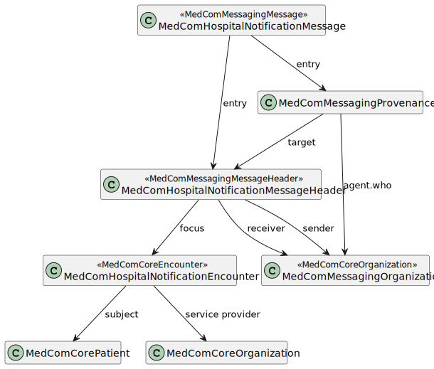

# MedComHospitalNotificationMessage - DK MedCom HospitalNotification v3.0.2

* [**Table of Contents**](toc.md)
* [**Artifacts Summary**](artifacts.md)
* **MedComHospitalNotificationMessage**

## Resource Profile: MedComHospitalNotificationMessage 

| | |
| :--- | :--- |
| *Official URL*:http://medcomfhir.dk/ig/hospitalnotification/StructureDefinition/medcom-hospitalNotification-message | *Version*:3.0.2 |
| Active as of 2026-02-10 | *Computable Name*:MedComHospitalNotificationMessage |

 
A message for a HospitalNotification. The message is triggered as patients are admitted, onleave or has finished a hospital stay in order to notify the relevant Municipalicy home care 

### Scope and usage

This profile is the root profile of MedCom HospitalNotification message. This profile is inherited from the MedComMessagingMessage. The following figure represent the profiles that shall be included in a MedCom FHIR HospitalNotification message.



The Bundle containing the HospitalNotification message is selfcontained, why it shall contain one instance of the MedComHospitalNotificationMessageHeader. By convention the cardinality is shown as 0..*.

Please refer to the tab "Snapshot Table(Must support)" below for the definition of the required content of a MedComHospitalNotificationMessage.

**Usages:**

* Examples for this Profile: [Bundle/a5e5b880-c087-4055-b9ec-99108695f81d](Bundle-a5e5b880-c087-4055-b9ec-99108695f81d.md), [Bundle/bfab3e80-9584-11ec-b909-0242ac120002](Bundle-bfab3e80-9584-11ec-b909-0242ac120002.md), [Bundle/c83671a4-9584-11ec-b909-0242ac120002](Bundle-c83671a4-9584-11ec-b909-0242ac120002.md), [Bundle/d3128d9b-cede-4c7f-8904-809eab322d7d](Bundle-d3128d9b-cede-4c7f-8904-809eab322d7d.md)... Show 8 more, [Bundle/e94de8ee-bd94-475e-b454-b8fbbef8a685](Bundle-e94de8ee-bd94-475e-b454-b8fbbef8a685.md), [Bundle/f4aa42a4-86db-4e68-9b38-9dda0dfd5774](Bundle-f4aa42a4-86db-4e68-9b38-9dda0dfd5774.md), [Bundle/g099bbf3-3fca-4722-a248-bfe1aa956410](Bundle-g099bbf3-3fca-4722-a248-bfe1aa956410.md), [Bundle/h1c8e4a8-6b45-4669-94ad-2a99ad96bf03](Bundle-h1c8e4a8-6b45-4669-94ad-2a99ad96bf03.md), [Bundle/kcab461b-f44e-4d97-a041-ef7e64800587](Bundle-kcab461b-f44e-4d97-a041-ef7e64800587.md), [Bundle/ld31e08a-b91f-49c3-841a-ce80e6380517](Bundle-ld31e08a-b91f-49c3-841a-ce80e6380517.md), [Bundle/m908i967-9ie3-9023-b9ec-98108695f01d](Bundle-m908i967-9ie3-9023-b9ec-98108695f01d.md) and [Bundle/n73ccf30-80b9-4bd2-bf50-1ac1914498f0](Bundle-n73ccf30-80b9-4bd2-bf50-1ac1914498f0.md)

You can also check for [usages in the FHIR IG Statistics](https://packages2.fhir.org/xig/medcom.fhir.dk.hospitalnotification|current/StructureDefinition/medcom-hospitalNotification-message)

### Formal Views of Profile Content

 [Description of Profiles, Differentials, Snapshots and how the different presentations work](http://build.fhir.org/ig/FHIR/ig-guidance/readingIgs.html#structure-definitions). 

 

Other representations of profile: [CSV](StructureDefinition-medcom-hospitalNotification-message.csv), [Excel](StructureDefinition-medcom-hospitalNotification-message.xlsx), [Schematron](StructureDefinition-medcom-hospitalNotification-message.sch) 


## Resource Content

```json
{
  "resourceType" : "StructureDefinition",
  "id" : "medcom-hospitalNotification-message",
  "url" : "http://medcomfhir.dk/ig/hospitalnotification/StructureDefinition/medcom-hospitalNotification-message",
  "version" : "3.0.2",
  "name" : "MedComHospitalNotificationMessage",
  "status" : "active",
  "date" : "2026-02-10T12:53:24+00:00",
  "publisher" : "MedCom",
  "contact" : [
    {
      "name" : "MedCom",
      "telecom" : [
        {
          "system" : "url",
          "value" : "http://www.medcom.dk"
        }
      ]
    }
  ],
  "description" : "A message for a HospitalNotification. The message is triggered as patients are admitted, onleave or has finished a hospital stay in order to notify the relevant Municipalicy home care",
  "jurisdiction" : [
    {
      "coding" : [
        {
          "system" : "urn:iso:std:iso:3166",
          "code" : "DK",
          "display" : "Denmark"
        }
      ]
    }
  ],
  "fhirVersion" : "4.0.1",
  "mapping" : [
    {
      "identity" : "v2",
      "uri" : "http://hl7.org/v2",
      "name" : "HL7 v2 Mapping"
    },
    {
      "identity" : "rim",
      "uri" : "http://hl7.org/v3",
      "name" : "RIM Mapping"
    },
    {
      "identity" : "cda",
      "uri" : "http://hl7.org/v3/cda",
      "name" : "CDA (R2)"
    },
    {
      "identity" : "w5",
      "uri" : "http://hl7.org/fhir/fivews",
      "name" : "FiveWs Pattern Mapping"
    }
  ],
  "kind" : "resource",
  "abstract" : false,
  "type" : "Bundle",
  "baseDefinition" : "http://medcomfhir.dk/ig/messaging/StructureDefinition/medcom-messaging-message",
  "derivation" : "constraint",
  "differential" : {
    "element" : [
      {
        "id" : "Bundle",
        "path" : "Bundle",
        "constraint" : [
          {
            "key" : "medcom-hospitalNotification-1",
            "severity" : "error",
            "human" : "The message header shall conform to medcom-hospitalNotification-messageHeader profile",
            "expression" : "entry.ofType(MessageHeader).all(resource.conformsTo('http://medcomfhir.dk/fhir/hospitalnotification/StructureDefinition/medcom-hospitalNotification-messageHeader'))",
            "source" : "http://medcomfhir.dk/ig/hospitalnotification/StructureDefinition/medcom-hospitalNotification-message"
          },
          {
            "key" : "medcom-hospitalNotification-2",
            "severity" : "error",
            "human" : "Entry shall contain exactly one patient resource",
            "expression" : "entry.where(resource.is(Patient)).count() = 1",
            "source" : "http://medcomfhir.dk/ig/hospitalnotification/StructureDefinition/medcom-hospitalNotification-message"
          },
          {
            "key" : "medcom-hospitalNotification-3",
            "severity" : "error",
            "human" : "All provenance resources shall contain activities from medcom-hospitalNotification-messageActivities valueset",
            "expression" : "entry.ofType(Provenance).all(resource.activity.memberOf('http://medcomfhir.dk/fhir/dk-medcom-terminology/ValueSet/medcom-hospitalNotification-messageActivities'))",
            "source" : "http://medcomfhir.dk/ig/hospitalnotification/StructureDefinition/medcom-hospitalNotification-message"
          },
          {
            "key" : "medcom-hospitalNotification-4",
            "severity" : "error",
            "human" : "The system of Patient.identifier shall be 'urn:oid:1.2.208.176.1.2', which represents an official Danish CPR-number",
            "expression" : "entry.resource.ofType(Patient).identifier.system = 'urn:oid:1.2.208.176.1.2'",
            "source" : "http://medcomfhir.dk/ig/hospitalnotification/StructureDefinition/medcom-hospitalNotification-message"
          },
          {
            "key" : "medcom-hospitalNotification-5",
            "severity" : "error",
            "human" : "The receiver of a HospitalNotification shall always be a primary receiver.",
            "expression" : "Bundle.entry.resource.ofType(MessageHeader).destination.extension.value.code = 'primary'",
            "source" : "http://medcomfhir.dk/ig/hospitalnotification/StructureDefinition/medcom-hospitalNotification-message"
          }
        ]
      },
      {
        "id" : "Bundle.id",
        "path" : "Bundle.id",
        "short" : "A unique identifier for a bundle. The element must be updated with a new value each time a new message is sent."
      },
      {
        "id" : "Bundle.timestamp",
        "path" : "Bundle.timestamp",
        "short" : "Holds information about when a bundle is created."
      },
      {
        "id" : "Bundle.entry",
        "path" : "Bundle.entry",
        "short" : "Message content (MedComHospitalNotificationMessageHeader, MedComMessagingOrganization, MedComMessagingProvenance, MedComHospitalNotificationEncounter, MedComCorePatient) - Open"
      }
    ]
  }
}

```
