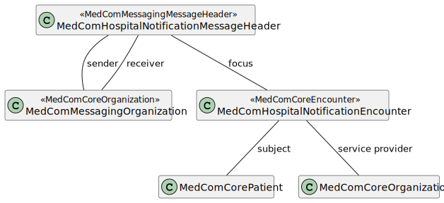

# MedComHospitalNotificationMessageHeader - DK MedCom HospitalNotification v3.0.2

* [**Table of Contents**](toc.md)
* [**Artifacts Summary**](artifacts.md)
* **MedComHospitalNotificationMessageHeader**

## Resource Profile: MedComHospitalNotificationMessageHeader 

| | |
| :--- | :--- |
| *Official URL*:http://medcomfhir.dk/ig/hospitalnotification/StructureDefinition/medcom-hospitalNotification-messageHeader | *Version*:3.0.2 |
| Active as of 2026-02-10 | *Computable Name*:MedComHospitalNotificationMessageHeader |

 
MessageHeader for a HospitalNotification message. 

### Scope and usage

This profile is used as the MessageHeader resource for the MedCom HospitalNotification message. Constraints and rules from MedComMessagingMessageHeader are inherited to this profile, but MedComHospitalNotificationMessageHeader is further restricted as carbon-copy is not allowed. The MedComHospitalNotificationMessageHeader contains an id which shall be globally unique for each message and an event code which shall be **hospital-notification-message** for a HospitalNotification message. Additionally, is it required to include a serviceprovider organization in the message.



Please refer to the tab "Snapshot Table(Must support)" below for the definition of the required content of a MedComHospitalNotificationMessageHeader.

### Report of admission

The request for a report of admission from a municipality shall be sent when a patient is initially admitted either as an inpatient or emergency admission or when an patient admitted as an inpatient is moved to a hospital in another region. Technically this includes setting the MessageHeader.extension.reportOfAdmissionFlag to 'true' and include a reference to the receiver of the report of admission in the element MessageHeader.extension.reportOfAdmissionRecipient. Section 2.1, in the [use case document](https://medcomdk.github.io/dk-medcom-hospitalnotification/#12-use-cases) describes more thoroughly in which cases the report of admission flag shall be sat to 'true'. The request for a report of admission should be made automatically.

**Usages:**

* Examples for this Profile: [MessageHeader/1ca19ddf-31bc-4597-8739-968c38dd88f8](MessageHeader-1ca19ddf-31bc-4597-8739-968c38dd88f8.md), [MessageHeader/a1b27813-8aa8-4fa1-846b-aeabf5afb7d4](MessageHeader-a1b27813-8aa8-4fa1-846b-aeabf5afb7d4.md), [MessageHeader/b9b4818e-02de-4cc4-b418-d20cbc7b5404](MessageHeader-b9b4818e-02de-4cc4-b418-d20cbc7b5404.md), [MessageHeader/cc47c1e2-78e6-4291-b071-f423a4f7fbfe](MessageHeader-cc47c1e2-78e6-4291-b071-f423a4f7fbfe.md)... Show 10 more, [MessageHeader/d8749b54-1aeb-4089-8941-8d876bdffc51](MessageHeader-d8749b54-1aeb-4089-8941-8d876bdffc51.md), [MessageHeader/e563a2b2-bf92-4b13-bbd2-0a021a95bded](MessageHeader-e563a2b2-bf92-4b13-bbd2-0a021a95bded.md), [MessageHeader/f47254da-f170-46f0-b624-4778a9c92b1f](MessageHeader-f47254da-f170-46f0-b624-4778a9c92b1f.md), [MessageHeader/g1affa53-c157-4080-abb0-8e681524f969](MessageHeader-g1affa53-c157-4080-abb0-8e681524f969.md), [MessageHeader/hefc6d95-6161-4493-99c9-f359488dedb8](MessageHeader-hefc6d95-6161-4493-99c9-f359488dedb8.md), [MessageHeader/i50fc5fe-2d11-4ef3-acac-2e2e5c6c0029](MessageHeader-i50fc5fe-2d11-4ef3-acac-2e2e5c6c0029.md), [MessageHeader/j3675c4a-33db-40f1-b578-ff16e3e9134c](MessageHeader-j3675c4a-33db-40f1-b578-ff16e3e9134c.md), [MessageHeader/m9bea09c-e662-4d59-b84f-9af570b57f42](MessageHeader-m9bea09c-e662-4d59-b84f-9af570b57f42.md), [MessageHeader/nabb68aa-c97b-4905-a60c-71ff3209fd51](MessageHeader-nabb68aa-c97b-4905-a60c-71ff3209fd51.md) and [MessageHeader/o9b4818e-12de-5cc4-c418-d30cbc7b5404](MessageHeader-o9b4818e-12de-5cc4-c418-d30cbc7b5404.md)

You can also check for [usages in the FHIR IG Statistics](https://packages2.fhir.org/xig/medcom.fhir.dk.hospitalnotification|current/StructureDefinition/medcom-hospitalNotification-messageHeader)

### Formal Views of Profile Content

 [Description of Profiles, Differentials, Snapshots and how the different presentations work](http://build.fhir.org/ig/FHIR/ig-guidance/readingIgs.html#structure-definitions). 

 

Other representations of profile: [CSV](StructureDefinition-medcom-hospitalNotification-messageHeader.csv), [Excel](StructureDefinition-medcom-hospitalNotification-messageHeader.xlsx), [Schematron](StructureDefinition-medcom-hospitalNotification-messageHeader.sch) 


## Resource Content

```json
{
  "resourceType" : "StructureDefinition",
  "id" : "medcom-hospitalNotification-messageHeader",
  "url" : "http://medcomfhir.dk/ig/hospitalnotification/StructureDefinition/medcom-hospitalNotification-messageHeader",
  "version" : "3.0.2",
  "name" : "MedComHospitalNotificationMessageHeader",
  "status" : "active",
  "date" : "2026-02-10T12:55:02+00:00",
  "publisher" : "MedCom",
  "contact" : [
    {
      "name" : "MedCom",
      "telecom" : [
        {
          "system" : "url",
          "value" : "http://www.medcom.dk"
        }
      ]
    }
  ],
  "description" : "MessageHeader for a HospitalNotification message.",
  "jurisdiction" : [
    {
      "coding" : [
        {
          "system" : "urn:iso:std:iso:3166",
          "code" : "DK",
          "display" : "Denmark"
        }
      ]
    }
  ],
  "fhirVersion" : "4.0.1",
  "mapping" : [
    {
      "identity" : "v2",
      "uri" : "http://hl7.org/v2",
      "name" : "HL7 v2 Mapping"
    },
    {
      "identity" : "rim",
      "uri" : "http://hl7.org/v3",
      "name" : "RIM Mapping"
    },
    {
      "identity" : "w5",
      "uri" : "http://hl7.org/fhir/fivews",
      "name" : "FiveWs Pattern Mapping"
    }
  ],
  "kind" : "resource",
  "abstract" : false,
  "type" : "MessageHeader",
  "baseDefinition" : "http://medcomfhir.dk/ig/messaging/StructureDefinition/medcom-messaging-messageHeader",
  "derivation" : "constraint",
  "differential" : {
    "element" : [
      {
        "id" : "MessageHeader",
        "path" : "MessageHeader"
      },
      {
        "id" : "MessageHeader.id",
        "path" : "MessageHeader.id",
        "short" : "A unique identifier for each message. This identifier should be globally unique."
      },
      {
        "id" : "MessageHeader.extension",
        "path" : "MessageHeader.extension",
        "slicing" : {
          "discriminator" : [
            {
              "type" : "value",
              "path" : "url"
            }
          ],
          "ordered" : false,
          "rules" : "open"
        }
      },
      {
        "id" : "MessageHeader.extension:reportOfAdmissionFlag",
        "path" : "MessageHeader.extension",
        "sliceName" : "reportOfAdmissionFlag",
        "definition" : "Shall be set to true if recipient is requested to send a report of admission",
        "min" : 0,
        "max" : "1",
        "type" : [
          {
            "code" : "Extension",
            "profile" : [
              "http://medcomfhir.dk/ig/hospitalnotification/StructureDefinition/medcom-messaging-reportOfAdmissionExtension"
            ]
          }
        ],
        "mustSupport" : true
      },
      {
        "id" : "MessageHeader.extension:reportOfAdmissionRecipient",
        "path" : "MessageHeader.extension",
        "sliceName" : "reportOfAdmissionRecipient",
        "definition" : "Shall contain recipient of report of admission if the recipient is not the sender of the hospital notification",
        "min" : 0,
        "max" : "1",
        "type" : [
          {
            "code" : "Extension",
            "profile" : [
              "http://medcomfhir.dk/ig/hospitalnotification/StructureDefinition/medcom-messaging-reportOfAdmissionRecipientExtension"
            ]
          }
        ],
        "mustSupport" : true
      },
      {
        "id" : "MessageHeader.event[x]",
        "path" : "MessageHeader.event[x]",
        "short" : "The MedComMessagingMessageHeader shall contain the event value hospital-notification-message",
        "patternCoding" : {
          "system" : "http://medcomfhir.dk/ig/terminology/CodeSystem/medcom-messaging-eventCodes",
          "code" : "hospital-notification-message"
        }
      },
      {
        "id" : "MessageHeader.destination:cc",
        "path" : "MessageHeader.destination",
        "sliceName" : "cc",
        "max" : "0"
      },
      {
        "id" : "MessageHeader.focus",
        "path" : "MessageHeader.focus",
        "min" : 1,
        "max" : "1",
        "type" : [
          {
            "code" : "Reference",
            "targetProfile" : [
              "http://medcomfhir.dk/ig/hospitalnotification/StructureDefinition/medcom-hospitalNotification-encounter"
            ],
            "aggregation" : ["bundled"]
          }
        ],
        "mustSupport" : true
      }
    ]
  }
}

```
