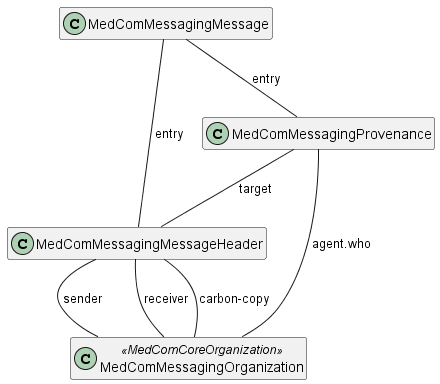

# MedComMessagingMessage - DK MedCom Messaging v4.0.2

* [**Table of Contents**](toc.md)
* [**Artifacts Summary**](artifacts.md)
* **MedComMessagingMessage**

## Resource Profile: MedComMessagingMessage 

| | |
| :--- | :--- |
| *Official URL*:http://medcomfhir.dk/ig/messaging/StructureDefinition/medcom-messaging-message | *Version*:4.0.2 |
| Active as of 2026-02-13 | *Computable Name*:MedComMessagingMessage |

 
Base resource for all MedCom messages. 

### Scope and usage

This profile describes the Bundle resource that shall be used in all MedCom FHIR Messages. MedComMessagingMessage is the root in all messages, as shown on the figure below. As this profile is the used in a message, shall the element type in MedComMessagingMessage always be **message**. This entails that the first resource in the entry element shall be a MedComMessagingMessageHeader.

For each messaging standard e.g., HospitalNotification or CareCommunication is a different set of profiles defined, but common to them both is that all included profiles shall be referenced from the entry element. Due to the different requirements for each standard, it should be expected that the MedComMessagingMessage is inherited in each standard.



Please refer to the tab "Snapshot Table(Must support)" below for the definition of the required content of a MedComMessagingMessage.

**Usages:**

* Examples for this Profile: [Bundle/eb26be85-fdb7-454d-a980-95cba6d1745b](Bundle-eb26be85-fdb7-454d-a980-95cba6d1745b.md)

You can also check for [usages in the FHIR IG Statistics](https://packages2.fhir.org/xig/medcom.fhir.dk.messaging|current/StructureDefinition/medcom-messaging-message)

### Formal Views of Profile Content

 [Description of Profiles, Differentials, Snapshots and how the different presentations work](http://build.fhir.org/ig/FHIR/ig-guidance/readingIgs.html#structure-definitions). 

 

Other representations of profile: [CSV](StructureDefinition-medcom-messaging-message.csv), [Excel](StructureDefinition-medcom-messaging-message.xlsx), [Schematron](StructureDefinition-medcom-messaging-message.sch) 


## Resource Content

```json
{
  "resourceType" : "StructureDefinition",
  "id" : "medcom-messaging-message",
  "url" : "http://medcomfhir.dk/ig/messaging/StructureDefinition/medcom-messaging-message",
  "version" : "4.0.2",
  "name" : "MedComMessagingMessage",
  "status" : "active",
  "date" : "2026-02-13T09:21:25+00:00",
  "publisher" : "MedCom",
  "contact" : [
    {
      "name" : "MedCom",
      "telecom" : [
        {
          "system" : "url",
          "value" : "http://www.medcom.dk"
        }
      ]
    }
  ],
  "description" : "Base resource for all MedCom messages.",
  "jurisdiction" : [
    {
      "coding" : [
        {
          "system" : "urn:iso:std:iso:3166",
          "code" : "DK",
          "display" : "Denmark"
        }
      ]
    }
  ],
  "fhirVersion" : "4.0.1",
  "mapping" : [
    {
      "identity" : "v2",
      "uri" : "http://hl7.org/v2",
      "name" : "HL7 v2 Mapping"
    },
    {
      "identity" : "rim",
      "uri" : "http://hl7.org/v3",
      "name" : "RIM Mapping"
    },
    {
      "identity" : "cda",
      "uri" : "http://hl7.org/v3/cda",
      "name" : "CDA (R2)"
    },
    {
      "identity" : "w5",
      "uri" : "http://hl7.org/fhir/fivews",
      "name" : "FiveWs Pattern Mapping"
    }
  ],
  "kind" : "resource",
  "abstract" : false,
  "type" : "Bundle",
  "baseDefinition" : "http://hl7.org/fhir/StructureDefinition/Bundle",
  "derivation" : "constraint",
  "differential" : {
    "element" : [
      {
        "id" : "Bundle",
        "path" : "Bundle",
        "constraint" : [
          {
            "key" : "medcom-messaging-2",
            "severity" : "error",
            "human" : "There shall be at least one Provenance resource in a MedCom message",
            "expression" : "entry.resource.ofType(Provenance).exists()",
            "source" : "http://medcomfhir.dk/ig/messaging/StructureDefinition/medcom-messaging-message"
          }
        ]
      },
      {
        "id" : "Bundle.id",
        "path" : "Bundle.id",
        "min" : 1,
        "mustSupport" : true
      },
      {
        "id" : "Bundle.type",
        "path" : "Bundle.type",
        "short" : "Always message",
        "patternCode" : "message",
        "mustSupport" : true
      },
      {
        "id" : "Bundle.timestamp",
        "path" : "Bundle.timestamp",
        "min" : 1,
        "mustSupport" : true
      },
      {
        "id" : "Bundle.entry",
        "path" : "Bundle.entry",
        "mustSupport" : true
      },
      {
        "id" : "Bundle.entry.resource",
        "path" : "Bundle.entry.resource",
        "short" : "Each MedCom message shall contain a MedComMessagingMessageHeader and MedComMessagingProvenance. Please refer to invariant medcom-messaging-1, medcom-messaging-2, and medcom-messaging-3.",
        "mustSupport" : true
      }
    ]
  }
}

```
