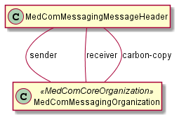

# MedComMessagingMessageHeader - DK MedCom Messaging v4.0.2

* [**Table of Contents**](toc.md)
* [**Artifacts Summary**](artifacts.md)
* **MedComMessagingMessageHeader**

## Resource Profile: MedComMessagingMessageHeader 

| | |
| :--- | :--- |
| *Official URL*:http://medcomfhir.dk/ig/messaging/StructureDefinition/medcom-messaging-messageHeader | *Version*:4.0.2 |
| Active as of 2026-02-13 | *Computable Name*:MedComMessagingMessageHeader |

 
MessageHeader for MedCom messages 

### Scope and usage

This profile describes the MessageHeader resource that shall be used in all MedCom FHIR Messages. A MedComMessagingMessageHeader shall include a sender and receiver and it may include a carbon-copy receiver, however this is depended on type of standard. Each MedComMessagingMessageHeader shall include a globally unique id, which is used to describe the message history from the [MedComMessagingProvenance](StructureDefinition-medcom-messaging-provenance.md) profile.

The element event shall be defined in accordance with the type of standard the message concerns e.g., HospitalNotification and CareCommunication. Due to the different requirements for each standard, it should be expected that the MedComMessagingMessageHeader is inherited in each standard.



Please refer to the tab "Snapshot Table(Must support)" below for the definition of the required content of a MedComMessagingMessageHeader.

**Usages:**

* Refer to this Profile: [MedComMessagingProvenance](StructureDefinition-medcom-messaging-provenance.md)
* Examples for this Profile: [MessageHeader/3881874e-2042-4a00-aee8-23512799f512](MessageHeader-3881874e-2042-4a00-aee8-23512799f512.md), [MessageHeader/42c01434-8feb-11ec-b909-0242ac120002](MessageHeader-42c01434-8feb-11ec-b909-0242ac120002.md), [MessageHeader/cb0b2ef0-8feb-11ec-b909-0242ac120002](MessageHeader-cb0b2ef0-8feb-11ec-b909-0242ac120002.md) and [MessageHeader/d28b9cb4-8feb-11ec-b909-0242ac120002](MessageHeader-d28b9cb4-8feb-11ec-b909-0242ac120002.md)

You can also check for [usages in the FHIR IG Statistics](https://packages2.fhir.org/xig/medcom.fhir.dk.messaging|current/StructureDefinition/medcom-messaging-messageHeader)

### Formal Views of Profile Content

 [Description of Profiles, Differentials, Snapshots and how the different presentations work](http://build.fhir.org/ig/FHIR/ig-guidance/readingIgs.html#structure-definitions). 

 

Other representations of profile: [CSV](StructureDefinition-medcom-messaging-messageHeader.csv), [Excel](StructureDefinition-medcom-messaging-messageHeader.xlsx), [Schematron](StructureDefinition-medcom-messaging-messageHeader.sch) 


## Resource Content

```json
{
  "resourceType" : "StructureDefinition",
  "id" : "medcom-messaging-messageHeader",
  "url" : "http://medcomfhir.dk/ig/messaging/StructureDefinition/medcom-messaging-messageHeader",
  "version" : "4.0.2",
  "name" : "MedComMessagingMessageHeader",
  "status" : "active",
  "date" : "2026-02-13T09:21:25+00:00",
  "publisher" : "MedCom",
  "contact" : [
    {
      "name" : "MedCom",
      "telecom" : [
        {
          "system" : "url",
          "value" : "http://www.medcom.dk"
        }
      ]
    }
  ],
  "description" : "MessageHeader for MedCom messages",
  "jurisdiction" : [
    {
      "coding" : [
        {
          "system" : "urn:iso:std:iso:3166",
          "code" : "DK",
          "display" : "Denmark"
        }
      ]
    }
  ],
  "fhirVersion" : "4.0.1",
  "mapping" : [
    {
      "identity" : "v2",
      "uri" : "http://hl7.org/v2",
      "name" : "HL7 v2 Mapping"
    },
    {
      "identity" : "rim",
      "uri" : "http://hl7.org/v3",
      "name" : "RIM Mapping"
    },
    {
      "identity" : "w5",
      "uri" : "http://hl7.org/fhir/fivews",
      "name" : "FiveWs Pattern Mapping"
    }
  ],
  "kind" : "resource",
  "abstract" : false,
  "type" : "MessageHeader",
  "baseDefinition" : "http://hl7.org/fhir/StructureDefinition/MessageHeader",
  "derivation" : "constraint",
  "differential" : {
    "element" : [
      {
        "id" : "MessageHeader",
        "path" : "MessageHeader"
      },
      {
        "id" : "MessageHeader.id",
        "extension" : [
          {
            "extension" : [
              {
                "url" : "code",
                "valueCode" : "SHALL:in-narrative"
              },
              {
                "url" : "actor",
                "valueCanonical" : "http://medcomfhir.dk/ig/messaging/ActorDefinition/ProducerActor"
              }
            ],
            "url" : "http://hl7.org/fhir/StructureDefinition/obligation"
          }
        ],
        "path" : "MessageHeader.id",
        "short" : "Each message shall include a globally unique id.",
        "min" : 1,
        "mustSupport" : true
      },
      {
        "id" : "MessageHeader.text",
        "path" : "MessageHeader.text",
        "short" : "The narrative text SHALL always be included when exchanging a MedCom FHIR Bundle.",
        "mustSupport" : true
      },
      {
        "id" : "MessageHeader.text.status",
        "path" : "MessageHeader.text.status",
        "mustSupport" : true
      },
      {
        "id" : "MessageHeader.text.div",
        "path" : "MessageHeader.text.div",
        "mustSupport" : true
      },
      {
        "id" : "MessageHeader.event[x]",
        "path" : "MessageHeader.event[x]",
        "short" : "The event element shall contain a value from MedComMessagingMessageTypes",
        "type" : [
          {
            "code" : "Coding"
          }
        ],
        "mustSupport" : true,
        "binding" : {
          "strength" : "required",
          "valueSet" : "http://medcomfhir.dk/ig/terminology/ValueSet/medcom-messaging-messageTypes"
        }
      },
      {
        "id" : "MessageHeader.event[x].system",
        "path" : "MessageHeader.event[x].system",
        "min" : 1,
        "mustSupport" : true
      },
      {
        "id" : "MessageHeader.event[x].code",
        "extension" : [
          {
            "extension" : [
              {
                "url" : "code",
                "valueCode" : "SHALL:in-narrative"
              },
              {
                "url" : "actor",
                "valueCanonical" : "http://medcomfhir.dk/ig/messaging/ActorDefinition/ProducerActor"
              }
            ],
            "url" : "http://hl7.org/fhir/StructureDefinition/obligation"
          }
        ],
        "path" : "MessageHeader.event[x].code",
        "min" : 1,
        "mustSupport" : true
      },
      {
        "id" : "MessageHeader.destination",
        "path" : "MessageHeader.destination",
        "slicing" : {
          "discriminator" : [
            {
              "type" : "value",
              "path" : "extension('http://medcomfhir.dk/ig/messaging/StructureDefinition/medcom-messaging-destinationUseExtension').value.code"
            }
          ],
          "rules" : "closed"
        },
        "min" : 1,
        "mustSupport" : true
      },
      {
        "id" : "MessageHeader.destination:primary",
        "path" : "MessageHeader.destination",
        "sliceName" : "primary",
        "min" : 1,
        "max" : "1",
        "mustSupport" : true
      },
      {
        "id" : "MessageHeader.destination:primary.extension",
        "path" : "MessageHeader.destination.extension",
        "slicing" : {
          "discriminator" : [
            {
              "type" : "value",
              "path" : "url"
            }
          ],
          "ordered" : false,
          "rules" : "open"
        },
        "min" : 1
      },
      {
        "id" : "MessageHeader.destination:primary.extension:use",
        "path" : "MessageHeader.destination.extension",
        "sliceName" : "use",
        "min" : 1,
        "max" : "1",
        "type" : [
          {
            "code" : "Extension",
            "profile" : [
              "http://medcomfhir.dk/ig/messaging/StructureDefinition/medcom-messaging-destinationUseExtension"
            ]
          }
        ],
        "mustSupport" : true
      },
      {
        "id" : "MessageHeader.destination:primary.extension:use.value[x].system",
        "path" : "MessageHeader.destination.extension.value[x].system",
        "patternUri" : "http://medcomfhir.dk/ig/terminology/CodeSystem/medcom-messaging-destinationUse"
      },
      {
        "id" : "MessageHeader.destination:primary.extension:use.value[x].code",
        "path" : "MessageHeader.destination.extension.value[x].code",
        "patternCode" : "primary"
      },
      {
        "id" : "MessageHeader.destination:primary.endpoint",
        "extension" : [
          {
            "extension" : [
              {
                "url" : "code",
                "valueCode" : "SHALL:in-narrative"
              },
              {
                "url" : "actor",
                "valueCanonical" : "http://medcomfhir.dk/ig/messaging/ActorDefinition/ProducerActor"
              }
            ],
            "url" : "http://hl7.org/fhir/StructureDefinition/obligation"
          }
        ],
        "path" : "MessageHeader.destination.endpoint",
        "mustSupport" : true
      },
      {
        "id" : "MessageHeader.destination:primary.receiver",
        "extension" : [
          {
            "extension" : [
              {
                "url" : "code",
                "valueCode" : "SHALL:in-narrative"
              },
              {
                "url" : "actor",
                "valueCanonical" : "http://medcomfhir.dk/ig/messaging/ActorDefinition/ProducerActor"
              }
            ],
            "url" : "http://hl7.org/fhir/StructureDefinition/obligation"
          }
        ],
        "path" : "MessageHeader.destination.receiver",
        "short" : "The primary reciever of the message",
        "min" : 1,
        "type" : [
          {
            "code" : "Reference",
            "targetProfile" : [
              "http://medcomfhir.dk/ig/messaging/StructureDefinition/medcom-messaging-organization"
            ],
            "aggregation" : ["bundled"]
          }
        ],
        "mustSupport" : true
      },
      {
        "id" : "MessageHeader.destination:cc",
        "path" : "MessageHeader.destination",
        "sliceName" : "cc",
        "min" : 0,
        "max" : "*",
        "mustSupport" : true
      },
      {
        "id" : "MessageHeader.destination:cc.extension",
        "path" : "MessageHeader.destination.extension",
        "slicing" : {
          "discriminator" : [
            {
              "type" : "value",
              "path" : "url"
            }
          ],
          "ordered" : false,
          "rules" : "open"
        },
        "min" : 1
      },
      {
        "id" : "MessageHeader.destination:cc.extension:use",
        "path" : "MessageHeader.destination.extension",
        "sliceName" : "use",
        "min" : 1,
        "max" : "1",
        "type" : [
          {
            "code" : "Extension",
            "profile" : [
              "http://medcomfhir.dk/ig/messaging/StructureDefinition/medcom-messaging-destinationUseExtension"
            ]
          }
        ],
        "mustSupport" : true
      },
      {
        "id" : "MessageHeader.destination:cc.extension:use.value[x].system",
        "path" : "MessageHeader.destination.extension.value[x].system",
        "patternUri" : "http://medcomfhir.dk/ig/terminology/CodeSystem/medcom-messaging-destinationUse"
      },
      {
        "id" : "MessageHeader.destination:cc.extension:use.value[x].code",
        "path" : "MessageHeader.destination.extension.value[x].code",
        "patternCode" : "cc"
      },
      {
        "id" : "MessageHeader.destination:cc.endpoint",
        "extension" : [
          {
            "extension" : [
              {
                "url" : "code",
                "valueCode" : "SHALL:in-narrative"
              },
              {
                "url" : "actor",
                "valueCanonical" : "http://medcomfhir.dk/ig/messaging/ActorDefinition/ProducerActor"
              }
            ],
            "url" : "http://hl7.org/fhir/StructureDefinition/obligation"
          }
        ],
        "path" : "MessageHeader.destination.endpoint",
        "mustSupport" : true
      },
      {
        "id" : "MessageHeader.destination:cc.receiver",
        "extension" : [
          {
            "extension" : [
              {
                "url" : "code",
                "valueCode" : "SHALL:in-narrative"
              },
              {
                "url" : "actor",
                "valueCanonical" : "http://medcomfhir.dk/ig/messaging/ActorDefinition/ProducerActor"
              }
            ],
            "url" : "http://hl7.org/fhir/StructureDefinition/obligation"
          }
        ],
        "path" : "MessageHeader.destination.receiver",
        "short" : "The carbon copy reciever of the message. Is only used when a message has multiple recievers.",
        "min" : 1,
        "type" : [
          {
            "code" : "Reference",
            "targetProfile" : [
              "http://medcomfhir.dk/ig/messaging/StructureDefinition/medcom-messaging-organization"
            ],
            "aggregation" : ["bundled"]
          }
        ],
        "mustSupport" : true
      },
      {
        "id" : "MessageHeader.sender",
        "extension" : [
          {
            "extension" : [
              {
                "url" : "code",
                "valueCode" : "SHALL:in-narrative"
              },
              {
                "url" : "actor",
                "valueCanonical" : "http://medcomfhir.dk/ig/messaging/ActorDefinition/ProducerActor"
              }
            ],
            "url" : "http://hl7.org/fhir/StructureDefinition/obligation"
          }
        ],
        "path" : "MessageHeader.sender",
        "short" : "The actual sender of the message",
        "min" : 1,
        "type" : [
          {
            "code" : "Reference",
            "targetProfile" : [
              "http://medcomfhir.dk/ig/messaging/StructureDefinition/medcom-messaging-organization"
            ],
            "aggregation" : ["bundled"]
          }
        ],
        "mustSupport" : true
      },
      {
        "id" : "MessageHeader.source",
        "path" : "MessageHeader.source",
        "short" : "Contains the information about the target for the Acknowledgement message.",
        "mustSupport" : true
      },
      {
        "id" : "MessageHeader.source.endpoint",
        "extension" : [
          {
            "extension" : [
              {
                "url" : "code",
                "valueCode" : "SHALL:in-narrative"
              },
              {
                "url" : "actor",
                "valueCanonical" : "http://medcomfhir.dk/ig/messaging/ActorDefinition/ProducerActor"
              }
            ],
            "url" : "http://hl7.org/fhir/StructureDefinition/obligation"
          }
        ],
        "path" : "MessageHeader.source.endpoint",
        "mustSupport" : true
      },
      {
        "id" : "MessageHeader.definition",
        "path" : "MessageHeader.definition",
        "mustSupport" : true
      }
    ]
  }
}

```
