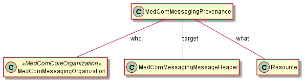

# MedComMessagingProvenance - DK MedCom Messaging v4.0.2

* [**Table of Contents**](toc.md)
* [**Artifacts Summary**](artifacts.md)
* **MedComMessagingProvenance**

## Resource Profile: MedComMessagingProvenance 

| | |
| :--- | :--- |
| *Official URL*:http://medcomfhir.dk/ig/messaging/StructureDefinition/medcom-messaging-provenance | *Version*:4.0.2 |
| Active as of 2026-02-13 | *Computable Name*:MedComMessagingProvenance |

 
Provenance information about the messages preceeding the current message 

### Scope and usage

This profile is used as the Provenance resource for MedCom FHIR messages. The Provenance resource tracks information about the activity what was created, revised, or deleted, while referencing the current message and previous messages if such exist. This is why the Provenance resource is valuable in MedCom messaging.

MedComMessagingProvenance describes the activity and history of a message. The element Provenance.agent.who contains information about the organisation that was involved in the activity, the element Provenance.target references the MessageHeader in the current message, and the element Provenance.what references the event that initiated a message e.g., a previous message.

The figure below illustrates the references from the Provenance resource.



Please refer to the tab "Snapshot Table(Must support)" below for the definition of the required content of a MedComMessagingProvenance.

#### Activity

In MedCom messaging, the Provenance.target shall always be a reference to a [MedComMessagingMessageHeader](StructureDefinition-medcom-messaging-messageHeader.md) or an inherited of MedComMessagingMessageHeader. The target references the resources on which the activity has occurred. For instances if Provenance.activity is 'new-message', it describes that the message referenced from the Messageheader is a new message.

The activitycodes used to describe the activity of the MedCom message may differ between standard e.g. [HospitalNotification](http://medcomfhir.dk/ig/hospitalnotification/) and [CareCommunication](http://medcomfhir.dk/ig/carecommunication/). Due to the different requirements of activities in a standard, it should be expected that there will be different invariants pointing at specific ValueSets for the given standard.

Provenance.agent describes the actor who is responsible for the activity that took place, by referencing the organisation responsible for the activity. The referenced organisation shall be an [MedComMessagingOrganization](StructureDefinition-medcom-messaging-organization.md).

#### History

MedComMessagingProvenance handles the message history in the Provenacne.entity element. This element shall be included if the message is a response to a previous message. In this case the element Provenance.entity.role is used to describe how the entity is used in the message. Provenance.entity.role shall be:

* **revision** when a message is a response, a correction, or a forwarding.
* **removal** when the message is a cancellation of a previously send message.

When a message is a response to a previous message, the previous message shall be referenced from the element Provenance.entity.what. The reference depends on the type of the previous message, which can be a MedCom FHIR message or a EDIFACT/OIOXML message. In the latter case, the reference shall be [lokationsnummer]#[brevid].

#### Timestamps

In MedComMessagingProvenance there are two timestamps, that represents the date and time the message was sent but in two different ways. Provenance.occuredDateTime is a human readable date and time and Provenance.recorded is a machine readable date and time.

**Usages:**

* Examples for this Profile: [Provenance/9c284936-5454-4116-95fc-3c8eeeed2400](Provenance-9c284936-5454-4116-95fc-3c8eeeed2400.md)

You can also check for [usages in the FHIR IG Statistics](https://packages2.fhir.org/xig/medcom.fhir.dk.messaging|current/StructureDefinition/medcom-messaging-provenance)

### Formal Views of Profile Content

 [Description of Profiles, Differentials, Snapshots and how the different presentations work](http://build.fhir.org/ig/FHIR/ig-guidance/readingIgs.html#structure-definitions). 

 

Other representations of profile: [CSV](StructureDefinition-medcom-messaging-provenance.csv), [Excel](StructureDefinition-medcom-messaging-provenance.xlsx), [Schematron](StructureDefinition-medcom-messaging-provenance.sch) 


## Resource Content

```json
{
  "resourceType" : "StructureDefinition",
  "id" : "medcom-messaging-provenance",
  "url" : "http://medcomfhir.dk/ig/messaging/StructureDefinition/medcom-messaging-provenance",
  "version" : "4.0.2",
  "name" : "MedComMessagingProvenance",
  "status" : "active",
  "date" : "2026-02-13T09:22:59+00:00",
  "publisher" : "MedCom",
  "contact" : [
    {
      "name" : "MedCom",
      "telecom" : [
        {
          "system" : "url",
          "value" : "http://www.medcom.dk"
        }
      ]
    }
  ],
  "description" : "Provenance information about the messages preceeding the current message",
  "jurisdiction" : [
    {
      "coding" : [
        {
          "system" : "urn:iso:std:iso:3166",
          "code" : "DK",
          "display" : "Denmark"
        }
      ]
    }
  ],
  "fhirVersion" : "4.0.1",
  "mapping" : [
    {
      "identity" : "workflow",
      "uri" : "http://hl7.org/fhir/workflow",
      "name" : "Workflow Pattern"
    },
    {
      "identity" : "rim",
      "uri" : "http://hl7.org/v3",
      "name" : "RIM Mapping"
    },
    {
      "identity" : "w3c.prov",
      "uri" : "http://www.w3.org/ns/prov",
      "name" : "W3C PROV"
    },
    {
      "identity" : "w5",
      "uri" : "http://hl7.org/fhir/fivews",
      "name" : "FiveWs Pattern Mapping"
    },
    {
      "identity" : "fhirauditevent",
      "uri" : "http://hl7.org/fhir/auditevent",
      "name" : "FHIR AuditEvent Mapping"
    }
  ],
  "kind" : "resource",
  "abstract" : false,
  "type" : "Provenance",
  "baseDefinition" : "http://hl7.org/fhir/StructureDefinition/Provenance",
  "derivation" : "constraint",
  "differential" : {
    "element" : [
      {
        "id" : "Provenance",
        "path" : "Provenance"
      },
      {
        "id" : "Provenance.id",
        "extension" : [
          {
            "extension" : [
              {
                "url" : "code",
                "valueCode" : "SHALL:in-narrative"
              },
              {
                "url" : "actor",
                "valueCanonical" : "http://medcomfhir.dk/ig/messaging/ActorDefinition/ProducerActor"
              }
            ],
            "url" : "http://hl7.org/fhir/StructureDefinition/obligation"
          }
        ],
        "path" : "Provenance.id",
        "mustSupport" : true
      },
      {
        "id" : "Provenance.text",
        "path" : "Provenance.text",
        "short" : "The narrative text SHALL always be included when exchanging a MedCom FHIR Bundle.",
        "mustSupport" : true
      },
      {
        "id" : "Provenance.text.status",
        "path" : "Provenance.text.status",
        "mustSupport" : true
      },
      {
        "id" : "Provenance.text.div",
        "path" : "Provenance.text.div",
        "mustSupport" : true
      },
      {
        "id" : "Provenance.target",
        "extension" : [
          {
            "extension" : [
              {
                "url" : "code",
                "valueCode" : "SHALL:in-narrative"
              },
              {
                "url" : "actor",
                "valueCanonical" : "http://medcomfhir.dk/ig/messaging/ActorDefinition/ProducerActor"
              }
            ],
            "url" : "http://hl7.org/fhir/StructureDefinition/obligation"
          }
        ],
        "path" : "Provenance.target",
        "short" : "Targets the MedComMessagingMessageHeader from the current message.",
        "max" : "1",
        "type" : [
          {
            "code" : "Reference",
            "targetProfile" : [
              "http://medcomfhir.dk/ig/messaging/StructureDefinition/medcom-messaging-messageHeader"
            ]
          }
        ],
        "mustSupport" : true
      },
      {
        "id" : "Provenance.occurred[x]",
        "path" : "Provenance.occurred[x]",
        "slicing" : {
          "discriminator" : [
            {
              "type" : "type",
              "path" : "$this"
            }
          ],
          "ordered" : false,
          "rules" : "open"
        },
        "min" : 1,
        "mustSupport" : true
      },
      {
        "id" : "Provenance.occurred[x]:occurredDateTime",
        "extension" : [
          {
            "extension" : [
              {
                "url" : "code",
                "valueCode" : "SHALL:in-narrative"
              },
              {
                "url" : "actor",
                "valueCanonical" : "http://medcomfhir.dk/ig/messaging/ActorDefinition/ProducerActor"
              }
            ],
            "url" : "http://hl7.org/fhir/StructureDefinition/obligation"
          }
        ],
        "path" : "Provenance.occurred[x]",
        "sliceName" : "occurredDateTime",
        "short" : "A human readable date and time for when the message is sent. Shall include a date, a time and timezone.",
        "min" : 1,
        "max" : "1",
        "type" : [
          {
            "code" : "dateTime"
          }
        ],
        "mustSupport" : true
      },
      {
        "id" : "Provenance.recorded",
        "path" : "Provenance.recorded",
        "short" : "A system readable date and time for when the message is sent.",
        "mustSupport" : true
      },
      {
        "id" : "Provenance.activity",
        "path" : "Provenance.activity",
        "definition" : "Activity that occurred and triggered the current or a previous message",
        "min" : 1,
        "mustSupport" : true,
        "binding" : {
          "strength" : "required",
          "valueSet" : "http://medcomfhir.dk/ig/terminology/ValueSet/medcom-messaging-activityCodes"
        }
      },
      {
        "id" : "Provenance.activity.coding",
        "path" : "Provenance.activity.coding",
        "min" : 1,
        "max" : "1",
        "mustSupport" : true
      },
      {
        "id" : "Provenance.activity.coding.system",
        "path" : "Provenance.activity.coding.system",
        "min" : 1,
        "mustSupport" : true
      },
      {
        "id" : "Provenance.activity.coding.code",
        "extension" : [
          {
            "extension" : [
              {
                "url" : "code",
                "valueCode" : "SHALL:in-narrative"
              },
              {
                "url" : "actor",
                "valueCanonical" : "http://medcomfhir.dk/ig/messaging/ActorDefinition/ProducerActor"
              }
            ],
            "url" : "http://hl7.org/fhir/StructureDefinition/obligation"
          }
        ],
        "path" : "Provenance.activity.coding.code",
        "definition" : "The activity defined by the system",
        "min" : 1,
        "mustSupport" : true
      },
      {
        "id" : "Provenance.agent",
        "path" : "Provenance.agent",
        "short" : "The actors involved in the activity taking place",
        "mustSupport" : true
      },
      {
        "id" : "Provenance.agent.who",
        "extension" : [
          {
            "extension" : [
              {
                "url" : "code",
                "valueCode" : "SHALL:in-narrative"
              },
              {
                "url" : "actor",
                "valueCanonical" : "http://medcomfhir.dk/ig/messaging/ActorDefinition/ProducerActor"
              }
            ],
            "url" : "http://hl7.org/fhir/StructureDefinition/obligation"
          }
        ],
        "path" : "Provenance.agent.who",
        "short" : "A reference to the actor of the activity, which shall be a MedComMessagingOrganization. If more actors has been involved, the element must be sliced.",
        "definition" : "Shall contain the messaging organization performing the activity. This also apply to an internal transmission to another messaging organization within a given system.",
        "type" : [
          {
            "code" : "Reference",
            "targetProfile" : [
              "http://medcomfhir.dk/ig/messaging/StructureDefinition/medcom-messaging-organization"
            ],
            "aggregation" : ["bundled"]
          }
        ],
        "mustSupport" : true
      },
      {
        "id" : "Provenance.entity",
        "path" : "Provenance.entity",
        "definition" : "Shall only be included if the current message is a response to a previous message.",
        "mustSupport" : true
      },
      {
        "id" : "Provenance.entity.role",
        "extension" : [
          {
            "extension" : [
              {
                "url" : "code",
                "valueCode" : "SHALL:in-narrative"
              },
              {
                "url" : "actor",
                "valueCanonical" : "http://medcomfhir.dk/ig/messaging/ActorDefinition/ProducerActor"
              }
            ],
            "url" : "http://hl7.org/fhir/StructureDefinition/obligation"
          }
        ],
        "path" : "Provenance.entity.role",
        "mustSupport" : true
      },
      {
        "id" : "Provenance.entity.what",
        "path" : "Provenance.entity.what",
        "short" : "A reference to the previous message. If the previous message is a FHIR message, the reference element must be used and if the previous message is an EDIFACT or OIOXML, the identifier element must be used.",
        "mustSupport" : true
      },
      {
        "id" : "Provenance.entity.what.reference",
        "extension" : [
          {
            "extension" : [
              {
                "url" : "code",
                "valueCode" : "SHALL:in-narrative"
              },
              {
                "url" : "actor",
                "valueCanonical" : "http://medcomfhir.dk/ig/messaging/ActorDefinition/ProducerActor"
              }
            ],
            "url" : "http://hl7.org/fhir/StructureDefinition/obligation"
          }
        ],
        "path" : "Provenance.entity.what.reference",
        "short" : "If the previous message is a FHIR message, this element must hold the MessageHeader.id from previous message, formatted as MessageHeader/[id].",
        "definition" : "Shall contain the message header id of messages given as input to the activity",
        "mustSupport" : true
      },
      {
        "id" : "Provenance.entity.what.identifier",
        "extension" : [
          {
            "extension" : [
              {
                "url" : "code",
                "valueCode" : "SHALL:in-narrative"
              },
              {
                "url" : "actor",
                "valueCanonical" : "http://medcomfhir.dk/ig/messaging/ActorDefinition/ProducerActor"
              }
            ],
            "url" : "http://hl7.org/fhir/StructureDefinition/obligation"
          }
        ],
        "path" : "Provenance.entity.what.identifier",
        "short" : "If previous message is EDIFACT or OIOXML, this element must be expressed as [lokationsnummer]#[brevid] from the EDIFACT or OIOXML message.",
        "definition" : "Shall contain the message header id of messages given as input to the activity if the previous message is not a fhir message",
        "mustSupport" : true
      }
    ]
  }
}

```
