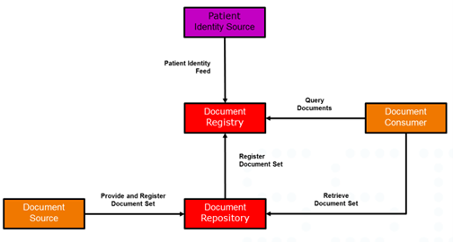
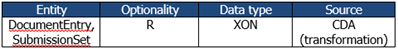

# XDS Metadata for Document Sharing Danish Profile v 1 0 0 - Danish profile of the IHE XDS Metadata Standard v2.0.0-trial-use-1

* [**Table of Contents**](toc.md)
* **XDS Metadata for Document Sharing Danish Profile v 1 0 0**

## XDS Metadata for Document Sharing Danish Profile v 1 0 0

# XDS Metadata for Document Sharing

```
    Danish profile Version 1.0.0 10. April 2024

    Custodians: MedCom/Danish Health Data Authority

    Contact: xds-metadata@medcom.dk.

```

**Revision history**

| | | | |
| :--- | :--- | :--- | :--- |
| 0.96 | 01-01-2018 | Thor Schliemann, Danish Health Data Authority | Revisions of initial version |
| 1.0.0 | 04-04-2024 | Ole Vilstrup Møller. MedCom | Revisions regarding further use of code systems added. Added MedCom logo and responsibility. |

## Purpose, Audience and Introduction

### Purpose

This document defines XDS Metadata for the use of documents, and hereunder HL7 CDA documents, in IHE XDS-based clinical documents exchange in Denmark, for example as provided by the Danish Document Sharing Service. The main background documents for the definition of the Danish profile are listed below:

* IHE IT Infrastructure Technical Framework, Volume 3 (ITI TF-3). Cross-Transaction Specification and Content Specification. Revision 15.0, July 24, 2018 [IHE-ITF-Vol3]
* IHE Patient Care Coordination (PCC) Technical Framework, Volume 2 (IHE PCC TF-2). Transactions and Content Modules. Revision 11.0, November 11, 2016.
* ELGA CDA Implementierungsleitfladen. Registrierung von CDA Dokumenten für ELGA mit IHE Cross-Enterprise Document Sharing: XDS Metadaten (XDSDocumentEntry). Version 2.06, 30.10.2015.
* HL7 Implementation Guide for CDA Release 2.0. Personal Healthcare Monitoring Report (PHMR). Danish profile – PHMR DK). Draft. Release 1.3, 31. March 2014, Update 24. April 2018.
* Continua Health Alliance. H.81X Interoperability design guidelines for personal health systems. Version 2017. December 15, 2017.

Information regarding HL7 v2.5 datatypes used in this document can be found in table 4.2.3.1.7-2 in [IHE-ITF-Vol3].

The first version of this document was prepared by the National Sundheds-it now known as Sundhedsdatastyrelsen (en: Danish Health Data Authority) in collaboration with a workgroup composed by a number of partners from the health sector and suppliers of ICT solutions to the healthcare sector.

The work group held 2 workshops in the period from November 2014 to December 2014. The work group included:

### Audience

The audience for this document includes software developers and implementers of products and services for the Danish Document Sharing Service (DDS).

### Introduction

The Danish Document Sharing Service is based on IHE XDS specifications. The aim is that the document can be used for implementing XDS Metadata across Danish IHE Affinity Domains. Metadata is information about documents or records that is used when searching to find the right item. This metadata has to be supplied by the document source and is generally limited to what can be provided by source information systems.

Each XDS system requires an XDS Affinity Domain (XAD), which establishes the rules and conventions about the type of clinical documents, metadata codes, security constraints and other policies that **SHALL** be used. One of the tasks in setting up an affinity domain is to specify the metadata code sets that are allowed. In Denmark this work is ongoing and not yet finalized.

This document specifies (for trial purposes) metadata to be used in Denmark. The metadata specification has until now had a focus on the use of HL7 CDA, especially the Danish profile of the CDA PHMR, Questionnaires and the Danish CDA header profile, but will from now on focus broader on XDS metadata for all kinds of documents, since IHE XDS is not limited to HL7 CDA documents. The metadata set in this document has been derived from and mapped to IHE XDS and includes information about the patient, the document, the author and the service being documented.

The metadata was originally used and assessed in pilot projects in 2018. The experiences from the pilot project and other later projects will systematically be collected and used for updates of this document.

Initial assumptions and assessments were made for establishing the foundational code systems for the Danish XDS Metadata ValueSet. Due to a broader use of this standard in relation to the ongoing work of sharing documents through the XDS infrastructure, these initial assessments and assumptions have now being superseded by practice and therefore new code systems will be added and existing systems extended, when need be.

The IBI[1](#fn:1) project for the registration of image data on XDS-I was part of this work but need some more work to be finalized.

The requirements for the XDS registry transactions (as ebXML Registry Package) are not part of this specification.

This version of the document is produced by MedCom, who has taken the responsibility role as custodian of this standard. This document will still reflect most of the style from the initial work done by the Danish Health Data Authority.

## Document Sharing

### Cross-Enterprise Document Sharing (XDS)

IHE XDS enables healthcare documents to be shared over a wide area network, between hospitals, primary care providers, social services and others in the patients’ circle or web of care. Rather than having one big database at the centre, IHE XDS fits the distributed collaborative approach to sharing clinical documents where they are held in different organizations. The primary components in XDS are a centralized Registry and one or more local Repositories. The XDS Registry stores metadata, which is queried to retrieve documents, while local XDS Repositories store the actual documents. The Registry and Repositories are logically and physically separate. A book library provides an analogy for explaining how XDS works: A library has books and a central index. An index entry for each book points to where to find the book on the library shelves together with brief details of the content. In the same way, the XDS Registry contains standardized metadata describing the content of each item and where to find it. The Repository **MAY** contain any type of electronic content much like the library shelves **MAY** contain any type of book or other media. Every item in the Repository has corresponding metadata in the Registry just as every book in the library has an entry in the index. XDS enables external user applications to retrieve documents from one or more repositories in a quick and consistent way. Each document is retrieved in its original form, which **MAY** be structured or unstructured. Every XDS implementation has five actors: Document Source, Document Repository, Document Registry, Document Consumer and Patient Identity Source.



Figure 1. XDS transaction diagram

#### Patient Identity Source

The Patient Identity Source provides a unique XDS identifier for each and every patient in the affinity domain. In Denmark we are using the CPR-number for this XDS patient identifier

#### Document Source

The Document Source submits HL7 CDA documents (or other documents) to a (local) Document Repository. Each organization **MAY** maintain its own Repository.

#### Document Repository

The Document Repository provides a persistent store for each document. It assigns a unique Identifier (uniqueId) to each document for subsequent retrieval by a Document Consumer.

In case of an updated version of the document will provide a new uniqueId and replacing the previous document, and updating metadata in Document Registry.

#### Document Registry

The Document Registry provides an index to all registered documents in the repositories about each patient using the patient identifier as the key. One Registry can index documents in any number of Repositories. It maintains a link (pointer) back to the Repository where each document is stored. The Registry supports queries to find metadata about documents irrespective of where they are actually stored. To maintain security, the Registry has no access to the content of any document, but relies only on standardized metadata to retrieve relevant documents.

#### Document Consumer

The Document Consumer submits queries to the Registry to get document metadata meeting specified query criteria, which are then used for locating the repository and retrieving the actual document from it. The Consumer can now retrieve the document(s). In order to retrieve a document, the following metadata attributes are required: homeCommunityId, repositoryUniqueId and document id (uniqueId).

### OID values used in Danish metadata

More of the metadata attributes are derived from national and international classifications. A “coded” attribute include three values:

* code (the id in the classification)
* displayName (the value for the code)
* codeSystem (the OID for the used classification)

The table below shows the classification systems used in this document including the used OID’s. The table is consistent with the OID’s and classifications used in the Danish PHMR profile.

Table 1. OID used in IHE Metadata

| | | |
| :--- | :--- | :--- |
| LOINC | 2.16.840.1.113883.6.1 | Regenstrief |
| **CPR-number**Danish civil registration system ("CPR"). Personal identification for Citizen in Denmark | 1.2.208.176.1.2 | Administered by Sundhedsdatastyrelsen (Danish Health Data Authority) for the owner Indenrigsministeriet (Ministry of the Interior) |
| **SOR**Register of Danish Health Organisations | 1.2.208.176.1.1 | Administered and owned by Sundhedsdatastyrelsen (Danish Health Data Authority) |
| **Autorisationsregister **Registered health professionals in Denmark | 1.2.208.176.1.3 | Administered by Sundhedsdatastyrelsen (Danish Health Data Authority) for the owner Danish Patient Safety Authority |
| **Yderregister**Health Provider register | 1.2.208.176.1.4 | Administered by Sundhedsdatastyrelsen (Danish Health Data Authority) for Danske Regioner (Danish Regions) |
| DK XDS ClassCodes | 1.2.208.184.100.9 | Administered and owned by MedCom |
| DK IHE formatCodes | 1.2.208.184.100.10 | Administered and owned by MedCom |
| SNOMED CT E.g. used by healthCareFacilityCodes and practiceSettingCode | 2.16.840.1.113883.6.96 | IHTSDO. Administered by Sundhedsdatastyrelsen (Danish Health Data Authority) |
| Danish NPU Codes | 1.2.208.176.2.1 | Administered and owned by Sundhedsdatastyrelsen (Danish Health Data Authority) |
| Confidentiality | 2.16.840.1.113883.5.25 |   |
| Tags for the Identification of Languages | 2.16.840.1.113883.6.121 |   |
| Mime Media Types | 2.16.840.1.113883.5.79 |   |

More information on the classification systems are described in APPENDIX 1 – Classification systems.

### XDS Metadata attributes: Reading instructions

The XDS metadata attributes are described in chapter 2, using a uniform template.

#### Attribute - Basic information

A table shows the basic information for the attributes:



Entity: The entity/entities, where the attribute are used.

Optionality: The optionality for the attribute according to optionality code definitions given in Table 3.

Data type: The data type for the attribute (HL7 v2 data types).

Source: The data source for the attribute according to

Table 4. The text (transformation) informs that the CDA data, which are based on HL7 v3 data types, **SHALL** be transformed to HL7 v2 data types.

#### Attribute – Description

The section **description** is describing the use of the attribute in a Danish health context. More information regarding the respective attributes can be found in the background documents as listed in section 1.2 of this document. The IHE-ITF-Vol3] is the main source of information. The other listed documents can provide knowledge about technical and clinical related to use in an implementation setup.

#### Attribute – Coding

The section **Coding** describes how the coding of the attributes **SHALL** be performed.

The section also includes (when applicable) colored boxes with examples on mapping to HL7 CDA, other requirements (RDK) and an XML metadata example.

### Allowed value sets for Danish metadata attributes

For some of the metadata attributes the corresponding value set is comprised of a limited sub-set of a code system. It is marked for those metadata attributes that have a limited value set in the Coding section. Like this:

**This metadata attribute has a value set comprised of a sub-set of values defined in a code system. See this reference for further information [DK-IHE_Metadata Value_sets]**.

#### [DK-IHE_Metadata Value_sets]

The allowed values in the value set, are listed in the Excel document placed at a public website at MedCom: DK-IHE_Metadata-Common_Code_systems-Value_sets [2](#fn:4)

Go to the tab for a given metadata attribute to look up allowed values for the given metadata attribute. Further instructions are written in the first tab “Instruction” of the Excel file.

# DANISH XDS Metadata attributes FOR Clinical documents

## Overview of Danish XDS Metadata for clinical documents for cross document sharing.

The three tables below shows an overview of the Danish Metadata for CDA documents.

Table 2 shows the sources to be used for the metadata attributes.

Table 2. Metadata Attribute Code Definitions for Source

| | |
| :--- | :--- |
| CDA | The data can be retrieved directly from a CDA document. |
| RDK | Relevant for use in Denmark |
| AUT | Automatic generated Metadata assigned by either source or repository. |

Table 3 shows the optionality for the metadata attributes.

Table 3. Metadata Attribute Optionality Code Definitions

| | |
| :--- | :--- |
| R | Mandatory |
| R2 | Required (when known) |
| O | Optional |

Table 4 shows the metadata attributes, their optionality, and data sources. For this profile, the optionality in force is given in the column DK, while the optionality in the column IHE is for reference only.

Table 4. Metadata Attributes optionality and sources.

| | | | | | |
| :--- | :--- | :--- | :--- | :--- | :--- |
|   |   |   | IHE | DK |   |
| Author | X | X | R | R |   |
| author.authorInstitution | X | X |   | R | CDA |
| author.authorperson | X | X |   | R2 | CDA |
| availabilityStatus | X | X | R | R | RDK |
| classCode | X |   | R | R | RDK |
| confidentialityCode | X |   | R | R | CDA |
| contentTypeCode |   | X | R | - | CDA |
| creationTime | X |   | R | R | CDA |
| entryUUID | X | X | R | R | AUT |
| eventCodeList | X |   | O | R2 | CDA |
| formatCode | X |   | R | R | RDK |
| hash[3](#fn:2) | X |   | R | R | AUT |
| healthcareFacilityTypeCode | X |   | R | R | RDK |
| homeCommunityId | X | X | R | R | AUT |
| languageCode | X |   | R | R | CDA |
| legalAuthenticator | X |   | O | R2 | CDA |
| mimeType | X |   | R | R | AUT |
| objectType | X |   | R | R | RDK |
| patientId | X |   | R | R | CDA |
| practiceSettingCode | X |   | R | R | RDK |
| referenceIdList | X |   | O | O | RDK |
| repositoryUniqueId | X |   | R | R | AUT |
| serviceStartTime | X |   | R2 | R2 | CDA |
| serviceStopTime | X |   | R2 | R2 | CDA |
| size[4](#fn:3) | X |   | R | R | AUT |
| sourcePatientId | X |   | R | R | CDA |
| sourcePatientInfo | X |   | R | R | CDA |
| submissionTime |   | X | R | R | RDK |
| title | X | X | O | R | CDA |
| typeCode | X |   | R | R | CDA |
| uniqueId | X | X | R | R | CDA |
| URI | X |   | O | O | AUT |

### Overview of Danish IHE XDS Metadata refinement and localization.

Table 5 Danish localization and refinement of Metadata shows which metadata attributes has been specially treated and narrowed for Danish document and image sharing (column ‘Refined for Danish use’) and which is either not in use or is as-is in the international IHE metadata profile without any Danish specialization needs.

The column ‘Danish Value Sets’ shows which metadata attribute has a limited allowed value set. See this reference for further information see section 1.3.4.1 [DK-IHE_Metadata Value_sets].

Table 5 Danish localization and refinement of Metadata

| | | | | |
| :--- | :--- | :--- | :--- | :--- |
| author | X |   |   |   |
| authorInstitution | X |   |   |   |
| authorPerson | X |   |   |   |
| authorRole |   | X |   |   |
| authorSpecialty |   | X |   |   |
| authorTeleCommunication |   | X |   |   |
| availabilityStatus |   |   | X |   |
| classCode | X |   |   | X |
| comments |   | X |   |   |
| confidentialityCode | X |   |   | X |
| creationTime |   |   | X |   |
| entryUUID |   |   | X |   |
| eventCodeList | X |   |   | X |
| formatCode | X |   |   | X |
| hash |   |   | X |   |
| healthcareFacility TypeCode | X |   |   | X |
| homeCommunityId | X |   |   | X |
| languageCode | X |   |   | X |
| legalAuthenticator | X |   |   |   |
| limitedMetadata |   | X |   |   |
| mimeType | X |   |   | X |
| objectType |   |   | X |   |
| patientId | X |   |   |   |
| practiceSettingCode | X |   |   | X |
| referenceIdList |   |   | X |   |
| repositoryUniqueId | X |   |   |   |
| serviceStartTime |   |   | X |   |
| serviceStopTime |   |   | X |   |
| size |   |   | X |   |
| sourcePatientId | X |   |   |   |
| sourcePatientInfo | X |   |   |   |
| title |   |   |   |   |
| typeCode | X |   |   | X |
| uniqueId |   |   | X |   |
| URI |   |   | X |   |

## Attribute Definitions

### author

**General information:**

| | | | |
| :--- | :--- | :--- | :--- |
| DocumentEntry SubmissionSet | R | See below | See below |

The author attributes of DocumentEntry and SubmissionSet represent the humans and/or machines that authored the document or SubmissionSet. The author attribute defines a structure to hold its sub-attributes that are individually defined:

* authorInstitution
* authorPerson
* authorRole
* authorSpecialty
* authorTelecommunication

Each sub-attribute is further described below.

#### authorInstitution

| | | | |
| :--- | :--- | :--- | :--- |
| DocumentEntry, SubmissionSet | R | XON | CDA (transformation) |

**Description:**

This is a sub-attribute of the author attribute.

The authorInstitution element describes the organization, in which the document was created.

**Coding:**

The format of the authorInstitution value is XON.

This specification restricts the coding to include the following fields:

* XON.1 - Organization Name (displayName)
* XON.6.2 - Assigning Authority (codeSystem)
* XON.10 Organization Identifier (code)

No other fields **SHALL** be specified.

**CDA Reference:**

```
    The mapping **SHALL** include the following values from the CDA as listed below.  
    
    The name of the institution: 
  
    $displayName = ClinicalDocument/author/assignedAuthor/representedOrganization/name  
    
    The associated OID for “Sundhedsvæsenets Organisations Register” (SOR): 
    $codeSystem = ClinicalDocument/author/assignedAuthor/id/@root  
    
    The id for the institution in “Sundhedsvæsenets Organisations Register”: 
    $code = ClinicalDocument/author/assignedAuthor/id/@extension  
    
    Example values in the DK PHMR CDA is: 
    $code = “ 8071000016009” 
    $displayName = “ Odense Universitetshospital – Svendborg” 
    $codeSystem = ”1.2.208.176.1.1” |

```

**XML example:**

```
    <rim:Slot name="authorInstitution">  
        <rim:ValueList>  
            <rim:Value> Odense Universitetshospital – Svendborg ^^^^^&amp;  1.2.208.176.1.1&amp;ISO^^^^ 8071000016009</rim:Value>  
        </rim:ValueList>
    </rim:Slot>

```

#### authorPerson

**General information:**

| | | | |
| :--- | :--- | :--- | :--- |
| DocumentEntry SubmissionSet | R | XCN | CDA (transformed) |

**Description:**

This is a sub-attribute of the author attribute.

Represents the person and/or machines that authored the document or SubmissionSet within the authorInstitution. The author **MAY** be the patient itself.

**Coding:**

The format of the authorPerson value is XCN.

This specification restricts the coding to include the following fields:

* Last Name
* First Name
* Second and Further Given Names

No other fields **SHALL** be specified.

**CDA Reference:**

```
    The name requires a last (family) name and a first (given) name. 
    One or more middle names can be inserted after the first name. 
    All middle names (Second and Further Given Names) **SHALL** be concatenated into one string separated by a “&”.  
    The mapping includes the following values from the CDA as listed below.  
    
    The last name (family) for the person: $last_name = ClinicalDocument/author/assignedAuthor/assignedPerson/name/family  
    The first name (given) of the person:  $first_name = ClinicalDocument/author/assignedAuthor/assignedPerson/name/given  
    The middle name (if any): $middle_name ClinicalDocument/author/assignedAuthor/assignedPerson/name/given  
    
    Example values in the DK PHMR CDA is: 
    $last_name = “Andersen” 
    $first_name = “Anders” 
    $middle_name = “Frederik Ingolf” 

```

**XML example:**

```
    <rim:Slot name="authorPerson">  
        <rim:ValueList>  
            <rim:Value>^Andersen^Anders^Frederik&amp;Ingolf ^^^^^ \&amp;ISO</rim:Value>    
        </rim:ValueList> 
    </rim:Slot

```

#### authorRole

The authorRole is not used in this profile.

#### authorSpecialty

The authorSpecialty is not used in this profile.

#### authorTeleCommunication

The authorTeleCommunication is not used in this profile.

### availabilityStatus

**General information:**

| | | | |
| :--- | :--- | :--- | :--- |
| DocumentEntry SubmissionSet | R | Predefined URN | AUT |

**Description:**

Represents the status of the DocumentEntry. A DocumentEntry **SHALL** have one of two availability statuses:

* Approved (The document is available for patient care).
* Deprecated (The document is obsolete)

It is always set to Approved as a result of the successful submission of new documents. It **MAY** be changed to Deprecated under the primary responsibility of the creating entity.

**Coding:**

The format of the availabilityStatus value is a URN.

In a query response the value is coded in the status attribute of the ExtrinsicObject representing the DocumentEntry and **SHALL** be

```
    "urn:oasis:names:tc:ebxml-regrep:StatusType:Approved" 
    
    or 
    
    "urn:oasis:names:tc:ebxml-regrep:StatusType:Deprecated" 
    
    The example below shows the status attribute.

```

**XML example:**

```
  <ExtrinsicObject  
    id="urn:uuid:fbeacdb7-5421-4474-9267-985007cd8855"
    objectType="urn:uuid:7edca82f-054d-47f2-a032-9b2a5b5186c1"  
    status="urn:oasis:names:tc:ebxml-regrep:StatusType:Approved">

```

### classCode

**General information:**

| | | | |
| :--- | :--- | :--- | :--- |
| DocumentEntry | R | Code | RDK |

**Description:**

The classCode attribute specifies the high-level use classification of the document type (e.g., Clinical Document, Report, Image and Treatment Plan).

The classCode attribute is related to the typeCode and has a lower degree of granularity for the classification of the document. The typeCode attribute (see 2.2.32) specifies the precise type of document from the user perspective.

In this profile, the classCode is given by values in the code system DK XDS ClassCodes described in section 3.7.

**Coding:**

This metadata attribute has a limited allowed value set. See this reference for further information see section 1.3.4.1 [DK-IHE_Metadata Value_sets].

There **SHALL** be exactly one ebRIM Classification containing a classCode for any DocumentEntry. For the classCode metadata attribute, the classificationScheme **SHALL** be urn: urn:uuid:41a5887f-8865-4c09-adf7-e362475b143a.

**RDK reference:**

```
    The code **SHALL** be a valid value for the document type.  
    The codeSystem **SHALL** be the associated OID for “DK XDS ClassCodes”  
    The displayName **SHALL** be the name for the document type found in the code system “DK XDS ClassCodes”.  
    
    Example values: 
    $code = “001"
    $displayName = “Klinisk rapport” 
    $codeSystem = ” 1.2.208.184.100.9”  

```

**XML example:**

```
    <rim:Classification  
        classificationScheme="urn:uuid:41a5887f-8865-4c09-adf7-e362475b143a"  
        classifiedObject="ExampleDocument"  
        id="IdExample_046"  
        objectType="urn:oasis:names:tc:ebxml- regrep:ObjectType:RegistryObject:Classification"  
        nodeRepresentation="001"  >  
      <rim:Name>  
        <rim:LocalizedString  value="Klinisk rapport"/>  
      </rim:Name>  
      <rim:Slot name="codingScheme">  
        <rim:ValueList>  
            <rim:Value>1.2.208.184.100.9</rim:Value>    
        </rim:ValueList>  
      </rim:Slot> 
    </rim:Classification>

```

### comments

Not used in this profile.

### confidentialityCode

**General information:**

| | | | |
| :--- | :--- | :--- | :--- |
| DocumentEntry | R | Code | CDA/AUT |

**Description:**

The confidentialityCode specifies the confidentiality assigned to the document.

**Coding:**

This metadata attribute has a limited allowed value set. See this reference for further information see section 1.3.4.1 [DK-IHE_Metadata Value_sets].

The confidentialityCode **SHALL** contain exactly one value from the HL7 code system.

For the confidentialityCode metadata attribute, the classificationScheme **SHALL** be urn:uuid:f4f85eac-e6cb-4883-b524-f2705394840f.

**CDA Reference:**

```
    $code = ClinicalDocument/confidentialityCode/@code 
    $displayName = ClinicalDocument/confidentialityCode/@displayName 
    $codeSystem = ClinicalDocument/confidentialityCode/
    
    @codeSystem  Example values in the DK PHMR CDA is: 
    $code = “N"
    $displayName = “Normal” 
    $codeSystem = “2.16.840.1.113883.5.25” 

```

**XML example:**

```
    <rim:Classification
      classificationScheme=  "urn:uuid:f4f85eac-e6cb-4883-b524-f2705394840f"
      classifiedObject="ExampleDocument"
      id="IdExample_046"
      objectType="urn:oasis:names:tc:ebxml-regrep:ObjectType:RegistryObject:Classification"
      nodeRepresentation="N">  
      <rim:Name>  
        <rim:LocalizedString value="Normal"/>  
      </rim:Name>  
      <rim:Slot name="codingScheme">  
        <rim:ValueList>  
            <rim:Value>2.16.840.1.113883.5.25</rim:Value>    
        </rim:ValueList>  
      </rim:Slot> 
    </rim:Classification>  

```

### contentTypeCode

The contentTypeCode is not used in this profile.

### creationTime

**General information:**

| | | | |
| :--- | :--- | :--- | :--- |
| DocumentEntry | R | DTM | CDA (transformed) |

**Description:**

Represents the time the author created the document.

Please see 2.2.24 serviceStartTime and 2.2.25 serviceStopTime for a thorough understanding of time attributes.

**Coding:**

The format of the creationTime value is data type DTM.

The value is coded as a single value within an ebRIM Slot in the DocumentEntry. The creationTime **SHALL** be precise to the second.

**CDA Reference:**

```
    $value = ClinicalDocument/effectiveTime/@value  
    
    Note: The CDA data type for time is TS, which includes an offset from UTC. 
    In the XDS metadata the data type for time is DTM, which **SHALL** be given in UTC timezone. 
    This requires that the value for time in the CDA **SHALL** be transformed ($value_DTM) before it is used for the XDS metadata.  
    
    Example: 
    December 25, 2014 21:20:10 UTC 

```

**XML example:**

```
    <rim:Slot name="creationTime">  
        <rim:ValueList>  
            <rim:Value>20141225212010</rim:Value>    
        </rim:ValueList> 
    </rim:Slot

```

### entryUUID

**General information:**

| | | | |
| :--- | :--- | :--- | :--- |
| DocumentEntry | R | String | AUT |

**Description:**

The entryUUID attribute is a globally unique identifier primarily intended for internal document management purposes. In contrast, the uniqueId attribute is used for external references (e.g., links, etc.).

UUIDs **SHALL** be version 4 or 5 and represented in the form XXXXXXXX-XXXX-XXXX-XXXX-XXXXXXXXXXXX, where each X is a character from the set [A-Fa-f0-9].

**Coding:**

The format of the entryUUID value is UUID.

At time of registration, certain Document Sharing transactions **MAY** allow symbolic Ids (anything that does not have the urn:uuid: prefix) to be used. Once submitted and received by a Document Registry or Repository, symbolic Ids will be replaced by UUID values.

The value of the entryUUID is coded in the id XML attribute on the ExtrinsicObject representing the DocumentEntry. In the example below, the entryUUID is urn:uuid:a6e06ca8-0c75-4064-9e5c-88b9045a96f6.

**XML example:**

```
<rim:ExtrinsicObject 
    mimeType="text/xml"
    id="urn:uuid:a6e06ca8-0c75-4064-9e5c-88b9045a96f6"
    objectType="urn:uuid:7edca82f-054d-47f2-a032-9b2a5b5186c1"> 
… 

```

### eventCodeList

**General information:**

| | | | |
| :--- | :--- | :--- | :--- |
| DocumentEntry | R2 | Code | CDA |

**Description:**

This list of codes represents the main clinical acts documented for the patient contact.

In health care the clinical process for the treatment of individual patients is based on evidence. The evidence for the individual patient is achieved by performing one or more examinations. The outcome of an examination is clinical “documents”, which for example includes clinical chemistry results, vital signs, images and clinical notes. Based on the outcome of the examinations, the health professionals will be able to point out a diagnosis for the patient’s illness, e.g. diabetes. In many cases the diagnosis is tentative and more examinations are needed to point out the “final” diagnose, which describes the patient’s health problem.

In health care, examinations are procedures, which describe the work to be done, e.g. pulmonary function testing, diabetes annual care review or blood pressure control. For each procedure the related outcome is “pre-defined” and **MAY** include a number of values, which in total will form the result for the examination. In several cases, the individual values cannot be used from an examination without maintaining its overall context.

There is currently no generalized accepted code system chosen for describing procedure code or clinical diagnosis for the main clinical acts of the document.

Special case for home monitoring reporting: Citizens at home are monitoring pulse, oxygen saturation, blood pressure and etc., which are collected and documented. The patient's clinical measured results documented by patient characteristics using NPU code.

**Coding:**

This metadata attribute has a value set **comprised of a sub-set of values defined in a code system**. See this reference for further information see section 1.3.4.1 [DK-IHE_Metadata Value_sets].

The eventCodeList is coded with ebRIM Classification objects. There **MAY** be zero, one, or more ebRIM Classifications containing a code and additional eventCode entries are coded by specifying multiple classification objects. For the eventCodeList metadata attribute, the classificationScheme **SHALL** be urn:uuid:2c6b8cb7-8b2a-4051-b291-b1ae6a575ef4.

**CDA Reference:**

```
    The mapping includes the following values from the CDA as listed below.  
    
    The code for the procedure in “Sundhedsvæsenets Klassifikationssystem” 
    
    $code =  ClinicalDocument/documentationOf[n]/serviceEvent/Code/@code  
    
    The official SKS name of the procedure: 
  
    $displayName = ClinicalDocument/documentationOf[n]/serviceEvent/Code/@displayName  The associated OID for “Sundhedsvæsenets Klassifikationssystem”: 
    $codeSystem = ClinicalDocument/documentationOf[n]/serviceEvent/Code/@codeSystem  Example values: 
    $code = “NPU21692"
    $displayName = “Puls;Hjerte” 
    $codeSystem = “” 

```

**XML example:**

```
    <rim:Classification
        classificationScheme=  "urn:uuid:2c6b8cb7-8b2a-4051-b291-b1ae6a575ef4"
        classifiedObject="ExampleDocument"
        id="IdExample_048"
        objectType="urn:oasis:names:tc:ebxml-regrep:ObjectType:RegistryObject:Classification"
        nodeRepresentation="ZZ3160"  >
      <rim:Name>  
      <rim:LocalizedString value="Blodtryksmåling"/>  </rim:Name>  
      <rim:Slot name="codingScheme">  
        <rim:ValueList>
            <rim:Value>1.2.208.176.2.1</rim:Value>    
        </rim:ValueList>  
      </rim:Slot> 
    </rim:Classification>

```

### formatCode

**General information:**

| | | | |
| :--- | :--- | :--- | :--- |
| DocumentEntry | R | code | RDK |

**Description:**

The formatCode specifying the detailed technical format of the document. Along with the typeCode, it **SHALL** provide sufficient information to allow potential consumer to know if it will be able to process the document

The formatCode **SHALL** be sufficiently specific to ensure processing/display by identifying a document encoding, structure and template (e.g., for a CDA Document, the fact that it complies with a CDA schema, possibly a template and the choice of a content-specific style sheet).

The formatCode allows a receiving system (Document Consumer Actor) to identify the processing to be done and thus the correct representation of the content in the document.

The CDA Schema is not an element for an automatic mapping. However, in a CDA document the formatCode can be derived from the clinicalDocument/templateId.

**Coding:**

This metadata attribute have a limited allowed value set. See this reference for further information see section 1.3.4.1 [DK-IHE_Metadata Value_sets].

There **SHALL** be one ebRIM Classification containing a formatCode. For the formatCode metadata attribute, the classificationScheme **SHALL** be urn: uuid: a09d5840-386c-46f2-b5ad-9c3699a4309d. Any valid URN **MAY** be used as a formatCode.

**RDK reference:**

```
    The code **SHALL** be a valid value for the formatCode.  
    The codeSystem **SHALL** be the associated OID for the list of “DK IHE formatCodes”  
    The displayName **SHALL** be the name for the document type found in the list of “DK IHE formatCodes”  
    
    Example values: 
    $code = “urn:ad:dk:medcom:phmr:full"
    $displayName = “DK PHMR schema” 
    $codeSystem = ”urn:ad:dk:medcom:phmr:full”  

```

**XML example**

```
    <rim:Classification
        classificationScheme=  "urn:uuid:a09d5840-386c-46f2-b5ad-9c3699a4309d"
        classifiedObject="ExampleDocument"
        id="IdExample_049"
        objectType="urn:oasis:names:tc:ebxml-regrep:ObjectType:RegistryObject:Classification"
        nodeRepresentation="DK PHMR schema"  >  
      <rim:Name>  
      <rim:LocalizedString value="DK PHMR schema"/>  </rim:Name>  
      <rim:Slot name="codingScheme">  
        <rim:ValueList>  
            <rim:Value>urn:ad:dk:medcom:phmr:full</rim:Value>    
        </rim:ValueList>  
      </rim:Slot> 
    </rim:Classification>

```

### hash

**General information:**

| | | | |
| :--- | :--- | :--- | :--- |
| DocumentEntry | R | SHA1 | AUT |

**Description:**

The hash of the contents of the document is filled by the repository

**Coding:**

The format of the hash value is SHA1 hash.

The value is coded as a case-insensitive single value within an ebRIM Slot in the DocumentEntry.

Is required for XDS Document Repository. Is not required for XDS On-Demand source.

```
    <rim:Slot name="hash">  
        <rim:ValueList>  
            <rim:Value>da39a3ee5e6b4b0d3255bfef95601890afd80709</rim:Value>    
        </rim:ValueList> 
    </rim:Slot

```

### healthcareFacilityTypeCode

**General information:**

| | | | |
| :--- | :--- | :--- | :--- |
| DocumentEntry | R | Code | RDK |

**Description:**

This code represents the type of organizational setting of the clinical encounter during which the documented act occurred.

The value set for healthcare facility type code represents the allowed values for the type of organizational setting of the clinical encounter during which the documented act occurred. Currently, all codes of the value set are given by the code system SNOMED CT. See Appendix 1, section 3.9 DK IHE healthCareFacilityTypeCodes.

**Coding:**

This metadata attribute has a limited allowed value set. See this reference for further information see section 1.3.4.1 [DK-IHE_Metadata Value_sets].

There **SHALL** be one ebRIM Classification containing a healthcareFacilityTypeCode. For the healthcareFacilityTypeCode metadata attribute the classificationScheme **SHALL** be urn:uuid:f33fb8ac-18af-42cc-ae0e-ed0b0bdb91e1.

In this profile, the healthcareFacilityCode is given by values from the value set DK IHE healthcareFacilityCodes described in section 3.9.

**RDK reference:**

```
    The code **SHALL** be a valid value for the health care facility type.  
    The codeSystem **SHALL** be the OID associated with the code value in the value set “DK IHE healthCareFacilityTypeCodes”  
    The displayName **SHALL** be the name for the health care facility type found in the list of “DK IHE health care facility types”  
      
    Example values: 
    $code = “22232009"
    $displayName = “hospital” 
    $codeSystem = ”2.16.840.1.113883.6.96”  

```

**XML example:**

```
    <rim:Classification
        classificationScheme=  "urn:uuid:f33fb8ac-18af-42cc-ae0e-ed0b0bdb91e1"
        classifiedObject="ExampleDocument"
        id="IdExample_050"
        objectType="urn:oasis:names:tc:ebxml-regrep:ObjectType:RegistryObject:Classification"
        nodeRepresentation="22232009">  
    <rim:Name>  
    <rim:value "hospital"/>  </rim:Name>  
    <rim:Slot name="codingScheme">  
        <rim:ValueList>  
            <rim:Value>2.16.840.1.113883.6.96</rim:Value>    
        </rim:ValueList>  
    </rim:Slot> </rim:Classification\

```

### homeCommunityId

**General information:**

| | | | |
| :--- | :--- | :--- | :--- |
| DocumentEntry | R | OID URN | AUT |

**Description:**

A unique identifier for a community where the DocumentEntry and document can be accessed.

According ITI XCA: A unique identifier (OID) for a "community" that is used subsequently to the corresponding web service endpoint (URI of the XCA Responding gate way (s)) to obtain.

**Coding:**

This metadata attribute has a limited allowed value set. See this reference for further information see section 1.3.4.1 [DK-IHE_Metadata Value_sets].

Max length is unbounded. Contained in the ebRS ExtrinsicObject home attribute for the ExtrinsicObject that corresponds to the DocumentEntry.

**XML example:**

```
    <rim:ExtrinsicObject home="urn:oid:1.2.208.176.8.1>  ...  </rim:ExtrinsicObject\

```

### intendedRecipient

| | | | |
| :--- | :--- | :--- | :--- |
| SubmissionSet | O | XON, XCN, XTN | - |

For use with Cross Enterprise Document Workflow (XDW).

Currently not used in this profile.

### languageCode

**General information:**

| | | | |
| :--- | :--- | :--- | :--- |
| DocumentEntry | R | CS | CDA |

**Description:**

The languageCode specifies the language (and country) of the document.

**Coding:**

This metadata attribute has a limited allowed value set. See this reference for further information see section 1.3.4.1 [DK-IHE_Metadata Value_sets].

The languageCode **SHALL** be in the form nn-CC.

The nn portion **SHALL** be a legal ISO=-639-1 language code in lower case. The CC portion, if present, **SHALL** be an ISO-3166 Alpha-Code 2 country code in upper case.

**CDA Reference:**

```
    $code = ClinicalDocument/languageCode/@code  Example values in the DK PHMR CDA is: 
    $code = “da-DK”  

```

**XML example:**

```
    <rim:Slot name="languageCode">  
        <rim:ValueList>  
            <rim:Value>”da-DK”</rim:Value>    
        </rim:ValueList> 
    </rim:Slot

```

### legalAuthenticator

**General information:**

| | | | |
| :--- | :--- | :--- | :--- |
| DocumentEntry | R | XCN | CDA (transformation) |

**Description:**

The legalAuthenticator represents a participant within the authorInstitution who has legally authenticated or attested the document.

**Coding:**

Max length is 256 characters. This attribute **SHALL** be absent if not applicable. The value is coded as a single value within an ebRIM Slot in the DocumentEntry. The format of the legalAuthenticator value is XCN.

This specification restricts the coding to include the following fields:

* Last Name
* First Name
* Second and Further Given Names

No other fields **SHALL** be specified.

**CDA Reference:**

```
    The name requires a last (family) name and a first (given) name. 
    One or more middle names can be inserted after the first name. 
    All middle names (Second and Further Given Names) **SHALL** be concatenated into one string separated by a “&”.  
    
    The mapping includes the following values from the CDA as listed below.  
    $person = ClinicalDocument/legalAuthenticator/assignedEntity/assignedPerson  
    
    The last name (family) for the person: 
    $last_name = $person/family  
    
    The first name (given) of the person:  
    $first_name = $person/given[1]  
    
    The middle name (if any and concatenated into one string): 
    $middle_name = $person/given[2]”&”given[3]..  
    
    Example values in the DK PHMR CDA is: 
    $last_name = “Andersen” 
    $first_name = “Anders” 
    $middle_name =”Frederik Ingolf” 

```

**XML example**

```
    <rim:Slot name="legalAuthenticator">  
        <rim:ValueList>  
            <rim:Value>^Andersen^Ander^Frederik&amp;Ingolf^^^^^^^&amp; ISO</rim:Value>    
        </rim:ValueList> 
    </rim:Slot

```

### limitedMetadata

| | | | |
| :--- | :--- | :--- | :--- |
| DocumentEntry | O | - | - |

This attribute is not used in this profile.

### mimeType

**General information:**

| | | | |
| :--- | :--- | :--- | :--- |
| DocumentEntry | R | String | RDK |

**Description:**

The mimeType element describes the "Internet Media Type" of the document in accordance with the "MIME" (MIME) standard. The standard is described in RFC 2045 to RFC 2049.

**Coding:**

This metadata attribute has a limited allowed value set. See this reference for further information see section 1.3.4.1 [DK-IHE_Metadata Value_sets].

The maximum length is unbounded. **SHALL** have only a single value. Encoded in the ebRS ExtrinsicObject mimeType attribute for the ExtrinsicObject that corresponds to the DocumentEntry.

**RDK reference:**

```
      In the case of CDA R2 documents, the MimeType according to IHE is always fixed to "text/xml".  

```

**XML example:**

```
    <rim:ExtrinsicObject 
        mimeType="text/xml"
        id="ExampleDocument"
        objectType="urn:uuid:7edca82f-054d-47f2-a032-9b2a5b5186c1">

```

### objectType

**General information:**

| | | | |
| :--- | :--- | :--- | :--- |
| DocumentEntry | R | UUID | RDK |

**Description:**

The objectType attribute reflects the type of DocumentEntry. There are two DocumentEntry types: Stable Document Entry and On-Demand Document Entry.

A Stable Document Entry contains metadata about an already created document available for retrieval. This document is stable because the contents have been effectively combined in the exact representation that will be returned in a Retrieve Document Set. A Stable DocumentEntry is an DocumentEntry with objectType equal to the UUID for Stable and availabilityStatus = Approved or Deprecated. All metadata fields contain valid values. If the document returned on a retrieve request is CDA, it will have in the ClinicalDocument/id in the HL7 CDA R2 header the same value of the DocumentEntry uniqueId.

An On-Demand DocumentEntry contains metadata, which can be used to create an on-demand document which collects the latest, most recent available information at the time of retrieval. It is designed by setting an objectType equal to the UUID for on-demand. On-Demand Document Entries never reflect actual document content, but rather the potential for a document with the characteristics described in the metadata of the entry. An On-Demand DocumentEntry **MAY** be replaced and deprecated.

**Coding:**

Max length is unbounded. The format of the objectType value is UUID.

The value of the objectType is coded in the objectType XML attribute on the ExtrinsicObject representing the DocumentEntry. In the example below, the objectType is urn:uuid:7edca82f-054d-47f2-a032-9b2a5b5186c1 and reflects a stable DocumentEntry.

**XML example:**

```
    <rim:ExtrinsicObject mimeType="text/xml"
    id="urn:uuid:a6e06ca8-0c75-4064-9e5c-88b9045a96f6"
    objectType="urn:uuid:7edca82f-054d-47f2-a032-9b2a5b5186c1" > … 

```

### patientId

The patientId attribute **SHALL** be used in this profile (see the specification for the sourcePatientId attribute).

### practiceSettingCode

In Denmark, the practiceSettingCode specifies the clinical specialty described by the value set “DK_IHE_practiceSettingCode”. Currently, all codes of the value set are given by the code system SNOMED CT. See Appendix 1, section 3.10 DK_IHE_practiceSettingCode.

**General information:**

| | | | |
| :--- | :--- | :--- | :--- |
| DocumentEntry | R | Code | RDK |

**Description:**

The value set for practiceSettingCode represents the type of clinical setting of the clinical encounter during which the documented act occurred. All code values are SNOMED CT identifiers (SCTID). It **SHALL** reflect the specialty of the department which best matches the contents of the document, regardless of the field of study of the author or the creating department.

**Coding:**

This metadata attribute has a limited allowed value set. See this reference for further information see section 1.3.4.1 [DK-IHE_Metadata Value_sets].

**RDK reference:**

```
    (**To be discussed**)  
    $code = ”394588006"
    $displayName = ”børne- og ungdomspsykiatri” 
    $codeSystem = “2.16.840.1.113883.6.96” 
    $codeSystemName = ”SNOMED CT”  

```

**XML example:**

```
    <rim:Classification
      classificationScheme="urn:uuid:cccf5598-8b07-4b77-a05e-ae952c785ead"
      classifiedObject="ExampleDocument"
      id="IdExample_052"
      objectType="urn:oasis:names:tc:ebxml-regrep:ObjectType:RegistryObject:Classification"
      nodeRepresentation="394588006">  
        <rim:Name>  
        <rim:LocalizedString  value="børne- og ungdomspsykiatri"/>  </rim:Name>  
        <rim:Slot name="codingScheme">  
            <rim:ValueList>  
                <rim:Value>2.16.840.1.113883.6.96</rim:Value>    
            </rim:ValueList>  
        </rim:Slot> 
    </rim:Classification\

```

### referenceIdList

**General information:**

| | | | |
| :--- | :--- | :--- | :--- |
| DocumentEntry | O | CXi | RDK |

**Description:**

This list contains zero, or more Identifiers. These Identifiers **MAY** be internal or external identifiers. The referenceIdList contains Identifiers CXi encoded.

XDS Document Registry Actors supporting the ReferenceId Option **SHALL** preserve this value.

**Coding:**

Coded as an ebRIM Slot. **MAY** have multiple values. Max length for each value is 256 characters. The name of the slot in the metadata **SHALL** be “urn:ihe:iti:xds:2013:referenceIdList”.

**XML example:**

```
<rim:Slot name="urn:ihe:iti:xds:2013:referenceIdList">  
    <rim:ValueList>  
        <rim:Value>  2013001^^^&amp;1.2.3.4.5.6&amp;ISO^urn:ihe:iti:xds:2013:accession  </rim:Value>  
        <rim:Value>  1.2.3.12.78.23^^^^urn:ihe:iti:xds:2013:uniqueId^&amp;1.2.3.4&amp;ISO  </rim:Value>    
    </rim:ValueList> 
</rim:Slot>  

```

### repositoryUniqueId

**General information:**

| | | | |
| :--- | :--- | :--- | :--- |
| DocumentEntry | R | OID | AUT |

**Description:**

The repositoryUniqueId is a globally unique, immutable identifier of the repository where the document referenced by the Document Entry can be accessed. This unique identifier for the repository **MAY** be used to identify and connect to the specific repository to access the document.

**Coding:**

Maximum length is 64 characters. The format of the repositoryUniqueId value is OID.

The value is coded as a single value within an ebRIM Slot in the DocumentEntry.

**XML example:**

```
    <rim:Slot name="repositoryUniqueId">  
        <rim:ValueList>  
            <rim:Value>1.3.6.1.4.5</rim:Value>    
        </rim:ValueList> 
    </rim:Slot

```

### serviceStartTime

**General information:**

| | | | |
| :--- | :--- | :--- | :--- |
| DocumentEntry | R2 | DTM | CDA (transformed) |

**Description:**

Represents the start time of the clinical act being documented took place (clinically significant, but not necessarily when the document was produced or approved). This **MAY** be the same as the encounter time in case the service was delivered during an encounter. Encounter time is not coded in metadata but **MAY** be coded within the document.

Note: If needed, other times associated with the document, such as time of approval, are to be recorded within the document.

**Coding:**

The format of the serviceStartTime value is DTM. The creationTime **SHALL** be precise to the second.

The value is coded as a single value within an ebRIM Slot Attribute in the DocumentEntry.

**CDA Reference:**

```
    $value = ClinicalDocument/documentationOf/serviceEvent/effectiveTime/low/@value  
    
    Note: The CDA data type for time is TS, which includes an offset from UTC. 
    In the XDS metadata the data type for time is DTM, which **SHALL** be given in UTC timezone. 
    This requires that the value for time in the CDA **SHALL** be transformed ($value_DTM) before it is used for the XDS metadata.   
    
    Example value: 
    December 25, 2014 21:20:10 UTC 


    <rim:Slot name="serviceStartTime">  
        <rim:ValueList>  
            <rim:Value>20141225212010</rim:Value>    
        </rim:ValueList> 
    </rim:Slot

```

### serviceStopTime

**General information:**

| | | | |
| :--- | :--- | :--- | :--- |
| DocumentEntry | R2 | DTM | CDA (transformed) |

**Description:**

Represents the stop time of the service being documented took place (clinically significant, but not necessarily when the document was produced or approved). This **MAY** be the same as the encounter time in case the service was delivered during an encounter. Encounter time is not coded in metadata but **MAY** be coded within the document.

If the service happens at a point in time, this attribute **SHALL** contain the same value as the serviceStartTime.

**Coding:**

The format of the serviceStopTime value is DTM. The creationTime **SHALL** be precise to the second.

The value is coded as a single value within an ebRIM Slot Attribute in the DocumentEntry.

**CDA Reference:**

```
    $value = ClinicalDocument/documentationOf/serviceEvent/effectiveTime/high/@value  
    
    Note: The CDA data type for time is TS, which includes an offset from UTC. 
    In the XDS metadata the data type for time is DTM, which **SHALL** be given in UTC timezone. 
    This requires that the value for time in the CDA **SHALL** be transformed ($value_DTM) before it is used for the XDS metadata.  
    
    Example values in the DK PHMR CDA is: 
    December 25, 2014 21:20:10 UTC 

```

**XML Example**

```
    <rim:Slot name="serviceStopTime">  
        <rim:ValueList>  
            <rim:Value>20141225212010</rim:Value>    
        </rim:ValueList> 
    </rim:Slot

```

### size

**General information:**

| | | | |
| :--- | :--- | :--- | :--- |
| DocumentEntry | R | Integer | AUT |

**Description:**

Size in bytes of the byte stream that comprises the document.

**Coding:**

Max length of the encoded size is 256 characters. Coded as an ebRIM Slot. **SHALL** have only a single value.

**XML example:**

```
    <rim:Slot name="size">  
        <rim:ValueList>  
            <rim:Value>3654</rim:Value>    
        </rim:ValueList> 
    </rim:Slot

```

### sourceId

Not used in this profile.

### sourcePatientId

**General information:**

| | | | |
| :--- | :--- | :--- | :--- |
| DocumentEntry | R | CX | CDA (transformed) |

**Description:**

The sourcePatientId represents the patients unique identifier (currently the CPR number).

Your municipality of residence is responsible for assigning a civil registration number (CPR number). The Central Office of Civil Registration does not assign CPR numbers. CPR can be found in the National Civil Registration System which is sourcePatientId.

**Coding:**

Max length is 256 characters. Coded as an ebRIM Slot with the value encoded according the HL7 v2.5 CX data type. It **SHALL** contain only two parts:

* An Id (e.g., Patient Id CX.1).
* The Authority Domain Id that assigned the Id (CX.4).

All other CX components **SHALL** be omitted.

**CDA Reference:**

```
    The Danish patient identification (cpr-nummer): 
    $code = ClinicalDocument/recordTarget/patientRole/Id/@extension  
    
    The associated OID for the National Danish patient registry (cpr): 
    $codeSystem = ClinicalDocument/recordTarget/patientRole/Id/@root  
    
    Example values in the DK PHMR CDA is: 
    $code = ”2512489996"
    $displayName =”Nancy Berggren” 
    $codeSystem = 1.2.208.176.1.2 

```

**XML example:**

```
    <rim:Slot name="sourcePatientId">  
        <rim:ValueList>  
            <rim:Value>2512489996^^^&amp;1.2.208.176.1.2&amp;ISO  </rim:Value>    
        </rim:ValueList> 
    </rim:Slot

```

### sourcePatientInfo

**General information:**

| | | | |
| :--- | :--- | :--- | :--- |
| DocumentEntry | R | PID | CDA (transformed) |

**Description:**

This attribute contains patient information at the time of submission of the patient to whose medical record this document belongs.

**Coding:**

The sourcePatientInfo **SHALL** include values for:

* PID-5 (source patient name)
* PID-7 (source patient date of birth)
* PID-8 (source patient gender)

Max length is 256 characters. Coded as an ebRIM Slot.

**CDA Reference:**

```
    The mapping includes the following values from the CDA as listed below.  
    
    The patient date of birth (format YYYYMMDD): $dateOfBirth = $patient/birthTime  
    
    The patient gender: $gender = $patient/administrativeGenderCode/@code  
    
    Example values in the DK PHMR CDA is: 
    $dateOfBirth = “19481225” 
    $gender = ”F” 

```

**XML example:**

```
    <rim:Slot name="sourcePatientInfo">
        <rim:ValueList>
            <rim:Value>PID-5\|DICTAPHONE^ONE^^^</rim:Value>
            <rim:Value>PID-7\|19481225</rim:Value>  
            <rim:Value>PID-8\|F</rim:Value>     
        </rim:ValueList> 
    </rim:Slot>   

```

### submissionTime

**General information:**

| | | | |
| :--- | :--- | :--- | :--- |
| SubmissionSet | R | DTM | RDK |

**Description:**

Represents the point in time at the creating entity when the SubmissionSet was submitted. This **SHALL** be provided by the submitting system.

**Coding:**

The format of the submissionTime value is DTM. The submissionTime **SHALL** be precise to the second.

**XML example:**

```
    The following example shows a submissionTime of December 25, 2004 21:20:10 Coordinated Universal Time (UTC).  \<rim:Slot name="submissionTime">  

        <rim:ValueList>  
            <rim:Value>20141225212010</rim:Value>    
        </rim:ValueList> 
    </rim:Slot

```

### title

**General information:**

| | | | |
| :--- | :--- | :--- | :--- |
| DocumentEntry | R | String | CDA |

**Description:**

The title element describes the readable title of the document.

**Coding:**

The format of the title attribute **SHALL** be any string of length less than 128 characters.

The title attribute is represented in ebXML as the "value" attribute of the LocalizedString element within the ebRIM Name structure. There can be only one ebRIM Name structure per DocumentEntry.

**CDA Reference:**

```
    $title = ClinicalDocument/title  
    
    Example values: 
    $title = ”Hjemmemonitorering for 2303439995” 

```

**XML example:**

```
    <rim:ExtrinsicObject  
      id="ExampleDocument"
      objectType="urn:uuid:7edca82f-054d-47f2-a032-9b2a5b5186c1"  
      mimeType="text/xml">  
        <rim:Name>  
            <rim:LocalizedString value="Hjemmemonitorering for 2303439995"/>  
        </rim:Name>
        ... 
    </rim:ExtrinsicObject>  

```

### typeCode

**General information:**

| | | | |
| :--- | :--- | :--- | :--- |
| DocumentEntry | R | Code | CDA |

**Description:**

The typeCode specifies the precise type of document from the user perspective.

**Coding:**

This metadata attribute has a limited allowed value set. See this reference for further information see section 1.3.4.1 [DK-IHE_Metadata Value_sets].

Coded as an ebRIM classification. **SHALL** have one value.

**CDA Reference:**

```
    The mapping includes the following values from the CDA as listed below.  
    
    The code for the document type in  classification system: 
    $code =  ClinicalDocument/documentationOf[n]/serviceEvent/Code/@code  
    
    The  name for the document type: 
    $displayName = ClinicalDocument/documentationOf[n]/serviceEvent/Code/@displayName  
    
    The associated OID for : 
    $codeSystem = ClinicalDocument/documentationOf[n]/serviceEvent/Code/@codeSystem  
    
    Example values: 
    $code = “53576-5"
    $displayName = “Personal Health Monitoring Report” 
    $codeSystem = “2.16.840.1.113883.6.1” 

```

**XML example:**

```
    <rim:Classification
      classificationScheme="urn:uuid:f0306f51-975f-434e-a61c-c59651d33983"
      classifiedObject="ExampleDocument"
      id="IdExample_053"
      objectType="urn:oasis:names:tc:ebxml- regrep:ObjectType:RegistryObject:Classification"
      nodeRepresentation="53576-5"  >  
        <rim:Name>  
            <rim:LocalizedString  value="Personal Health Monitoring Report”/>  
        </rim:Name>  
        <rim:Slot name="">  
            <rim:ValueList>  
                <rim:Value>2.16.840.1.113883.6.1</rim:Value>     
            </rim:ValueList>  
        </rim:Slot> 
    </rim:Classification\

```

### uniqueId

**General information:**

| | | | |
| :--- | :--- | :--- | :--- |
| DocumentEntry | R | OID | CDA |

**Description:**

Globally unique identifier assigned to the document by the creating entity.

A DocumentEntry representing a single document is identified by the uniqueId attribute; the linkage between DocumentEntry and the document it represents is made with the uniqueId attribute.

This unique identifier **MAY** be used in other documents to reference this document.

**Coding:**

The format of the DocumentEntry.uniqueId value is OID. Coded as an ebRIM ExternalIdentifier which references, and is contained in, the ExtrinsicObject representing the DocumentEntry. There **SHALL** be only a single uniqueId value.

**CDA Reference:**

```
    $uniqueId = ClinicalDocument/id/@root + ^ + ClinicalDocument/id/@extension  
    
    Example values in the DK PHMR CDA is:  
    ClinicalDocument/id/@extension="aa2386d0-79ea-11e3-981f-0800200c9a66" 
    ClinicalDocument/id/@root="1.2.208.184"  

```

**XML example:**

```
    <rim:ExternalIdentifier  
     identificationScheme="urn:uuid:2e82c1f6-a085-4c72-9da3-8640a32e42ab"  
     value="1.2.208.184^aa2386d0-79ea-11e3-981f-0800200c9a66"      
     id="IdExample_054"
     objectType="urn:oasis:names:tc:ebxml-regrep:ObjectType:RegistryObject:ExternalIdentifier"  
     registryObject="DocumentEntry01">  
        <rim:Name>  
            <rim:LocalizedString value="XDSDocumentEntry.uniqueId"/>  
        </rim:Name> 
    </rim:ExternalIdentifier\

```

### SubmissionSet.uniqueId

**General information:**

| | | | |
| :--- | :--- | :--- | :--- |
| SubmissionSet | R | OID | RDK |

**Description:**

The globally unique identifier for the SubmissionSet assigned by the entity that contributed the SubmissionSet.

Coding:

The format of the SubmissionSet.uniqueId value is OID (see Table 4.2.3.1.7-2 in reference [IHE-ITF-Vol3] for further information.

The value is coded within a single ebRIM ExternalIdentifier element which references, and is contained in, the RegistryPackage representing the SubmissionSet. See Section 4.2.3.1.3 in reference [IHE-ITF-Vol3] for a description of coding an ebRIM ExternalIdentifier. There **SHALL** be only a single uniqueId value.

The following example shows a uniqueId of 1.2.208.184.

**XML example:**

```
    <rim:ExternalIdentifier  
     identificationScheme="urn:uuid:96fdda7c-d067-4183-912e-bf5ee74998a8"   
     id="IdExample_059"   
     objectType="urn:oasis:names:tc:ebxml-regrep:ObjectType:RegistryObject:ExternalIdentifier"   
     value="1.2.208.184"   
     registryObject="SubmissionSet01">
        <rim:Name>
            <rim:LocalizedString value = "XDSSubmissionSet.uniqueId"/>   
        </rim:Name>  
    </rim:ExternalIdentifier\

```

### URI

**General information:**

| | | | |
| :--- | :--- | :--- | :--- |
| DocumentEntry | O | URI | RDK |

**Description:**

The URI attribute contains the URI for the document.

**Coding:**

Coded as an ebRIM Slot. **SHALL** have only a single value. Max length is 256 characters.

**XML example:**

```
    <rim:Slot name="URI">  
        <rim:ValueList>
            <rim:Value>DOC001.XML</rim:Value>    
        </rim:ValueList>  
    </rim:Slot

```

# APPENDIX 1 – Classification systems

## LOINC

**General information**

Logical Observation Identifiers Names and Codes (LOINC) is a database and universal standard for identifying medical laboratory observations. It was developed and is maintained by the Regenstrief Institute, a US non-profit medical research organization, in 1994. LOINC was created in response to the demand for an electronic database for clinical care and management and is publicly available at no cost.

**Use**

The LOINC codes are mainly used for classifying the type of the document (typeCode), which is derived from the CDA.

The affinity domain is responsible for the use of new LOINC codes.

**Other information**

OID: 2.16.840.1.113883.6.1

Web: http://loinc.org/

Responsible: Regenstrief

## CPR

**General information**

A CPR-number is a unique identification number for Danish Citizens. The CPR-number was introduced in Denmark April 2, 1968.

**Use**

A valid CPR-number **SHALL** be used to identify the patient.

**Other information**

OID: 1.2.208.176.1.2

Web: https://cpr.dk

Responsible: Indenrigsministeriet, CPR-kontoret

## SOR

**General information**

Sundhedsvæsenets Organisationsregister (SOR) is a registry for organizations and addresses for the Danish Health Care service.

**Use**

The registry is used to identify the responsible health organization in Denmark.

**Other information**

OID: 1.2.208.176.1

Web: http://sundhedsdatastyrelsen.dk/da/registre-og-services/om-sor

Responsible: Sundhedsdatastyrelsen

## Yderregister

**General information**

Currently not used.

**Use**

**Other information**

OID: 1.2.208.176.1.4

Web: https://www.regionh.dk/om-region-hovedstaden/denAdministrativeRegion/CIMT/sundhedsteknologi/Sider/praksys-dk-nyt-sygesikringssystem.aspx

Responsible: Regions in Denmark, managed by Region Midtjylland

## Autorisationsregister

**General information**

Currently not used

**Use**

**Other information**

OID: 1.2.208.176.1.3

Web: [http://stps.dk/en/sundhedsprofessionelle-og-myndigheder/autorisationsregister](http://stps.dk/en/sundhedsprofessionelle-og-myndigheder/autorisationsregister)

Responsible: Styrelsen for Patientsikkerhed (en: Danish Patient Safety Authority)

## SKS

**General information**

Sygehusvæsenets Klassificationssystem (SKS) consist of thousands of codes, which are used to deliver structured information to various systems. The codes span over many aspects.

**Use**

The SKS codes are only to be used for the eventCodesList attribute. Only SKS procedure codes **SHALL** be used.

**Other information**

OID:

Web: [http://www.medinfo.dk/sks/index.php](http://www.medinfo.dk/sks/index.php)

Responsible: Sundhedsdatastyrelsen

## DK XDS ClassCodes

**General information**

DK XDS ClassCodes are used for the classCode attribute.

**Use**

At the moment only one code exists:

Code: 001

Displayname: Klinisk rapport

The XDS affinity domain will define more codes on request and when needed.

**Other information**

OID: 1.2.208.184.100.9

Web: DK-IHE_Metadata-Common_Code_systems-Value_sets [2](#fn:4)

Owner: MedCom/Sundhedsdatastyrelsen

## DK IHE formatCodes

**General information**

DK IHE formatCodes are used for the formatCode attribute.

**Use**

Example formatCode:

Code: urn:ad:dk:medcom:phmr:full
 Displayname: DK PHMR schema

Document adheres to HL7 PHMR DK profile ver. 1.0.

The XDS affinity domain will define more codes on request and when needed.

**Other information**

OID: 1.2.208.184.100.10

Web: DK-IHE_Metadata-Common_Code_systems-Value_sets [2](#fn:4)

Owner: Sundhedsdatastyrelsen

## DK IHE healthCareFacilityTypeCodes

**General information**

DK IHE healthCareFacilityTypeCodes are used for the healthCareFacilityTypeCode attribute.

**Use**

The value set for healthcare facility type code represents the allowed values for the type of organizational setting of the clinical encounter during which the documented act occurred. The value set "DK_IHE_HealthcareFacilityTypeCodeSystem" was initially a subset of the code list from the SOR lookup table "SOR-Enhedstyper". All code values are given in the code system SNOMED CT identifiers (SCTID). Further use of code systems are documented in DK-IHE_Metadata-Common_Code_systems-Value_sets [2](#fn:4)

**Other information**

OID: 2.16.840.1.113883.6.96

The OID is Systematized Nomenclature of Medicine-Clinical Terms (SNOMED CT). Sundhedsdatastyrelsen (Danish Health Data Authority) administers the allowed codes.

Web: DK-IHE_Metadata-Common_Code_systems-Value_sets [2](#fn:4)

Owner: IHTSDO and managed by Sundhedsdatastyrelsen

## DK_IHE_practiceSettingCode

**General information**

DK_IHE_practiceSettingCode is used for the IHE practiceSettingCode attribute.

**Use**

The value set for practiceSettingCode represents the type of clinical setting of the clinical encounter during which the documented act occurred. The value set "DK_IHE_practiceSettingCode" was initially comprised of a subset of the code list from the SOR lookup table "clinical_speciality". All code values are SNOMED CT identifiers (SCTID). Further use of code systems are documented in DK-IHE_Metadata-Common_Code_systems-Value_sets [2](#fn:4)

**Other information**

OID: 2.16.840.1.113883.6.96

The OID is Systematized Nomenclature of Medicine-Clinical Terms (SNOMED CT). Sundhedsdatastyrelsen (Danish Health Data Authority) administers the allowed codes.

Web: DK-IHE_Metadata-Common_Code_systems-Value_sets [2](#fn:4)

Owner and managed by Sundhedsdatastyrelsen

1. IBI – Interregional Billedindeks (Interregional Image Index) (2016) [↩](#fnref:1)
1. [DK-IHE_Metadata-Common_Code_systems-Value_sets (opens in new window)](https://svn.medcom.dk/svn/releases/Standarder/IHE/OID/DK-IHE_Metadata-Common_Code_systems-Value_sets.xlsx) [↩](#fnref:4) [↩2](#fnref:4:1) [↩3](#fnref:4:2) [↩4](#fnref:4:3) [↩5](#fnref:4:4) [↩6](#fnref:4:5) [↩7](#fnref:4:6)
1. This attribute is prohibited for on-demand type of documents. [↩](#fnref:2)
1. This attribute is prohibited for on-demand type of documents. [↩](#fnref:3)

